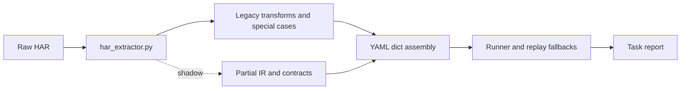

# ADR 0001: cosmic-replay-v5 production convergence

- Status: Accepted
- Date: 2026-06-15
- Scope: HAR import, IR, YAML, runner, contracts, evidence, API layering

## Context

The current implementation already has useful IR and contract modules, but they are
not yet the only business spine:

- `lib/har_extractor.py` still performs scenario inference, field discovery, page
  context recovery, compatibility transforms, contract attachment, and final YAML
  assembly in one 9k-line adapter.
- `lib/ir/yaml_bridge.py` identifies the current mode as
  `shadow_contract/observe_and_validate`.
- `lib/ir/yaml_generator.py` emits a conservative draft rather than the executable
  case consumed by the runner.
- Schema versions are expressed as `0.4`, `1.0`, and integer `1` in different
  layers without one compatibility registry.
- Preview, YAML, and runtime now carry a field catalog, but some UI and runner paths
  still reconstruct field meaning from `vars`, `pick_fields`, and steps.
- Runtime pageId handling is mature but distributed across extraction, contracts,
  replay, and runner fallbacks rather than enforced by one window-state contract.

The migration must preserve the current 13-sample baseline and avoid a one-shot
rewrite.

## Open-source adoption matrix

| Source | Adopted | Rejected | Cosmic-specific |
|---|---|---|---|
| Grafana `har-to-k6` | Explicit `validate -> parse -> render` boundaries; renderer consumes normalized structures only | Rendering directly from loosely validated HAR input | Add HR business semantics, form/page context, resolver and write evidence between parse and render |
| Grafana k6 Studio | Immutable recording evidence; inspectable rules; correlation, parameterization and verification as separate concerns; generator and validator separated | Treating generated scripts as sufficient evidence of business success | Preserve source request indexes and evidence for every inferred rule; readiness gate before generation and execution |
| Playwright HAR replay | Deterministic URL, method, body and header matching; explicit match diagnostics | Picking a "best" request silently when multiple candidates remain | Return `exact`, `semantic`, `ambiguous`, or `not_found`; critical requests block on the latter two |
| Keploy | Stable schema contracts; dynamic-field noise suppression; structured diffs; final status derived after all checks | Generic response equality and success inferred from HTTP status alone | Compare Cosmic action/form/schema/notification/primary-key/workflow semantics and require independent write evidence |

Primary references:

- https://github.com/grafana/har-to-k6/blob/master/ARCHITECTURE.md
- https://grafana.com/docs/k6-studio/components/generator/
- https://playwright.dev/python/docs/mock
- https://github.com/keploy/keploy

## Decision

The target business spine is:

```mermaid
flowchart LR
  A["Raw HAR"] --> B["EvidenceBundle"]
  B --> C["NormalizedRequest"]
  C --> D["SemanticRole"]
  D --> E["ScenarioModel"]
  E --> F["PageContextGraph"]
  F --> G["FieldCatalog"]
  G --> H["VariableBinding"]
  H --> I["ResolverContract"]
  I --> J["ResponseContract"]
  J --> K["ReadbackContract"]
  K --> L["Preflight"]
  L --> M["ExecutionPlan"]
  M --> N["YAML Renderer"]
  N --> O["Runner"]
  O --> P["ResultEvidence"]
```

The current path is:

### Versioned contracts

- Introduce one compatibility registry for IR, YAML, rule, and result-evidence
  versions.
- Every inferred rule must expose `rule_id`, `version`, `evidence`,
  `source_request_index`, `confidence`, `assumptions`, and `need_confirm`.
- Existing YAML remains readable through migrations and compatibility adapters.
- New executable YAML is rendered from an `ExecutionPlan`; legacy assembly remains
  behind a feature flag until parity is proven.

### Migration flags

- `COSMIC_IR_PIPELINE_MODE=observe`: build and compare the canonical model while
  legacy YAML remains authoritative.
- `COSMIC_IR_PIPELINE_MODE=prefer_ir`: render from IR and fall back only when an
  explicit compatibility decision permits it.
- `COSMIC_IR_PIPELINE_MODE=strict`: no silent fallback for critical generation or
  matching gaps.

Every fallback produces structured evidence and is forbidden for critical requests,
environment IDs, unsafe pageId recovery, and write verification.

### Ownership boundaries

- HAR adapter: evidence extraction and normalization only.
- IR services: scenario, fields, bindings, page state, contracts, preflight, plan.
- Renderer: versioned serialization only.
- Runner: consume execution plans and emit result evidence.
- API routes: HTTP concerns only.
- Application services: orchestration and transaction boundaries.
- Repositories: case, run, report, and artifact persistence.
- Diagnosis: structured failure classification and next action.

## Consequences

- Existing behavior is protected by parity reports and feature flags.
- New rules are reviewable and attributable to HAR evidence.
- Unsupported or ambiguous behavior becomes a first-class result, not an implicit
  fallback.
- The 13-sample baseline is not updated unless a reviewed semantic change is
  intentional.

