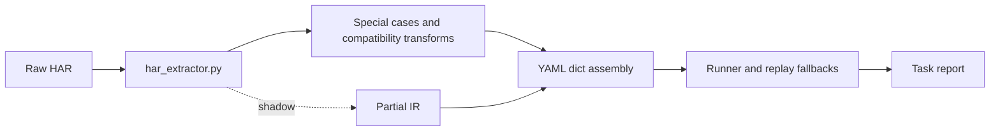

# cosmic-replay-v5 production convergence report

- Date: 2026-06-15
- Source revision: cosmic-replay-v4 `4785501`
- Publication rule: V4 remains uncommitted; verified changes are published from a clean V5 repository.

## Architecture

Before:

After:

```mermaid
flowchart LR
  A["Raw HAR"] --> B["EvidenceBundle"]
  B --> C["NormalizedRequest"]
  C --> D["SemanticRole"]
  D --> E["ScenarioModel"]
  E --> F["PageContextGraph"]
  F --> G["FieldCatalog"]
  G --> H["VariableBinding"]
  H --> I["ResolverContract"]
  I --> J["ResponseContract"]
  J --> K["ReadbackContract"]
  K --> L["Preflight"]
  L --> M["ExecutionPlan"]
  M --> N["YAML Renderer"]
  N --> O["Runner"]
  O --> P["ResultEvidence"]
```

The migration is staged. `har_extractor.py` still contains legacy rules, but executable
YAML now passes through a versioned `ExecutionPlan` renderer and parity checks. The
remaining adapter debt is protected by `observe`, `prefer_ir`, and `strict` modes.

## Open-source adoption

| Source | Adopted | Rejected | Cosmic-specific |
|---|---|---|---|
| Grafana har-to-k6 | Validate, parse, and render boundaries | Rendering business YAML directly from loose HAR data | HR scenario, page context, resolver, contracts, and evidence between parse and render |
| Grafana k6 Studio | Immutable evidence, inspectable rules, separated generation and validation | Treating generated scripts as proof of business success | Rule provenance and readiness gates before generation and execution |
| Playwright HAR replay | Deterministic request matching | Silent best-candidate fallback | `exact`, `semantic`, `ambiguous`, and `not_found`; critical ambiguity blocks |
| Keploy | Stable schemas, dynamic-noise suppression, structured differences | Generic response equality and HTTP-only success | Action, form, callback, schema, notification, primary-key, workflow, and readback semantics |

Full decision context and source links are in `docs/adr/0001-production-convergence-v5.md`.

## Rules migrated into IR

- Canonical scenario kinds: `query`, `create`, `update`, `delete`, `submit`,
  `approve`, `reject`, `mixed`, `partial_supported`, and `unsupported`.
- Query scenarios no longer inherit persistence requirements.
- Upload-only recordings are classified as `partial_supported`.
- Every emitted rule trace has `rule_id`, `version`, `evidence`,
  `source_request_index`, `confidence`, `assumptions`, and `need_confirm`.
- Request matching is deterministic and exposes ambiguity instead of silently
  selecting a request.
- Field rendering, user override, environment resolution, and final values share
  one ordered `FieldCatalog`.
- Environment-sensitive fields resolve by exact business code or name. Zero and
  multiple matches fail explicitly; static internal-ID fallback is not allowed.
- L0/L2/L3 window lifecycle, close, reopen, parent-child context, generation, and
  stale pageId reuse are enforced by one page-state machine.
- Generic `commonSearch` readback is blocked unless a form-specific strategy is
  explicitly validated.
- Result evidence separates request success, action success, contract pass,
  verified write, unverified write, and business failure.

## Modified areas

- IR and schema: `lib/ir/`, `lib/yaml_schema.py`, `lib/har_extractor.py`
- Execution: `lib/runner.py`, `lib/replay.py`, `lib/page_state.py`
- Contracts and evidence: `lib/case_contract.py`, `lib/field_resolver.py`,
  `lib/result_evidence.py`, `lib/task_manager.py`
- API layering: `lib/webui/routes/`, `application/`, `repositories/`, `diagnosis/`
- UI: modular `lib/webui/static/vnext/`; legacy page retained at `/legacy`
- Tests: IR, schema, resolver, runner, page state, result evidence, API, and UI
- Reviewed parser baselines: eight scenario-kind normalizations only

## Real HAR results

| # | Scenario | Env | Result | Evidence |
|---|---|---|---|---|
| 01 | Employment relationship base data | SIT | `write_unverified` | Request, contracts, and save response passed; no safe readback |
| 02 | Full-field personnel attachment | SIT | `write_unverified` | Request and contracts passed; response present; no safe readback |
| 03 | Base-data attachment | SIT | `write_unverified` | Request and contracts passed; response present; no safe readback |
| 04 | Onboarding application to confirmation | SIT | `business_failed` | Target backend Java exception at `click_barstart`; 11/11 maintained values applied |
| 05 | Controlled change reason | SIT | `write_unverified` | Save response semantics passed; no safe readback |
| 06 | Change reason BBB | SIT | `write_unverified` | Save response semantics passed; no safe readback |
| 07 | Nationality | SIT | `write_unverified` | Passed after stale pageId reopen fix; no safe readback |
| 08 | Employing organization | SIT | `write_unverified` | Save response semantics passed; no safe readback |
| 09 | Position maintenance | SIT | `write_unverified` | Passed; one non-critical navigation IR gap remains reviewable |
| 10 | Administrative organization | SIT | `write_unverified` | Passed after stale pageId reopen fix; response present; no safe readback |
| 11 | Onboarding creation | SIT | `business_failed` | Reproducible target backend Java exception at `click_barstart`; 18/18 values applied |
| 12 | Salary adjustment submit and approve | UAT | `business_failed` | Reproducible target backend Java exception at `btnok`; stopped before write anchor |
| 13 | Salary calculation full flow | UAT | `business_failed` | Strict response contract rejected empty upper-person callback/list semantics |

Counts:

- `query`: 0
- `write_verified`: 0
- `write_unverified`: 9
- `business_failed`: 4
- `unsupported`: 0

The four failures are not reported as script success. Samples 04, 11, and 12 were
reproduced against the target environments; sample 13 consistently failed the
recorded stable response semantics.

## Metrics

| Metric | Result |
|---|---:|
| HAR parsed | 13/13 |
| YAML schema version | 13/13 at version 1 |
| ExecutionPlan schema | 13/13 at version 1.0 |
| Rule provenance | 1,262 entries, 0 missing required attributes |
| FieldCatalog | 182 fields, 0 unknown |
| Maintainable fields | 134 bound, 0 unbound |
| Field order mismatch | 0 |
| Unsafe static cross-environment binding | 0 |
| Cross-environment selectors ready | 84/84 |
| IR write anchors | 26, 0 uncovered, 0 missing critical contract |
| IR navigation | 653 matched, 1 non-critical unmatched |
| Recorded pageId links | 1,428 exact, 0 cross-form |
| Runtime pageId traces | 738 |
| PageId risk | 10 low, 3 medium |
| Request contract failures | 0 |
| Response contract failures | 5, all in the four failed scenarios |
| Readback verified | 0 |

Readback remains deliberately conservative: ten scenarios have no validated safe
readback, and three stopped before their configured readback. No generic
`commonSearch` result was accepted as write proof.

## Web UI verification

- vNext is the default page; `/legacy` and `COSMIC_WEBUI_MODE=legacy` remain rollback paths.
- The implemented information architecture is: case workspace, execution center,
  run history, and AI troubleshooting; case detail contains overview, business
  variables, steps, validation/contracts, runs, and technical diagnostics.
- Variable maintenance persists the canonical lineage
  `recorded_value -> user_override -> environment_resolved_value -> final_request_value`.
  Browser verification changed a text field, saved it, refreshed readiness, and
  confirmed the final effective value remained consistent.
- Readiness distinguishes configured-but-unreachable environments using a cached
  network probe. A refused endpoint was correctly classified
  `environment_unavailable`; no run was presented as ready.
- A reachable delayed-failure endpoint was then used to exercise the real runner:
  start, SSE events, structured logs, stop request, safe cancellation, `case_done`,
  history, and refresh recovery all completed with `cancelled`, never success.
- Historical incomplete runs are shown as interrupted failures. Old events that
  only contain a display name are compatibly matched to one existing YAML case;
  deleted cases still return a minimum evidence diagnosis instead of HTTP 500.
- AI troubleshooting was operated against a real login failure. It displayed the
  environment/auth category, failed stage, evidence, suggested action, post-fix
  verification, safety constraints, and a redacted context section.
- Desktop 1440 x 900 and mobile 390 x 844 workflows were operated in the in-app
  Browser. The mobile page had `scrollWidth == clientWidth == 390`; field lineage
  was converted to stacked rows so no critical value column requires page-level
  horizontal scrolling.
- The final Browser screenshots were visually compared with the generated design
  concept. The delivered UI keeps the three-region workbench, canonical field
  table, readiness rail, execution/log workflow, and restrained visual hierarchy.
- `/legacy` was opened and operated after the vNext checks.
- Temporary screenshots and generated design concepts are excluded from publication.

## Tests and gates

- V4 workspace pytest with private HAR fixtures: `643 passed`
- Public V5 pytest without private HAR fixtures: `600 passed, 59 skipped`
- HAR parser baseline: `13 samples`, `0 changed`
- Core regression gate: passed
- Sensitive fixture scan: passed
- vNext JavaScript syntax checks: passed
- `git diff --check`: passed
- New coverage includes workspace aggregation, value persistence, exact-only
  resolver application, repair confirmation, structured/redacted run snapshots,
  interrupted history, cancellation, AI evidence/safety, vNext HTTP contracts,
  resumable SSE/static contracts, and runner cancellation boundaries.
- Real import and execution: 13/13 parsed, 9/13 executed through contracts

The 13-sample results and metrics above are retained from the previously verified
private regression run. The private HAR corpus is intentionally absent from this
public V5 checkout, so this UI completion pass did not recreate or update those
baselines. The current core gate reported `HAR compare: skipped` for that explicit
reason and still passed the sensitive-data scan.

The temporary historical execution baseline reported 101 differences because it
does not contain the new scenario fields and reflects older target-environment
results. It was not updated, reviewed as a source baseline, or included in V5.

Tests backed by ignored local HAR files now declare that precondition centrally:
they execute normally when the fixtures exist and skip with the missing filename
in a clean public checkout. `core_regression_gate.py --require-local-har` keeps a
strict mode for release machines that own the private regression corpus.

## Remaining work

- `har_extractor.py` is still a 9k-line compatibility adapter. The next migration
  should move remaining field and special-case rules into registered IR rule modules.
- One non-critical position-navigation IR action is unmatched and remains behind
  a review decision.
- No scenario currently has a validated, old-data-safe readback strategy, so nine
  successful writes remain `write_unverified`.
- Target-environment owners must investigate the three Java exceptions and the
  missing callback semantics before those flows can become production-green.

These are explicit limitations, not hidden fallbacks.

## Rollback

- Set `COSMIC_IR_PIPELINE_MODE=observe` to make the compatibility path authoritative
  while retaining IR diagnostics.
- Set `COSMIC_WEBUI_MODE=legacy` or use `/legacy` to restore the previous UI.
- Existing YAML remains readable through schema compatibility and migrations.
- V4 is untouched by commits; V5 can be archived or deleted without altering the
  source repository or user working changes.
