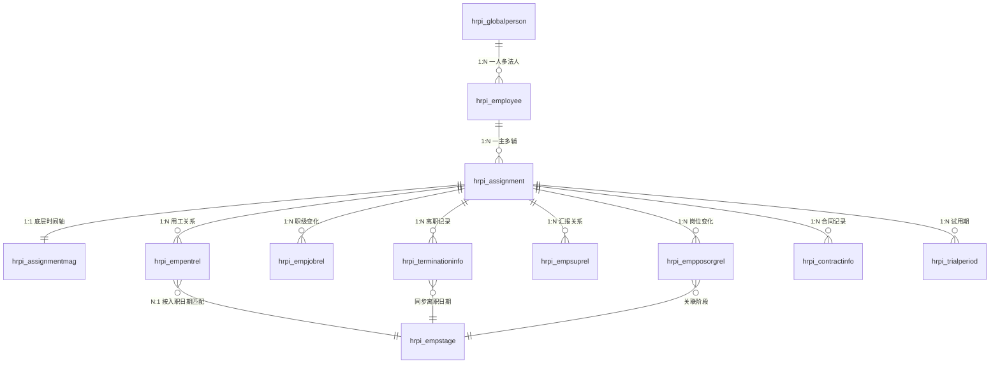

# HCM 员工模型设计文档

> **适用对象**: 交付实施顾问（了解实体、对象、业务规则、基本数据库知识）  
> **系统版本**: 金蝶苍穹 HCM 8.0.4+  
> **覆盖范围**: 人员信息域全部 14 个核心实体 + 28 个附属实体  
> **版本**: V1.1（修正时间轴模型描述）

---

## 目录

1. [概述与核心架构](#1-概述与核心架构)
2. [数据模型说明](#2-数据模型说明)
3. [核心实体详解](#3-核心实体详解)
   - 3.1 全球员工 · 3.2 员工 · 3.3 组织分配 · 3.4 组织分配管理主体
   - 3.5 雇佣信息 · **3.6 雇佣阶段（含完整推演）**
   - 3.7 任职经历（最复杂的实体） · 3.8 职级职等
   - 3.9 汇报关系 · 3.10 离职信息 · 3.11 合同信息
   - 3.12 试用期 · 3.13 任免经历 · 3.14 服务年限 · 3.15 轮岗 · 3.16 外派
4. [附属实体（28个）](#4-附属实体28个)
5. [实体关联关系](#5-实体关联关系)
6. [系统自动行为](#6-系统自动行为)
7. [业务规则总览](#7-业务规则总览)
8. [典型业务场景](#8-典型业务场景)
9. [码表与枚举值参考](#9-码表与枚举值参考)
10. [附录：缩略语与术语](#10-附录缩略语与术语)

---

## 1. 概述与核心架构

### 1.1 人员信息域定位

金蝶苍穹 HCM 的员工信息管理由 **员工信息中心** 负责，属于「人员信息域」。该域管理员工从入职到离职全生命周期的人事档案数据。

### 1.2 核心实体关系总览

```
全球员工(hrpi_globalperson)
└── 员工(hrpi_employee)  ←── 一个全球员工可关联多个员工（不同法人实体）
    └── 组织分配(hrpi_assignment)  ←── 一个员工可有1主+N辅个组织分配
        ├── 任职经历(hrpi_empposorgrel)     ←── 时间轴：记录岗位变化历史
        ├── 职级职等(hrpi_empjobrel)         ←── 时间轴：记录职级变化历史
        ├── 雇佣信息(hrpi_empentrel)         ←── 记录用工关系
        ├── 汇报关系(hrpi_empsuprel)         ←── 记录上下级关系
        ├── 离职信息(hrpi_terminationinfo)   ←── 记录离职日期和类型
        ├── 合同信息(hrpi_contractinfo)      ←── 记录劳动合同
        ├── 试用期(hrpi_trialperiod)         ←── 记录试用期信息
        ├── 任免经历(hrpi_appointremoverel)  ←── 央国企干部任免
        ├── 服务年限(hrpi_perserlen)         ←── 司龄/工龄等
        ├── 轮岗情况(hrpi_rotationinfo)      ←── 轮岗记录
        ├── 外派信息(hrpi_dispatchinfo)      ←── 外派记录
        └── 组织分配管理主体(hrpi_assignmentmag)  ←── 组织分配的时间轴版本
```

**一句话总结**：
- **员工** = "这个人是谁"（有版本管理，支持按时间追溯）
- **组织分配** = "这个人属于哪个组织"（支持一主多辅）
- **任职经历** = "这个人在什么时间、在哪个部门/岗位任职"（时间轴，最复杂）
- **雇佣信息** = "这个人什么时候入职、在哪个用人单位"
- **雇佣阶段** = "用入职日期划分雇佣段，连接雇佣信息与各时间轴数据"

### 1.3 核心实体一览

| 实体编码 | 中文名 | 数据库表 | 数据模型 | 时间轴模式 | 逻辑主键 | 说明 |
|---------|--------|---------|---------|----------|---------|------|
| `hrpi_globalperson` | 全球员工 | `t_hrpi_globalperson` | 基础资料 | — | — | 跨法人的唯一人员标识 |
| `hrpi_employee` | 员工 | `t_hrpi_employee` | 历史模型 | — | — | 员工档案主表 |
| `hrpi_assignment` | 组织分配 | `t_hrpi_assignment` | 基础资料 | — | — | 连接员工与组织的桥梁 |
| `hrpi_assignmentmag` | 组织分配管理主体 | `t_hrpi_assignmentmag` | 时间轴 | 不间断不重叠 | 组织分配 | 组织分配的带时间段版本 |
| `hrpi_empentrel` | 雇佣信息 | `t_hrpi_empentrel` | 时间轴 | 不间断不重叠 | 员工 | 记录用工关系，联动雇佣阶段 |
| `hrpi_empstage` | 雇佣阶段 | `t_hrpi_empstage` | 桥梁实体 | — | — | 按入职日期划分雇佣段 |
| `hrpi_empposorgrel` | 任职经历 | `t_hrpi_empposorgrel` | 时间轴 | 可间断可重叠 | 组织分配 | 记录岗位变化，**最复杂** |
| `hrpi_empjobrel` | 职级职等 | `t_hrpi_empjobrel` | 时间轴 | 可间断可重叠 | 组织分配 | 记录职级/职等变化 |
| `hrpi_empsuprel` | 汇报关系 | `t_hrpi_empsuprel` | 时间轴 | 可间断可重叠 | 组织分配 | 记录上下级关系 |
| `hrpi_terminationinfo` | 离职信息 | `t_hrpi_terminationinfo` | 时间轴 | 可间断不重叠 | 组织分配 | 记录离职日期/类型 |
| `hrpi_contractinfo` | 合同信息 | `t_hrpi_contractinfo` | 时间轴 | 可间断可重叠 | 组织分配 | 记录劳动合同 |
| `hrpi_trialperiod` | 试用期 | `t_hrpi_trialperiod` | 时间轴 | 可间断可重叠 | 组织分配 | 记录试用期信息 |
| `hrpi_appointremoverel` | 任免经历 | `t_hrpi_appointremoverel` | 时间轴 | 可间断可重叠 | 组织分配 | 央国企干部管理 |
| `hrpi_perserlen` | 服务年限 | `t_hrpi_perserlen` | 时间轴 | 可间断不重叠 | 组织分配 | 司龄/工龄自动计算 |
| `hrpi_rotationinfo` | 轮岗情况 | `t_hrpi_rotationinfo` | 时间轴 | 可间断可重叠 | — | 轮岗记录 |
| `hrpi_dispatchinfo` | 外派信息 | `t_hrpi_dispatchinfo` | 时间轴 | 可间断可重叠 | — | 外派记录 |

---

## 2. 数据模型说明

人员信息域的实体使用四种数据模型，理解它们是掌握员工模型的关键。

### 2.1 历史模型（HisModel）

**使用实体**: 员工（`hrpi_employee`）

**核心概念**: 同一个员工在数据库中可能存在**多条记录（多个版本）**，共享同一个业务主键 `boid`，通过 `iscurrentversion` 标记哪条是当前生效版本。

**数据库示例**：

| id | boid | iscurrentversion | bsed | bsled | datastatus | name |
|----|------|-----------------|------|-------|-----------|------|
| 1001 | 1001 | 是 | 2020-01-01 | 2999-12-31 | 1(生效中) | 张三 |
| 2001 | 1001 | 否 | 2020-01-01 | 2023-06-30 | 1 | 张三 |
| 2002 | 1001 | 否 | 2023-07-01 | 2999-12-31 | 1 | 张三丰 |

- `id=1001`（`iscurrentversion`=是）：最新数据，查当前信息用这条
- `id=2001/2002`（`iscurrentversion`=否）：历史版本，查历史某天信息用这些

**版本状态说明**:

| 状态值 | 含义 | 典型场景 |
|-------|------|---------|
| -3 | 暂存 | 入职单草稿还未提交 |
| -2 | 已删除 | 员工被逻辑删除 |
| -1 | 已废弃 | 新版本生效后，旧版本自动变为已废弃 |
| 0 | 待生效 | 已提交但未到生效日期（如未来的调岗） |
| 1 | 生效中 | 当前正在生效的版本 |
| 2 | 已失效 | 超过失效日期 |

**版本状态流转**:

```
暂存(-3) ──提交──→ 待生效(0) ──到达生效日期──→ 生效中(1)
                                   │
                                   ├─ 提交新变更 → 新版本变为 待生效(0) → 生效中(1)
                                   │                 原版本自动变为 已废弃(-1)
                                   ├─ 逻辑删除 → 已删除(-2)
                                   └─ 超过失效日期 → 已失效(2)
```

**给实施人员的提示**:
- 查询在职员工时，过滤条件须为 `iscurrentversion`=是 且 `datastatus`=1
- 不要只按 `id` 查询，因为同一员工可能有多条版本记录
- 查某天的历史版本：用 `boid` + `bsed` ≤ 目标日期 + `bsled` ≥ 目标日期

### 2.2 时间轴模型（Timeline）

**使用实体**: 雇佣信息、组织分配管理主体、任职经历、职级职等、汇报关系、离职信息、合同信息、试用期、任免经历、服务年限、轮岗、外派等

**核心概念**: 一个员工在某个维度上的数据随时间变化，形成一条**按时间排列的记录链**。每条记录都有 `startdate`（开始日期）和 `enddate`（结束日期）。

**三种时间段约束模式**:

| 模式 | 含义 | 使用实体 |
|------|------|--------|
| 不间断不重叠 | 相邻记录时间必须连续，不允许有空隙或重叠 | 雇佣信息、组织分配管理主体、报税信息 |
| 可间断不重叠 | 允许有时间间隔，但同一逻辑键下不可重叠 | 离职信息、服务年限、干部信息 |
| 可间断可重叠 | 允许有时间间隔，也允许时间段重叠 | 任职经历、职级职等、汇报关系、合同信息、试用期、任免经历、轮岗、外派 |

> **注意**: 任职经历虽然元数据级别配置为「可间断可重叠」，但业务层对每条**{组织分配+是否主任职+任职序号}**轨道强制执行「不间断不重叠」规则。详见 §3.7。

**不间断不重叠规则示意**:

```
✅ 正确：时间连续
  记录1: 2020-01-01 ~ 2023-06-30
  记录2: 2023-07-01 ~ 2999-12-31  (前一条结束日期的后一天 = 后一条开始日期)

❌ 错误：存在空隙
  记录1: 2020-01-01 ~ 2023-06-30
  记录2: 2023-08-01 ~ 2999-12-31  (中间空了7月份)

❌ 错误：存在重叠
  记录1: 2020-01-01 ~ 2023-07-15
  记录2: 2023-07-01 ~ 2999-12-31  (7月1日~15日重叠)
```

**给实施人员的提示**: 时间轴数据的最后一条记录的结束日期通常为 `2999-12-31`（系统最大日期），表示"至今有效"。调岗、晋级等操作实际上是将最后一条记录的结束日期截断，然后新增一条记录。

### 2.3 基础资料模型（BaseData）

**使用实体**: 全球员工（`hrpi_globalperson`）、组织分配（`hrpi_assignment`）

**核心概念**: 最简单的模型，每条记录对应一个独立的业务对象，没有版本管理，也没有时间轴。

**给实施人员的提示**: 组织分配虽然是基础资料，但它的保存操作实际上是**转发给组织分配管理主体（时间轴模型）处理**的。也就是说，用户在界面上保存组织分配时，系统会在后台创建/更新时间轴记录。

### 2.4 桥梁实体

**使用实体**: 雇佣阶段（`hrpi_empstage`）

**核心概念**: 雇佣阶段不使用时间轴框架，也不是基础资料。它是由雇佣信息的保存/删除操作自动维护的桥梁实体，按入职日期划分员工的「雇佣段」，将雇佣信息与各时间轴数据关联起来。有 `entrydate`（入职日期）、`enddate`（结束日期）、`departdate`（离职日期），但不参与标准时间轴的校验和覆盖逻辑。

---

## 3. 核心实体详解

### 3.1 全球员工（hrpi_globalperson）

**数据库表**: `t_hrpi_globalperson`  
**业务定位**: 当一个自然人在多个法人实体（如集团下的不同子公司）任职时，全球员工作为跨法人的唯一人员标识，将同一人的多个员工记录关联起来。

| 字段 | 中文名 | 说明 |
|------|--------|------|
| `number` | 编号 | 全球员工编号 |

**业务规则**:
- 当创建新员工且未指定全球员工时，系统**自动创建**一条全球员工记录
- 当再入职时（前员工非空），新员工**继承**前员工的全球员工，不会重复创建

### 3.2 员工（hrpi_employee）

**数据库表**: `t_hrpi_employee`（主表）、`t_hrpi_employee_a`（扩展表）  
**数据模型**: 历史模型（详见 §2.1）

#### 核心字段

| 字段 | 中文名 | 类型 | 必填 | 说明 |
|------|--------|------|------|------|
| `boid` | 业务ID | 长整型 | 自动 | 同一员工所有版本共享的主键 |
| `iscurrentversion` | 当前生效版本 | 勾选框 | 自动 | 标记当前生效的版本 |
| `datastatus` | 数据版本状态 | 下拉 | 自动 | -3/-2/-1/0/1/2（见 §2.1） |
| `bsed` | 版本生效日期 | 日期 | 自动 | 为空时自动从雇佣信息的入职日期获取 |
| `bsled` | 版本失效日期 | 日期 | 自动 | |
| `firstbsed` | 最早生效日期 | 日期 | 自动 | 第一个版本的生效日期 |
| `hisversion` | 版本号 | 文本 | 自动 | V0001, V0002, ... |
| `globalperson` | 全球员工 | 基础资料 | 自动 | 为空时自动创建 |
| `isprimary` | 主员工标识 | 勾选框 | — | 同一全球员工下只有一个为"是" |
| `primaryemployee` | 主员工 | 基础资料 | — | 指向主员工记录 |
| `oldemployee` | 前员工 | 基础资料 | — | 再入职时关联前一次的员工记录 |
| `oldempnumber` | 前工号 | 文本 | — | 再入职时的原工号 |
| `empnumber` | 工号 | 文本 | 是 | 用户可见的员工编号 |
| `number` | 员工系统ID | 文本 | 自动 | 系统内部编码（由编码规则自动生成） |
| `name` | 姓名 | 文本 | 是 | |
| `gender` | 性别 | 基础资料 | — | |
| `birthday` | 出生日期 | 日期 | — | |
| `age` | 年龄 | 整数 | 自动 | 根据出生日期自动计算 |
| `headsculpture` | 头像 | 图片 | 自动 | 为空时根据姓名+性别自动生成 |
| `phone` | 手机号码 | 文本 | — | |
| `nationality` | 国籍 | 基础资料 | — | |
| `folk` | 民族 | 基础资料 | — | |
| `assignment` | 组织分配 | 基础资料 | — | **冗余字段**，指向主组织分配 |
| `isdeleted` | 已删除 | 勾选框 | 自动 | 逻辑删除标记 |

#### 关键业务规则

| 编号 | 规则 | 说明 |
|------|------|------|
| EMP-1 | 主员工互斥 | 同一个全球员工下，有且仅有一个员工的 `isprimary`=是。当新员工设为主员工时，原主员工自动变为非主 |
| EMP-2 | 逻辑删除 | 删除员工时不会物理删除数据库记录，而是将 `isdeleted` 设为"是" |
| EMP-3 | 编码规则 | 系统编码规则应用于 `number` 字段（非 `empnumber`），`empnumber` 是用户手工录入的工号 |
| EMP-4 | 版本管理 | 对员工信息的变更会自动创建新版本，旧版本标记为"已废弃" |
| EMP-5 | 再入职继承 | 再入职时，如果指定了前员工，新员工自动继承前员工的全球员工 |

### 3.3 组织分配（hrpi_assignment）

**数据库表**: `t_hrpi_assignment`  
**数据模型**: 基础资料  
**业务定位**: 连接员工与人事管理组织的桥梁。一个员工可以有 **1个主组织分配 + N个辅组织分配**。

#### 核心字段

| 字段 | 中文名 | 类型 | 必填 | 说明 |
|------|--------|------|------|------|
| `number` | 组织分配号 | 文本 | 自动 | |
| `employee` | 员工 | 基础资料 | 是 | 关联员工 |
| `adminorg` | 管理部门 | 行政组织 | 是 | 员工所属的行政组织 |
| `org` | 人事管理组织 | 组织 | — | |
| `orgtype` | 组织分类 | 基础资料 | — | 行政组织/虚拟组织等 |
| `businesstype` | 业务类型 | 基础资料 | — | 正式/实习/劳务派遣 |
| `persongroup` | 员工组 | 基础资料 | — | 人员分组 |
| `isprimary` | 主组织分配 | 勾选框 | — | 是=主组织分配，否=辅组织分配 |
| `primaryassignment` | 主组织分配 | 基础资料 | 自动 | 指向该员工的主组织分配 |
| `assignmentstatus` | 状态 | 下拉 | 自动 | 1=生效，2=失效，3=暂停 |
| `empstage` | 雇佣阶段 | 基础资料 | 自动 | |
| `startdate` | 开始日期 | 日期 | 是 | 组织分配生效开始日期 |
| `country` | 国家/地区 | 基础资料 | — | |
| `isdeleted` | 已删除 | 勾选框 | 自动 | 逻辑删除标记 |

#### 主辅组织分配示例

| 组织分配号 | 管理部门 | 主组织分配 | 主组织分配指向 | 状态 |
|-----------|---------|-----------|-------------|------|
| A001 | 金蝶软件·研发部 | **是** | A001(指向自身) | 生效 |
| A002 | 金蝶云·产品部 | 否 | A001(指向主) | 生效 |

> 规则：辅组织分配的「主组织分配」字段指向主分配；主组织分配发生切换时，系统自动更新所有辅分配的指向。员工表的 `assignment` 冗余字段始终指向主组织分配。

#### 关键业务规则

| 编号 | 规则 | 说明 |
|------|------|------|
| ASG-1 | 一主多辅 | 一个员工有且仅有一个主组织分配，主组织分配决定员工的归属部门 |
| ASG-2 | 保存转发 | 用户保存组织分配时，系统实际上是通过「组织分配管理主体」的时间轴逻辑来处理的 |
| ASG-3 | 逻辑删除 | 删除组织分配不会物理删除，而是设 `isdeleted`=是 |
| ASG-4 | 信息采集限制 | 信息采集任务只能对在职员工（状态=生效）发起 |

### 3.4 组织分配管理主体（hrpi_assignmentmag）

**数据库表**: `t_hrpi_assignmentmag`  
**数据模型**: 时间轴（不间断不重叠，逻辑主键：组织分配）  
**业务定位**: 组织分配的时间轴版本。用户看到的是组织分配，系统后台维护的是管理主体的时间轴数据。

#### 核心字段

| 字段 | 中文名 | 类型 | 说明 |
|------|--------|------|------|
| `assignment` | 组织分配 | 基础资料 | 关联的组织分配 |
| `employee` | 员工 | 员工字段 | |
| `isprimary` | 主组织分配 | 勾选框 | |
| `adminorg` | 管理部门 | 行政组织 | |
| `number` | 组织分配号 | 文本 | 自动从组织分配同步 |
| `orgtype` | 组织分类 | 基础资料 | 自动兜底赋值 |
| `businesstype` | 业务类型 | 基础资料 | 自动兜底赋值 |
| `startdate` | 开始日期 | 日期 | 时间轴开始 |
| `enddate` | 结束日期 | 日期 | 时间轴结束 |

#### 关键业务规则

| 编号 | 规则 | 说明 |
|------|------|------|
| MAG-1 | 主组织分配互斥 | 同一员工同一时间段只能有一个主组织分配。新增主组织分配时，系统自动截断已有主组织分配的结束日期 |
| MAG-2 | 至少保留一条 | 不允许删除最后一条组织分配记录 |
| MAG-3 | 数据回写 | 保存/删除后，系统自动将数据同步回关联的组织分配记录 |

### 3.5 雇佣信息（hrpi_empentrel）

**数据库表**: `t_hrpi_empentrel`  
**数据模型**: 时间轴（不间断不重叠，逻辑主键：员工）  
**业务定位**: 记录员工与企业的用工关系，是雇佣阶段的创建者和维护者。

#### 核心字段

| 字段 | 中文名 | 类型 | 必填 | 说明 |
|------|--------|------|------|------|
| `employee` | 员工 | 员工字段 | 是 | |
| `assignment` | 组织分配 | 基础资料 | 是 | |
| `enterprise` | 用人单位 | 基础资料 | 是 | 法人实体 |
| `laborreltype` | 用工关系类型 | 基础资料 | 是 | 合同工/劳务派遣/实习等 |
| `laborrelstatus` | 用工关系状态 | 基础资料 | 是 | 在职/离职/退休等 |
| `entrydate` | 入职日期 | 日期 | 是 | 核心字段，关联雇佣阶段的匹配键 |
| `startdate` | 开始日期 | 日期 | 是 | 时间轴字段 |
| `enddate` | 结束日期 | 日期 | 是 | 时间轴字段 |
| `onboardsource` | 入职来源 | 基础资料 | — | 社招/校招/内推等 |
| `candidate` | 候选人ID | 基础资料 | — | 关联招聘的候选人 |
| `ishired` | 在职 | 勾选框 | 自动 | 从用工关系状态自动同步 |
| `istrial` | 试用 | 勾选框 | 自动 | 从用工关系状态自动同步 |
| `empstage` | 雇佣阶段 | 基础资料 | 自动 | 按入职日期匹配或自动创建 |
| `empstagelatestrecord` | 最新记录 | 勾选框 | 自动 | |

#### 关键业务规则

| 编号 | 规则 | 说明 |
|------|------|------|
| ENT-1 | 在职/试用标记同步 | `ishired` 和 `istrial` 不可手动设置，由系统从用工关系状态的属性自动同步 |
| ENT-2 | 雇佣阶段自动维护 | 新增/修改入职日期时，按 {员工, 入职日期} 匹配雇佣阶段；无匹配则自动创建新的雇佣阶段 |
| ENT-3 | 删除联动 | 删除雇佣信息时，如该入职日期下无其他雇佣记录，则连带删除对应的雇佣阶段 |
| ENT-4 | 入职日期修订级联 | 修订入职日期时，系统自动级联修订所有关联的时间轴数据 |
| ENT-5 | 再入职保护 | 再入职场景下，系统强制创建新的雇佣阶段，避免匹配到前一次入职的记录 |

### 3.6 雇佣阶段（hrpi_empstage）— 桥梁实体（非时间轴）

**数据库表**: `t_hrpi_empstage`  
**数据模型**: 桥梁实体（非时间轴，不参与时间轴框架的校验和覆盖逻辑）  
**业务定位**: 作为雇佣信息与时间轴数据之间的**桥梁**，按入职日期分员工的“雇佣段”。虽然有 `entrydate`/`enddate`/`departdate` 日期字段，但不继承时间轴模板，由雇佣信息的保存/删除操作自动维护。

#### 核心字段

| 字段 | 中文名 | 说明 |
|------|--------|------|
| `employee` | 员工 | |
| `entrydate` | 入职日期 | 由雇佣信息创建时写入 |
| `enddate` | 结束日期 | 前后阶段衔接时自动维护 |
| `departdate` | 离职日期 | 由离职信息保存时同步写入 |

#### 雇佣阶段关联示意

```
雇佣阶段(入职日期=2025-03-01, 结束日期=2999-12-31, 离职日期=空)
├── 雇佣信息(入职日期=2025-03-01)        ← 创建/维护此雇佣阶段
├── 任职经历(雇佣阶段=本阶段)            ← 关联此阶段
├── 职级职等(雇佣阶段=本阶段)            ← 关联此阶段
├── 离职信息(雇佣阶段=本阶段)            ← 同步离职日期到此阶段
└── ...其他时间轴数据
```

#### 雇佣阶段的完整生命周期

```
创建 ← 保存雇佣信息时，如果该入职日期下没有匹配的雇佣阶段
      ├── 新增时：自动计算结束日期（查后续阶段的入职日期 - 1天，或设为 2999-12-31）
      └── 新增时：自动截断前一阶段的结束日期

更新 ← 三种触发方式
      ├── 保存离职信息 → 同步离职日期
      ├── 修订入职日期 → 级联修订所有关联时间轴数据
      └── 保存/删除时间轴数据 → 重新分配雇佣阶段（12个实体触发）

删除 ← 删除雇佣信息时，如果该入职日期下无其他雇佣记录

清空离职日期 ← 删除离职信息
```

#### 雇佣阶段匹配规则

| 场景 | 处理方式 |
|------|----------|
| 该员工只有1个雇佣阶段 | 直接返回该阶段（不判断日期） |
| 该员工有多个雇佣阶段 | 精确匹配：入职日期 ≤ 目标日期 ≤ 结束日期 |
| 无匹配 | 返回空 |

#### 需要关联雇佣阶段的12个实体

以下实体在保存或删除时，会触发系统重新分配雇佣阶段：

| 实体编码 | 中文名 |
|---------|--------|
| `hrpi_empposorgrel` | 任职经历 |
| `hrpi_empjobrel` | 职级职等 |
| `hrpi_empsuprel` | 汇报关系 |
| `hrpi_terminationinfo` | 离职信息 |
| `hrpi_contractinfo` | 合同信息 |
| `hrpi_trialperiod` | 试用期 |
| `hrpi_appointremoverel` | 任免经历 |
| `hrpi_perserlen` | 服务年限 |
| `hrpi_rotationinfo` | 轮岗情况 |
| `hrpi_dispatchinfo` | 外派信息 |
| `hrpi_assignmentmag` | 组织分配管理主体 |
| `hrpi_emptutor` | 导师信息 |

#### 雇佣阶段完整推演

> 以下通过一个员工从入职到再入职的完整生命周期，逐步推演雇佣阶段在数据库中的变化过程。

**推演背景** — 员工张三将经历以下业务事件：

| 时间 | 事件 | 说明 |
|------|------|------|
| 2025-03-01 | 首次入职 | 入职研发中心 |
| 2025-06-01 | 调岗 | 从研发中心调到产品中心 |
| 2025-09-30 | 第一次离职 | 主动离职 |
| 2026-01-15 | 再入职 | 重新入职到销售中心 |
| 2026-03-01 | 修订入职日期 | 发现入职日期录错，修订为2026-02-01 |
| — | 撤销离职 | 删除第一次的离职信息 |

##### 第1步：首次入职（2025-03-01）

**触发操作**: 保存雇佣信息，入职日期 = 2025-03-01

**系统自动处理**:
1. 系统检测到这是一条全新的雇佣信息（首次入职）
2. 自动创建一个新的雇佣阶段
3. 查询该员工是否有后续雇佣阶段 → 没有 → 结束日期设为 2999-12-31
4. 查询该员工是否有更早的雇佣阶段 → 没有 → 无需调整其他阶段

**数据库结果**:

| 表 | ID | 员工 | 入职日期 | 结束日期 | 离职日期 |
|----|-----|------|---------|---------|----------|
| 雇佣阶段 | S1 | 张三 | 2025-03-01 | 2999-12-31 | (空) |
| 雇佣信息 | E1 | 张三 | 2025-03-01 | — | 雇佣阶段→S1 |
| 任职经历 | P1 | 张三·研发中心 | 2025-03-01 ~ 2999-12-31 | 雇佣阶段→S1 |

##### 第2步：调岗（2025-06-01）

**触发操作**: 保存任职经历，从研发中心调到产品中心

**系统自动处理**:
1. 时间轴分割：原任职经历 P1 的结束日期截断为 2025-05-31，新增 P2
2. 系统自动检查任职经历的雇佣阶段归属（任职经历属于 12 个触发实体之一）
3. P1 和 P2 都在 S1 的时间范围内 → 雇佣阶段不变

**数据库结果** — 雇佣阶段表不变，任职经历时间轴分割：

| ID | 行政组织 | 开始日期 | 结束日期 | 雇佣阶段 |
|----|---------|---------|---------|----------|
| P1 | 研发中心 | 2025-03-01 | **2025-05-31** | → S1 |
| P2 | 产品中心 | **2025-06-01** | 2999-12-31 | → S1 |

> **关键理解**: 调岗只影响任职经历的时间轴分割，不会创建新的雇佣阶段。雇佣阶段只跟「入职日期」和「离职日期」关联。

##### 第3步：第一次离职（2025-09-30）

**触发操作**: 保存离职信息，离职日期 = 2025-09-30

**系统自动处理**: 通过离职日期匹配到 S1，将 S1 的离职日期设置为 2025-09-30。

**数据库结果** — 雇佣阶段表：

| ID | 员工 | 入职日期 | 结束日期 | 离职日期 |
|----|------|---------|---------|----------|
| S1 | 张三 | 2025-03-01 | 2999-12-31 | **2025-09-30** |

> **关键理解**: 离职不会创建新的雇佣阶段，只是在已有阶段上填入离职日期。

##### 第4步：再入职（2026-01-15）

**触发操作**: 保存雇佣信息，入职日期 = 2026-01-15

**系统自动处理**:
1. 系统检测到这是一条全新的雇佣信息（再入职场景）
2. **强制创建新的雇佣阶段**，不会复用前一次入职的阶段 S1（再入职保护机制）
3. 查询后续阶段 → 没有 → 新阶段结束日期设为 2999-12-31
4. 查询前一个阶段 → 找到 S1 → 自动将 S1 结束日期截断为 **2026-01-14**

**数据库结果** — 雇佣阶段表：

| ID | 员工 | 入职日期 | 结束日期 | 离职日期 | 说明 |
|----|------|---------|---------|----------|------|
| S1 | 张三 | 2025-03-01 | **2026-01-14** | 2025-09-30 | 结束日期被截断 |
| **S2** | 张三 | **2026-01-15** | 2999-12-31 | (空) | **新增**：再入职阶段 |

> **关键理解**: 再入职是最复杂的场景。系统检测到全新的雇佣信息后会**直接创建新阶段而不去匹配已有阶段**，防止错误复用旧阶段。同时 S1 结束日期自动被截断为新阶段入职日期的前一天。

##### 第5步：修订入职日期（2026-01-15 → 2026-02-01）

**触发操作**: 执行「修订入职日期」操作，将 E2 的入职日期修订为 2026-02-01

**系统自动处理**:
1. 执行级联修订：**所有关联 S2 的时间轴数据**的开始日期同步调整
2. 修订场景下系统不会额外触发雇佣阶段重新分配，由修订操作统一处理

**数据库结果** — 雇佣阶段表：

| ID | 入职日期 | 结束日期 | 变化说明 |
|----|---------|---------|----------|
| S1 | 2025-03-01 | **2026-01-31** | 结束日期跟随调整为新入职日期的前一天 |
| S2 | **2026-02-01** | 2999-12-31 | 入职日期从01-15改为02-01 |

> **关键理解**: 修订入职日期不只改雇佣信息本身，而是**级联修订**所有关联的时间轴数据。

##### 第6步：撤销第一次离职（删除离职信息）

**触发操作**: 删除第一段的离职信息

**系统自动处理**: 系统找到关联的雇佣阶段 S1，将 S1 的离职日期清空。

> **关键理解**: 删除离职信息只清空对应雇佣阶段的离职日期，**不删除雇佣阶段本身**。

##### 补充：删除雇佣信息导致阶段被删除

如果删除了雇佣信息 E1（入职日期=2025-03-01），系统会检查该员工在同一入职日期下是否还有其他雇佣信息。如果没有 → **连带删除** S1 雇佣阶段。如果还有 → S1 保留。

 **关键理解**: 雇佣阶段的生命周期由雇佣信息控制——雇佣信息创建时自动创建，**最后一条同入职日期的雇佣信息被删除**时自动删除。

### 3.7 任职经历（hrpi_empposorgrel）— 最复杂的实体

**数据库表**: `t_hrpi_empposorgrel`  
**数据模型**: 时间轴（元数据级别：可间断可重叠，逻辑主键：组织分配；**业务层对每条轨道强制执行不间断不重叠**）  
**业务定位**: 记录一个员工在某个组织分配下，在哪个部门、哪个岗位、什么时间段内任职。支持一天多次变动。

#### 核心字段

| 字段 | 中文名 | 必填 | 说明 |
|------|--------|------|------|
| `employee` | 员工 | 是 | |
| `assignment` | 组织分配 | 是 | |
| `adminorg` | 行政组织（部门） | 是 | 任职所在部门 |
| `position` | 岗位 | — | 任职岗位 |
| `job` | 职位 | — | 任职职位 |
| `postype` | 任职类型 | — | 全职/兼职等 |
| `posstatus` | 任职状态 | — | 在岗/不在岗等 |
| `isprimary` | 是否主任职 | — | |
| `company` | 所属公司 | 自动 | 从行政组织自动获取 |
| `startdate` | 开始日期 | 是 | 时间轴开始 |
| `enddate` | 结束日期 | 是 | 时间轴结束 |
| `number` | 任职编号 | 自动 | 系统生成 |
| `adminorgvid` | 历史行政组织 | 自动 | 存储入职时的组织版本，用于历史追溯 |
| `positionvid` | 历史岗位 | 自动 | 存储入职时的岗位版本 |
| `jobvid` | 历史职位 | 自动 | |
| `chgaction` | 变动操作 | — | 记录产生该记录的变动类型 |
| `chgreason` | 变动原因 | — | |
| `isinsystem` | 是否系统内任职 | — | |
| `workplace` | 常驻工作地 | — | |
| `workcalendar` | 工作日历 | — | |
| `timeseq` | 时间序号 | 自动 | 同一天多次变动时递增区分先后 |
| `orgrelseq` | 任职序号 | 自动 | 区分主任职(=1)和辅任职(递增) |
| `servicelength` | 时长（天） | 自动 | 自动计算任职天数 |
| `laborrelrecord` | 用工关系记录 | — | |
| `isquitassignment` | 退出组织分配后记录 | 自动 | 离职时系统自动标记 |
| `islatestrecord` | 退出组织分配前最新记录 | 自动 | |
| `isseqlatestrecord` | 是否最新任职 | 自动 | |
| `ismaxtimeseqrecord` | 是否当天最新 | 自动 | 一天多次变动时标记当天最新的那一条 |

#### 逻辑主键

任职经历的元数据配置为「可间断可重叠」（逻辑主键：组织分配），但业务层代码对每条 **{组织分配, 是否主任职, 任职序号}** 轨道强制执行「不间断不重叠」规则。同一轨道内的记录构成一条不间断不重叠的时间线，但不同轨道之间可以重叠（如主任职和辅任职并存）。

#### 任职序号与时间序号

| 概念 | 字段 | 规则 |
|------|------|------|
| 任职序号 | `orgrelseq` | 主任职始终为1；辅任职从当前最大值+1递增 |
| 时间序号 | `timeseq` | 默认为1；仅在一天多次变动时递增 |

**示例1：普通场景（无一天多次变动）**

| 任职序号 | 时间序号 | 部门·岗位 | 时间段 | 主任职 | 当天最新 |
|---------|---------|----------|--------|--------|----------|
| 1 | 1 | 研发一部·Java工程师 | 2020-01-01 ~ 2022-06-30 | 是 | 是 |
| 1 | 1 | 研发二部·高级工程师 | 2022-07-01 ~ 2024-12-31 | 是 | 是 |
| 1 | 1 | 架构部·架构师 | 2025-01-01 ~ 2999-12-31 | 是 | 是 |
| 2 | 1 | 产品部·技术顾问 | 2023-01-01 ~ 2024-12-31 | 否 | 是 |

> 不同时间段的记录时间序号均为1，因为没有一天多次变动。

**示例2：一天多次变动场景**

当系统参数「允许同一天多次变动」开启时，同一天内可以发生多次主任职变动。此时同一天的多条记录共享相同的开始日期和结束日期（均为当天），通过时间序号递增区分先后：

| 任职序号 | 时间序号 | 部门 | 开始日期 | 结束日期 | 主任职 | 当天最新 |
|---------|---------|------|---------|---------|--------|----------|
| 1 | 1 | 研发一部 | 2025-01-01 | 2025-01-01 | 是 | 否 |
| 1 | 2 | 架构部 | 2025-01-01 | 2025-01-01 | 是 | 否 |
| 1 | 3 | 架构部 | 2025-01-02 | 2999-12-31 | 是 | **是** |

> **给实施人员的提示**: 一天多次变动场景下，查询某天有效任职时，需加上 `ismaxtimeseqrecord`=是 的过滤条件，以获取当天最新的那一条。

#### 时间轴校验规则

| 编号 | 校验类型 | 规则 | 说明 |
|------|---------|------|------|
| POS-1 | 修改校验 | 不可覆盖前一段 | 修改后的开始日期不可早于或等于前一段的开始日期 |
| POS-2 | 修改校验 | 不可覆盖后一段 | 修改后的结束日期不可晚于或等于后一段的结束日期 |
| POS-3 | 修改校验 | 不可同时覆盖前后段 | |
| POS-4 | 修改校验 | 最后一条结束日期不可调整 | 最后一条记录的结束日期必须保持 2999-12-31 |
| POS-5 | 新增校验 | 第一条必须到最大日期 | 第一条数据的结束日期必须为 2999-12-31 |
| POS-6 | 新增校验 | 不可早于最早生效日期 | 新增的开始日期不可早于已有数据的最早开始日期 |
| POS-7 | 连续性校验 | 不可有断点 | 新增的数据与已有数据之间不能有时间空隙 |
| POS-8 | 引用校验 | 不可删除被引用记录 | 删除或覆盖时检查是否被其他实体（如考勤排班等）引用 |
| POS-9 | 历史版本记录 | 自动保存历史版本 | 任职变更时自动存储入职时的组织/岗位版本ID，用于历史追溯 |

#### 关键业务规则

| 编号 | 规则 | 说明 |
|------|------|------|
| POS-A | 主任职不间断不重叠 | 主任职时间线必须连续且不能有重叠 |
| POS-B | 辅任职宽松约束 | 辅任职时间约束更宽松，允许有间断 |
| POS-C | 每个组织分配最多一条主任职线 | |
| POS-D | 逻辑删除 | 删除任职经历不会物理删除，而是标记 `isdeleted`=是 |
| POS-E | 至少保留一条 | 不允许删除最后一条任职经历记录 |
| POS-F | 所属公司自动获取 | 保存时自动从行政组织获取所属公司 |

### 3.8 职级职等（hrpi_empjobrel）

**数据库表**: `t_hrpi_empjobrel`  
**数据模型**: 时间轴（可间断可重叠，逻辑主键：组织分配）

#### 核心字段

| 字段 | 中文名 | 说明 |
|------|--------|------|
| `jobgrade` | 职级 | |
| `joblevel` | 职等 | |
| `position` | 职位 | |
| `jobfamily` | 职位族 | 从职位自动级联获取 |
| `jobclass` | 职位类 | 从职位自动级联获取 |
| `jobseq` | 职位序列 | 从职位自动级联获取 |
| `primaryempjobrel` | 主职级记录 | 同一组织分配下只有一个"是" |
| `startdate` | 开始日期 | |
| `enddate` | 结束日期 | |

#### 关键业务规则

| 编号 | 规则 | 说明 |
|------|------|------|
| JOB-1 | 职位级联 | 选择职位时，自动填充职位族、职位类、职位序列 |
| JOB-2 | 主职级互斥 | 同一组织分配下同一时间段只有一条主职级记录 |
| JOB-3 | 所属公司自动获取 | 从行政组织的所属公司自动获取 |

### 3.9 汇报关系（hrpi_empsuprel）

**数据库表**: `t_hrpi_empsuprel`  
**数据模型**: 时间轴（可间断可重叠，逻辑主键：组织分配）

#### 核心字段

| 字段 | 中文名 | 说明 |
|------|--------|------|
| `reporttype` | 汇报关系类型 | 直线/虚线/矩阵等 |
| `empposorgrel` | 本人任职 | 当前人的任职 |
| `superiorempposorgrel` | 汇报上级 | 上级的任职 |
| `businessstatus` | 业务状态 | 自动计算：待生效/生效中/已失效 |
| `startdate` | 开始日期 | |
| `enddate` | 结束日期 | |

#### 关键业务规则

| 编号 | 规则 | 说明 |
|------|------|------|
| SUP-1 | 自动处理时间段重叠 | 新增汇报关系时，如果与已有记录存在时间重叠，系统自动处理 4 种场景 |
| SUP-2 | 业务状态自动计算 | 根据开始/结束日期与当前日期的关系自动计算 |
| SUP-3 | 失效操作 | 「失效」操作仅对"生效中"的记录有效，将结束日期设为当天 |

**汇报关系时间段重叠处理规则**:

| 场景 | 新记录与旧记录的关系 | 系统自动处理 |
|------|-------------------|-------------|
| 完全覆盖 | 新记录时间完全包含旧记录 | 删除旧记录 |
| 被包含 | 旧记录时间完全包含新记录 | 旧记录拆分为前后两段 |
| 左交叉 | 新记录的结束日期落在旧记录中间 | 旧记录的开始日期 = 新结束日期 + 1天 |
| 右交叉 | 新记录的开始日期落在旧记录中间 | 旧记录的结束日期 = 新开始日期 - 1天 |

### 3.10 离职信息（hrpi_terminationinfo）

**数据库表**: `t_hrpi_terminationinfo`  
**数据模型**: 时间轴（可间断不重叠，逻辑主键：组织分配）

#### 核心字段

| 字段 | 中文名 | 说明 |
|------|--------|------|
| `departdate` | 离职日期 | 核心字段 |
| `lastworkdate` | 最后工作日 | |
| `startdate` | 开始日期 | 默认 = 离职日期 |
| `enddate` | 结束日期 | 默认 = 2999-12-31 |
| `termtype` | 离职类型 | 主动/被动/退休等 |
| `empstage` | 雇佣阶段 | |

#### 关键业务规则

| 编号 | 规则 | 说明 |
|------|------|------|
| TRM-1 | 雇佣阶段联动 | 保存离职信息时，系统自动将离职日期同步到对应雇佣阶段的离职日期 |
| TRM-2 | 删除清空 | 删除离职信息时，系统自动将对应雇佣阶段的离职日期清空 |
| TRM-3 | 离职日期修订 | 修订离职日期时，系统自动级联修订所有关联的时间轴数据 |

### 3.11 合同信息（hrpi_contractinfo）

**数据库表**: `t_hrpi_contractinfo`  
**数据模型**: 时间轴（可间断可重叠，逻辑主键：组织分配）

#### 关键业务规则

| 编号 | 规则 | 说明 |
|------|------|------|
| CTR-1 | 合同状态自动计算 | 保存时，如合同状态为空，系统自动计算 |
| CTR-2 | 无固定期限处理 | 合同期限类型为"无固定期限"时，系统自动清空计划到期日和期限单位 |
| CTR-3 | 日期校验 | 计划到期日必须 ≥ 开始日期 |

### 3.12 试用期（hrpi_trialperiod）

**数据库表**: `t_hrpi_trialperiod`  
**数据模型**: 时间轴（可间断可重叠，逻辑主键：组织分配）

#### 关键业务规则

| 编号 | 规则 | 说明 |
|------|------|------|
| TRL-1 | 预计转正日期自动计算 | 根据试用开始日期 + 试用期时长 + 时长单位自动计算 |

**计算规则明细**:

| 时长单位 | 计算方式 | 示例 |
|---------|---------|------|
| 月 | 试用开始日期 + N个月 | 2025-03-01 + 3个月 = 2025-06-01 |
| 周 | 试用开始日期 + N×7天 | 2025-03-01 + 2周 = 2025-03-15 |
| 天 | 试用开始日期 + N天 | 2025-03-01 + 90天 = 2025-05-30 |

### 3.13 任免经历（hrpi_appointremoverel）

**数据库表**: `t_hrpi_appointremoverel`  
**数据模型**: 时间轴（可间断可重叠，逻辑主键：组织分配）  
**适用场景**: 央国企干部管理

#### 关键业务规则

| 编号 | 规则 | 说明 |
|------|------|------|
| APT-1 | 任免状态推导 | 免职日期 = 2999-12-31（系统最大日期）→ 状态为"已任命"；否则 → "已免职" |
| APT-2 | 关联值自动赋值 | 所属公司从行政组织自动带出；是否主任免、任职类型从任职经历自动带出 |

### 3.14 服务年限（hrpi_perserlen）

**数据库表**: `t_hrpi_perserlen`  
**数据模型**: 时间轴（可间断不重叠，逻辑主键：组织分配）

#### 关键业务规则

保存时系统自动计算以下 4 项年限指标（截止日期 = 当前日期）：

| 指标字段 | 中文名 | 计算依据 |
|---------|--------|----------|
| `comsercount` | 集团服务年限 | 入集团日期 + 调整集团工龄 |
| `comserviceyear` | 司龄 | 是否连续服务年限标记 |
| `socialworkage` | 工龄 | 参加工作日期 + 调整工龄 |
| `workyear` | 工作年限 | 参加工作日期 |

### 3.15 轮岗情况（hrpi_rotationinfo）

**数据库表**: `t_hrpi_rotationinfo`  
**数据模型**: 时间轴（可间断可重叠）

#### 关键业务规则

| 编号 | 规则 | 说明 |
|------|------|------|
| ROT-1 | 系统内外互斥 | 选择"系统内单位"时，自动清空手工输入的文本字段；选择"系统外单位"时，自动清空基础资料引用字段 |

### 3.16 外派信息（hrpi_dispatchinfo）

**数据库表**: `t_hrpi_dispatchinfo`  
**数据模型**: 时间轴（可间断可重叠）

#### 关键业务规则

- 日期合规校验
- 岗位必须归属于所选行政组织
- 所属公司校验

---

## 4. 附属实体（28个）

以下实体没有独立的业务逻辑，仅继承模板级通用行为（详见 §6.1）：

| 实体编码 | 中文名 | 所属模板 |
|---------|--------|----------|
| `hrpi_empcadre` | 干部信息 | 组织分配时间轴 |
| `hrpi_employeetaxcn` | 报税信息 | 员工模板 |
| `hrpi_empproexp` | 工作经历 | 组织分配时间轴 |
| `hrpi_emptrainfile` | 培训经历 | 组织分配时间轴 |
| `hrpi_emptutor` | 导师信息 | 组织分配时间轴 |
| `hrpi_emrgcontact` | 紧急联系人 | 组织分配时间轴 |
| `hrpi_familymemb` | 家庭成员 | 组织分配时间轴 |
| `hrpi_fertilityinfo` | 生育信息 | 组织分配时间轴 |
| `hrpi_partymember` | 党员信息 | 组织分配时间轴 |
| `hrpi_peraddress` | 个人地址 | 组织分配时间轴 |
| `hrpi_percontact` | 联系方式 | 组织分配时间轴 |
| `hrpi_percre` | 资格证书 | 组织分配时间轴 |
| `hrpi_pereduexp` | 教育经历 | 组织分配时间轴 |
| `hrpi_perfresult` | 职称评审 | 组织分配时间轴 |
| `hrpi_perhobby` | 个人爱好 | 组织分配时间轴 |
| `hrpi_perlgability` | 语言能力 | 组织分配时间轴 |
| `hrpi_perocpqual` | 从业资格 | 组织分配时间轴 |
| `hrpi_perpractqual` | 执业资格 | 组织分配时间轴 |
| `hrpi_perprotitle` | 专业技术职称 | 组织分配时间轴 |
| `hrpi_perregion` | 籍贯信息 | 组织分配时间轴 |
| `hrpi_perrprecord` | 奖惩信息 | 组织分配时间轴 |
| `hrpi_personuserrel` | 人员用户关系 | 组织分配时间轴 |
| `hrpi_preworkexp` | 工作经历 | 组织分配时间轴 |
| `hrpi_rsmpatinv` | 专利发明 | 组织分配时间轴 |
| `hrpi_rsmproskl` | 专业技能 | 组织分配时间轴 |
| `hrpi_debardinfo` | 除名信息 | 组织分配时间轴 |
| `hrpi_emporgrelall` | 全部组织关系 | 组织分配时间轴 |
| `hrpi_blacklist` | 黑名单 | — |

---

## 5. 实体关联关系

### 5.1 ER 关系图



### 5.2 关联规则说明

| 关联 | 关系 | 说明 |
|------|------|------|
| 全球员工 → 员工 | 一对多 | 一个自然人在多个法人实体任职时，共享同一个全球员工 |
| 员工 → 组织分配 | 一对多 | 1个主组织分配 + N个辅组织分配 |
| 组织分配 → 任职经历 | 一对多 | 每次调岗产生新记录，形成时间轴 |
| 组织分配 → 职级职等 | 一对多 | 每次晋升/降级产生新记录 |
| 组织分配 → 雇佣信息 | 一对多 | 记录用工关系变更 |
| 雇佣信息 → 雇佣阶段 | 多对一 | 多条雇佣信息可能关联同一个雇佣阶段 |
| 离职信息 → 雇佣阶段 | 同步写入 | 保存离职日期时同步到雇佣阶段的离职日期 |

---

## 6. 系统自动行为

### 6.1 模板级通用行为

以下行为对所有继承「组织分配时间轴模板」的实体（任职经历、职级职等、汇报关系、离职信息、合同信息、试用期等及 §4 中的28个附属实体）**自动生效**，实施时无需单独配置：

| 序号 | 自动行为 | 触发时机 | 说明 |
|------|---------|---------|------|
| 1 | 时间轴标准处理 | 保存/删除 | 自动处理时间轴的分割、合并、截断等 |
| 2 | 禁止覆盖校验 | 保存 | 防止新增的时间段完全覆盖已有时间段 |
| 3 | 自动设置组织分配 | 保存 | 如果组织分配字段为空，自动设置为默认组织分配 |
| 4 | 变动事务记录 | 保存/删除 | 自动记录数据变动，用于变动事务查询（详见 §6.2） |
| 5 | 雇佣阶段关联维护 | 保存/删除 | 时间轴数据变更后自动重新分配雇佣阶段（详见 §3.6） |
| 6 | 必填校验替换 | 保存 | 在事务变动场景下使用标品专用校验器 |
| 7 | 删除忽略引用 | 删除 | 时间轴数据删除时忽略基础资料引用校验 |

### 6.2 变动事务记录（自动生成）

每次对员工信息的增、删、改操作，系统会自动生成变动事务记录，无需人工干预。

**自动记录的内容**:

| 信息 | 说明 |
|------|------|
| 变动前数据 | 系统自动缓存修改前的字段值 |
| 变动后数据 | 修改后的字段值 |
| 变动人/时间 | 操作人和操作时间 |
| 关联员工 | 同一员工的多个变动归入同一条变动记录 |
| 隐私脱敏 | 配置在黑名单中的敏感字段自动脱敏处理 |

**三种数据模型的处理差异**:

| 数据模型 | 识别方式 | 变动内容记录 |
|---------|---------|-------------|
| 历史模型（员工） | 检测到版本变更信息 | 新旧版本字段对比 |
| 时间轴（附表） | 检测到时间轴变更信息且存在开始/结束日期 | 时间段级字段对比 |
| 基础资料 | 其他情况 | 记录级字段对比 |

### 6.3 操作日志

系统自动记录员工信息的字段级变更日志，包括：
- 每次操作分配唯一事务ID
- 员工页面操作归属到业务主键（`boid`）
- 时间轴数据操作归属到所属员工
- 构建字段级变更记录（哪个字段从什么值改为什么值）

---

## 7. 业务规则总览

### 7.1 跨实体规则模式

| 规则模式 | 涉及实体 | 说明 |
|---------|---------|------|
| **逻辑删除** | 员工、组织分配、任职经历 | 删除操作不物理删除数据库记录，而是标记 `isdeleted`=是 |
| **互斥标记** | 员工(`isprimary`)、管理主体(`isprimary`)、职级职等(`primaryempjobrel`) | 同一维度下同一时间只允许一个记录为"是"，系统自动将其余改为"否" |
| **至少保留一条** | 任职经历、组织分配管理主体 | 不允许删除最后一条记录 |
| **字段级联** | 职级职等、任免经历 | 修改某个字段时自动更新关联字段 |
| **雇佣阶段联动** | 雇佣信息、离职信息、所有时间轴数据 | 入职/离职日期变更时自动维护雇佣阶段 |
| **日期修订级联** | 雇佣信息(修订入职日期)、离职信息(修订离职日期) | 修订日期时自动级联修订所有关联的时间轴数据 |

### 7.2 自动计算字段汇总

| 序号 | 实体 | 字段 | 计算来源 | 触发时机 |
|------|------|------|---------|----------|
| 1 | 员工 | 头像 | 根据姓名+性别自动生成 | 保存时为空 |
| 2 | 员工 | 年龄 | 根据出生日期计算 | 保存 |
| 3 | 员工 | 全球员工 | 自动创建全球员工记录 | 保存时为空 |
| 4 | 员工 | 生效日期(`bsed`) | 从雇佣信息的入职日期获取 | 保存时为空 |
| 5 | 任职经历 | 任职序号(`orgrelseq`) | 自增分配 | 新增 |
| 6 | 任职经历 | 所属公司 | 从行政组织自动获取 | 保存 |
| 7 | 职级职等 | 职位族/职位类/职位序列 | 从职位级联获取 | 职位变更 |
| 8 | 职级职等 | 所属公司 | 从行政组织的所属公司获取 | 保存 |
| 9 | 雇佣信息 | 在职/试用标记 | 从用工关系状态的属性自动同步 | 保存 |
| 10 | 汇报关系 | 业务状态 | 根据开始/结束日期与当前日期计算 | 保存 |
| 11 | 离职信息 | 开始日期 | 默认=离职日期 | 保存时为空 |
| 12 | 离职信息 | 结束日期 | 默认=2999-12-31 | 保存时为空 |
| 13 | 试用期 | 预计转正日期 | 试用开始日期+试用期时长×时长单位 | 保存 |
| 14 | 服务年限 | 4项年限指标 | 各自的计算规则（见§3.14） | 保存 |
| 15 | 任免经历 | 任免状态 | 根据免职日期推导 | 保存(央国企) |

---

## 8. 典型业务场景

### 8.1 新员工入职

**业务流程**: HR在入职管理创建入职单 → 确认入职 → 系统自动同步到员工信息中心

**数据创建顺序及说明**:

| 步骤 | 实体 | 创建数据 |
|------|------|----------|
| 1 | 全球员工 | 如不存在，自动创建 |
| 2 | 员工 | 创建员工记录（版本状态=生效中, 当前版本=是, 生效日期=入职日期, 失效日期=2999-12-31） |
| 3 | 组织分配 | 创建主组织分配（主组织分配=是, 状态=生效） |
| 4 | 任职经历 | 创建第一条任职经历（开始日期=入职日期, 结束日期=2999-12-31, 时间序号=1, 任职序号=1） |
| 5 | 雇佣信息 | 创建雇佣信息（入职日期=入职日期） |
| 6 | 雇佣阶段 | 自动创建雇佣阶段（入职日期=入职日期, 结束日期=2999-12-31） |

### 8.2 员工调岗（时间轴分割）

**业务场景**: 张三原在研发中心任高级工程师，2024-03-25 调岗到产品中心任产品总监。

**调岗前** — 任职经历数据：

| 行政组织 | 岗位 | 开始日期 | 结束日期 | 时间序号 |
|---------|------|---------|---------|----------|
| 研发中心 | 高级工程师 | 2020-01-01 | 2999-12-31 | 1 |

**调岗后** — 系统自动分割为两条记录：

| 行政组织 | 岗位 | 开始日期 | 结束日期 | 时间序号 | 说明 |
|---------|------|---------|---------|---------|------|
| 研发中心 | 高级工程师 | 2020-01-01 | **2024-03-24** | 1 | 原记录的结束日期被截断 |
| 产品中心 | 产品总监 | **2024-03-25** | 2999-12-31 | 2 | 新增的调岗记录 |

> **注意**: 原记录的结束日期 2024-03-24 与新记录的开始日期 2024-03-25 正好相差1天，满足"不间断不重叠"规则。

### 8.3 员工兼职（多组织分配）

**业务场景**: 张三主职在研发中心，同时兼职产品线的产品顾问。

**组织分配数据**:

| 组织分配号 | 管理部门 | 主组织分配 | 主组织分配指向 |
|-----------|---------|-----------|-------------|
| A001 | 研发中心 | **是** | A001(指向自身) |
| A002 | 产品线 | 否 | A001(指向主) |

**任职经历数据（两条独立的任职线）**:

| 组织分配 | 行政组织 | 主任职 | 任职序号 | 岗位 | 开始日期 | 结束日期 |
|---------|---------|-------|---------|------|---------|----------|
| A001 | 研发中心 | 是 | 1 | 高级工程师 | 2020-01-01 | 2999-12-31 |
| A002 | 产品线 | 否 | 2 | 产品顾问 | 2023-06-01 | 2999-12-31 |

### 8.4 员工离职

**业务流程**: HR发起离职 → 审批通过 → 系统联动更新

**数据变更过程**:

| 步骤 | 实体 | 变更内容 |
|------|------|----------|
| 1 | 离职信息 | 新增离职记录（离职日期=离职日期，最后工作日=离职日期） |
| 2 | 雇佣阶段 | 系统自动同步：离职日期 = 离职日期 |
| 3 | 任职经历 | 最后一条任职经历的结束日期截断为离职日期，任职状态=不在岗，标记退出组织分配 |
| 4 | 组织分配 | 状态 = 失效 |
| 5 | 雇佣信息 | 在职标记 = 否, 结束日期 = 离职日期 |
| 6 | 员工 | 版本状态 = 已失效，失效日期 = 离职日期 |

### 8.5 再入职（前员工关联）

**业务场景**: 离职员工张三通过相同的证件号被识别为前员工，重新入职。

**系统处理**:

| 步骤 | 说明 |
|------|------|
| 1 | 通过证件号查找全球员工 → 找到前员工记录 |
| 2 | 创建新的员工记录，设置前员工 = 前员工ID |
| 3 | 新员工自动继承前员工的全球员工（不重复创建） |
| 4 | 新员工设为主员工（主员工=是），前员工自动变为非主 |
| 5 | 创建全新的组织分配、任职经历等（不复用前员工的数据） |
| 6 | 强制创建新的雇佣阶段（不匹配前一次的雇佣阶段） |

**再入职后的全球员工下属结构**:

```
全球员工(GP001)
├── 前员工(E001) — 主员工=否, 版本状态=已失效
└── 新员工(E002) — 主员工=是, 版本状态=生效中, 前员工=E001
```

### 8.6 查询某时间点的完整信息

当需要查询员工在某个历史时间点的完整信息时，需要按以下条件组合查询：

| 实体 | 查询条件 |
|------|----------|
| 员工 | 当前版本=是 且 生效日期 ≤ 目标日期 且 失效日期 > 目标日期 |
| 组织分配 | 员工ID=员工 且 状态=生效 |
| 任职经历 | 组织分配ID=组织分配 且 开始日期 ≤ 目标日期 且 结束日期 > 目标日期 |
| 雇佣信息 | 员工ID=员工 且 开始日期 ≤ 目标日期 且 结束日期 > 目标日期 |

---

## 9. 码表与枚举值参考

### 9.1 数据版本状态（datastatus）— 员工专用

| 值 | 含义 | 说明 |
|----|------|------|
| -3 | 暂存 | 草稿 |
| -2 | 已删除 | 逻辑删除 |
| -1 | 已废弃 | 被新版本替代 |
| 0 | 待生效 | 已提交但未到生效日期 |
| 1 | 生效中 | 当前正在生效 |
| 2 | 已失效 | 超过失效日期 |

### 9.2 组织分配状态（assignmentstatus）

| 值 | 含义 |
|----|------|
| 1 | 生效 |
| 2 | 失效 |
| 3 | 暂停 |

### 9.3 业务状态（businessstatus）— 时间轴通用

| 值 | 含义 | 计算规则 |
|----|------|----------|
| 0 | 待生效 | 当前日期 < 开始日期 |
| 1 | 生效中 | 开始日期 ≤ 当前日期 < 结束日期 |
| 2 | 已失效 | 当前日期 ≥ 结束日期 |

### 9.4 员工模型配置类型

| 值 | 含义 | 示例 |
|----|------|------|
| 0 | 员工附表 | 证件信息、联系方式 |
| 1 | 组织分配附表 | 任职经历、职级职等 |
| 2 | 全球员工 | 全球员工实体 |
| 3 | 员工 | 员工实体 |
| 4 | 组织分配 | 组织分配实体 |

### 9.5 系统最大日期

系统中的 `2999-12-31` 表示"至今有效"或"无限期"。在时间轴模型中，最后一条记录的结束日期通常设为此值。

---

## 10. 附录：缩略语与术语

| 术语 | 含义 |
|------|------|
| boid | 业务对象ID，同一员工所有版本共享 |
| bsed | 版本生效日期（Begin Service Effective Date） |
| bsled | 版本失效日期（Begin Service Leading End Date） |
| 逻辑键 | 时间轴中用于区分不同时间线的字段组合 |
| 时间轴分割 | 调岗等操作将最后一条记录截断，并新增一条记录 |
| 不间断不重叠 | 时间轴数据必须连续且不能有重叠时间段 |
| 雇佣阶段 | 按入职日期划分的雇佣段，连接雇佣信息与各时间轴数据 |
| 全球员工 | 跨法人的唯一人员标识 |
| 主组织分配 | 员工的主要归属组织分配 |
| 辅组织分配 | 员工的兼职组织分配 |
| 变动事务记录 | 系统自动记录每次数据变更的详细信息 |
| 事务变动 | 通过业务流程（如调岗、晋升）触发的数据变更 |
| HRDM | HR Data Migration，历史数据迁移 |
| 任职序号(orgrelseq) | 区分同一组织分配下的不同任职线，主任职=1 |
| 时间序号(timeseq) | 同一天多次变动时区分先后顺序的序号 |
| 当天最新标记(ismaxtimeseqrecord) | 一天多次变动时标记当天最新的那条记录 |

---

> **文档完成**。本文档合并了 V0.8（开发设计版）和 V0.9（实施顾问版）的内容，补充了任职经历的完整字段、一天多次变动机制、时间轴校验规则、离职场景详细步骤等内容，并将雇佣阶段调整到 §3.6 以体现其与雇佣信息的紧密关系。
