# HRMP 云 ER 图

**涉及实体**: 375 &emsp; **FK关系**: 881 &emsp; **业务子域**: 12

> 数据来源：`hrmp_reference_objects.md` Section 7（160条去重FK关系）  
> 已排除：平台对象、基础资料-非主数据类  
> 关系基数：所有 FK 引用均为 N:1（多对一）

---

## 1. 领域依赖鸟瞰图

节点 = 业务子域（实体数 + 域内关系数），箭头 = 跨域FK依赖（数字 = 关系条数）。

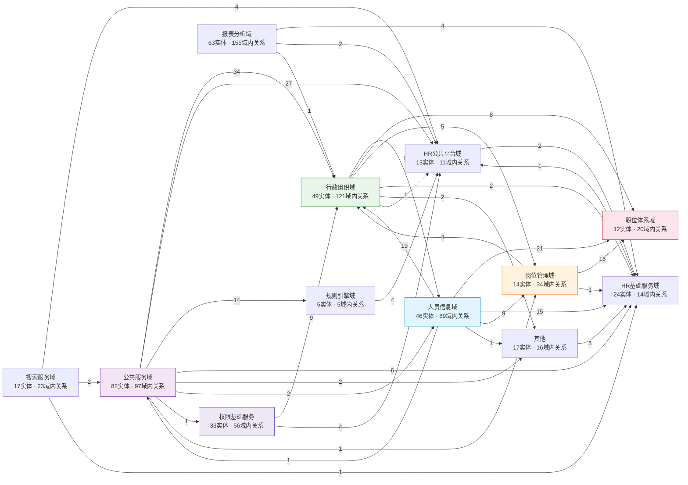

### 领域统计

| 领域 | 简称 | ER实体数 | 域内关系 | 跨域依赖 |
|------|------|----------|----------|----------|
| 公共服务域 | cs | 82 | 97 | 87 |
| 报表分析域 | rpt | 63 | 155 | 7 |
| 行政组织域 | org | 49 | 121 | 27 |
| 人员信息域 | pi | 46 | 89 | 66 |
| 权限基础服务 | perm | 33 | 56 | 13 |
| HR基础服务域 | bss | 24 | 14 | 1 |
| 其他 | other | 17 | 16 | 5 |
| 搜索服务域 | ss | 17 | 23 | 7 |
| 岗位管理域 | pos | 14 | 34 | 21 |
| HR公共平台域 | plat | 13 | 11 | 2 |
| 职位体系域 | job | 12 | 20 | 0 |
| 规则引擎域 | brm | 5 | 5 | 4 |

---

## 2. 核心实体关系图（TOP-20）

选取连接度最高的 20 个实体及其**相互之间**的关系。

```mermaid
erDiagram
    haos_adminorg }o--|| haos_adminorg : "所属行政组织, 所属公司, 所属部门, 上级行政组织"
    haos_adminorg }o--|| hbss_lawentity : "法律实体"
    haos_orgfullname }o--|| haos_adminorg : "组织, 一级组织, 十级组织, 十一级组织, 十二级组织, 十三级组织, 十四级组织, 十五级组织, 十六级组织, 十七级组织, 十八级组织, 十九级组织, 二级组织, 二十级组织, 二十一级组织, 二十二级组织, 二十三级组织, 二十四级组织, 二十五级组织, 二十六级组织, 二十七级组织, 二十八级组织, 二十九级组织, 三级组织, 三十级组织, 四级组织, 五级组织, 六级组织, 七级组织, 八级组织, 九级组织"
    haos_structure }o--|| haos_adminorg : "根组织"
    haos_structure }o--|| haos_structure : "依赖架构方案"
    hbpm_positionhr }o--|| haos_adminorg : "行政组织, 行政组织名称"
    hbpm_positionhr }o--|| hbjm_jobhr : "职位"
    hbpm_positionhr }o--|| hbpm_positionhr : "上级岗位"
    hrpi_assignment }o--|| haos_adminorg : "管理部门"
    hrpi_assignment }o--|| hrpi_assignment : "主组织分配"
    hrpi_assignment }o--|| hrpi_employee : "员工"
    hrpi_assignment }o--|| hrpi_empstage : "雇佣阶段"
    hrpi_empjobrel }o--|| haos_adminorg : "行政组织, 所属公司"
    hrpi_empjobrel }o--|| hbjm_jobhr : "职位"
    hrpi_empjobrel }o--|| hbpm_positionhr : "岗位"
    hrpi_empjobrel }o--|| hrpi_assignment : "组织分配"
    hrpi_empjobrel }o--|| hrpi_empjobrel : "调整前职级职等"
    hrpi_empjobrel }o--|| hrpi_employee : "员工"
    hrpi_empjobrel }o--|| hrpi_empstage : "雇佣阶段"
    hrpi_employee }o--|| hrpi_assignment : "组织分配"
    hrpi_employee }o--|| hrpi_employee : "前员工, 主员工"
    hrpi_empposorgrel }o--|| haos_adminorg : "行政组织, 历史行政组织, 所属公司"
    hrpi_empposorgrel }o--|| hbjm_jobhr : "职位, 历史职位"
    hrpi_empposorgrel }o--|| hbpm_positionhr : "岗位, 历史岗位"
    hrpi_empposorgrel }o--|| hrpi_assignment : "组织分配"
    hrpi_empposorgrel }o--|| hrpi_employee : "员工"
    hrpi_empposorgrel }o--|| hrpi_empstage : "雇佣阶段"
    hrpi_empstage }o--|| hrpi_employee : "员工"
    hrptmc_filter }o--|| hrptmc_anobjfield_f7 : "分析对象字段, 历史时段查询-开始日期, 历史时段查询-结束日期"
    hrptmc_filter }o--|| hrptmc_reportmanage : "报表管理"
    hrptmc_reportmanage }o--|| hrptmc_anobjtemplib : "分析对象"
    hrptmc_rowfield }o--|| hrptmc_anobjfield_f7 : "分析对象字段"
    hrptmc_rowfield }o--|| hrptmc_reportmanage : "报表管理"
    hrptmc_rowfield }o--|| hrptmc_rowfield : "数据格式, 父字段"
    hrss_searchscene }o--|| hbp_devportal_bizapp : "所属应用"
    hrss_searchscene }o--|| hbp_entityobject : "基础资料"

    haos_adminorg {
        主表 t_haos_adminorg "组织基本信息（主）"
    }
    haos_orgfullname {
        主表 t_haos_orgfullname "组织全称"
    }
    haos_structure {
        主表 t_haos_structproject "矩阵组织维护"
    }
    hbjm_jobhr {
        主表 t_hbjm_job "职位"
    }
    hbp_devportal_bizapp {
        名称 _ "HR业务应用实体"
    }
    hbp_entityobject {
        名称 _ "HR主实体对象"
    }
    hbpm_positionhr {
        主表 t_hbpm_position "岗位信息维护"
    }
    hbss_lawentity {
        主表 t_hbss_lawentity "法律实体"
    }
    hrpi_assignment {
        主表 t_hrpi_assignment "组织分配"
    }
    hrpi_empjobrel {
        主表 t_hrpi_empjobrel "职级职等"
    }
    hrpi_employee {
        主表 t_hrpi_employee "员工"
    }
    hrpi_empposorgrel {
        主表 t_hrpi_empposorgrel "任职经历"
    }
    hrpi_empstage {
        主表 t_hrpi_empstage "雇佣阶段"
    }
    hrptmc_anobjfield_f7 {
        主表 t_hrptmc_anobjqueryfield "分析对象查询字段_F7布局"
    }
    hrptmc_anobjtemplib {
        主表 t_hrptmc_analysisobject "分析对象模板库"
    }
    hrptmc_filter {
        主表 t_hrptmc_filter "筛选器设置"
    }
    hrptmc_reportmanage {
        主表 t_hrptmc_reportmanage "报表管理"
    }
    hrptmc_rowfield {
        主表 t_hrptmc_rowfield "行字段"
    }
    hrss_searchscene {
        主表 t_hrss_searchscenecfg "搜索场景"
    }
```

### 核心实体清单

| # | 实体 | 中文名 | 领域 | 连接度 |
|---|------|--------|------|--------|
| 1 | `haos_adminorg` | 组织基本信息（主） | 行政组织域 | 134 |
| 2 | `hrpi_employee` | 员工 | 人员信息域 | 57 |
| 3 | `hrptmc_anobjfield_f7` | 分析对象查询字段_F7布局 | 报表分析域 | 51 |
| 4 | `hrptmc_filter` | 筛选器设置 | 报表分析域 | 48 |
| 5 | `hbpm_positionhr` | 岗位信息维护 | 岗位管理域 | 45 |
| 6 | `haos_orgfullname` | 组织全称 | 行政组织域 | 31 |
| 7 | `hrpi_empposorgrel` | 任职经历 | 人员信息域 | 28 |
| 8 | `hrptmc_reportmanage` | 报表管理 | 报表分析域 | 28 |
| 9 | `hbjm_jobhr` | 职位 | 职位体系域 | 28 |
| 10 | `hbp_entityobject` | HR主实体对象 | HR公共平台域 | 25 |
| 11 | `hrpi_assignment` | 组织分配 | 人员信息域 | 24 |
| 12 | `hbp_devportal_bizapp` | HR业务应用实体 | HR公共平台域 | 19 |
| 13 | `hrptmc_rowfield` | 行字段 | 报表分析域 | 17 |
| 14 | `hrpi_empjobrel` | 职级职等 | 人员信息域 | 17 |
| 15 | `hrptmc_anobjtemplib` | 分析对象模板库 | 报表分析域 | 15 |
| 16 | `hrss_searchscene` | 搜索场景 | 搜索服务域 | 14 |
| 17 | `hrpi_empstage` | 雇佣阶段 | 人员信息域 | 14 |
| 18 | `haos_structure` | 矩阵组织维护 | 行政组织域 | 14 |
| 19 | `hbss_lawentity` | 法律实体 | HR基础服务域 | 13 |

---

## 3. 子域详细 ER 图

每个子域展示域内全部关系 + 到核心实体的跨域引用。
注释中 `[外部]` 表示该实体属于其他域。

### 3.1 公共服务域（82个实体，114条关系）

实体清单

| 实体 | 中文名 |
|------|--------|
| `hrcs_actassignrec` | 任务操作记录 |
| `hrcs_activity` | 活动 |
| `hrcs_activityenablerec` | 活动启动记录 |
| `hrcs_activityexception` | 异常监控 |
| `hrcs_activitygroupins` | 活动组实例 |
| `hrcs_activityins` | 活动任务实例 |
| `hrcs_activityscheme` | 活动方案 |
| `hrcs_activitytype` | 活动类型 |
| `hrcs_admingrouporg` | 行政组织范围 |
| `hrcs_bgtaskrecord` | 悬浮球任务记录 |
| `hrcs_bgtaskregister` | 悬浮球任务注册 |
| `hrcs_businessobject` | 业务对象 |
| `hrcs_bussinesstype` | 业务类型关系 |
| `hrcs_chgeventblacklist` | 变动大类黑名单 |
| `hrcs_commonvariable` | 常用变量 |
| `hrcs_contractest` | 电子合同_联调测试 |
| `hrcs_coordappcfg` | 协作应用配置 |
| `hrcs_coordbizfield` | 业务协作字段 |
| `hrcs_coordbizfieldgrp` | 业务协作字段分组 |
| `hrcs_coordbizobject` | 协作业务对象 |
| `hrcs_coordfieldrule` | 协作规则方案字段规则映射 |
| `hrcs_coordrulesch` | 协作规则方案 |
| `hrcs_coordsceneconf` | 协作场景应用配置 |
| `hrcs_coordstrategy` | 协作处理策略 |
| `hrcs_coordstrategylog` | 协作处理策略日志表 |
| `hrcs_dynaruleitem` | 规则参数项 |
| `hrcs_econtemplate` | 电子签署配置 |
| `hrcs_empstrategy` | 行政组织-员工管理关系策略设置 |
| `hrcs_esignappcfg` | 应用配置 |
| `hrcs_esigncoauth` | 企业授权管理 |
| `hrcs_esigncoseal` | 企业印章 |
| `hrcs_esignsealauth` | 印章授权 |
| `hrcs_esignsealtype` | 印章类型 |
| `hrcs_esignspmgr` | 电子签服务商管理 |
| `hrcs_essyncrecord` | 同步记录 |
| `hrcs_essyncschemecfig` | ES同步方案配置 |
| `hrcs_filterparam` | 过滤场景参数 |
| `hrcs_filterscene` | 过滤场景 |
| `hrcs_function` | 函数配置 |
| `hrcs_functiontype` | 公式函数分类 |
| `hrcs_keywordmapping` | 模板变量取值关系配置 |
| `hrcs_label` | 标签 |
| `hrcs_labeldimension` | 打标圈定维度 |
| `hrcs_labelgroup` | 标签分类 |
| `hrcs_labelobject` | 打标对象 |
| `hrcs_labelobjectrel` | 标签打标对象关联关系 |
| `hrcs_labelparam` | 标签关联因子 |
| `hrcs_labelpolicyrule` | 打标策略规则 |
| `hrcs_labelpolicytask` | 打标策略执行表 |
| `hrcs_labelscene` | 标签场景 |
| `hrcs_labelvalue` | 标签值 |
| `hrcs_labelvaluerule` | 标签值规则 |
| `hrcs_lbldimension` | 打标对象维度（废弃） |
| `hrcs_lblentityrelation` | 标签实体关联关系 |
| `hrcs_lblfieldtype` | 因子分类 |
| `hrcs_lbljoinentity` | 标签关联实体 |
| `hrcs_lblobjconfig` | 能力配置 |
| `hrcs_lblstrategy` | 打标策略 |
| `hrcs_lblstrategyfilter` | 打标策略打标范围 |
| `hrcs_orgstrategy` | 行政组织-组织管理关系策略设置 |
| `hrcs_projempstrategy` | 项目团队-员工管理关系策略设置 |
| `hrcs_projorgstrategy` | 项目团队-组织管理关系策略设置 |
| `hrcs_prompt` | 提示语配置 |
| `hrcs_promptimport` | 提示语导入实体 |
| `hrcs_promptrule` | 提示语映射 |
| `hrcs_querydynsourcelist` | HR多实体查询配置列表 |
| `hrcs_relateentity` | 关联实体 |
| `hrcs_signfile` | 电子签署文件 |
| `hrcs_signflow` | 电子签署流程 |
| `hrcs_strategy` | 基础资料_策略类型 |
| `hrcs_tplvariableconfig` | 取值对象配置 |
| `hrcs_varmappingscene` | 变量映射场景 |
| `hrcs_warncalfield` | HR预警计算字段 |
| `hrcs_warnmsgpersist` | 消息详情 |
| `hrcs_warnmsgrowdata` | 消息详情持久化行数据 |
| `hrcs_warnobjtpl` | 预警对象模板(废弃) |
| `hrcs_warnpluginservice` | 预警插件服务 |
| `hrcs_warnscene` | 预警场景 |
| `hrcs_warnsceneentityrel` | 预警对象实体关联关系 |
| `hrcs_warnscenejoinentity` | 预警场景关联实体 |
| `hrcs_warnscheme` | 预警方案 |
| `hrcs_workingplanquery` | 公共日历 |

```mermaid
erDiagram
    hrcs_actassignrec }o--|| hrcs_activityins : "活动任务实例"
    hrcs_activity }o--|| haos_adminorg : "管理行政组织"
    hrcs_activity }o--|| hrcs_activitytype : "活动类型"
    hrcs_activityenablerec }o--|| hrcs_activity : "基础资料"
    hrcs_activityexception }o--|| hrcs_activityins : "活动任务实例"
    hrcs_activitygroupins }o--|| hrcs_activity : "活动"
    hrcs_activityins }o--|| hrcs_activity : "活动"
    hrcs_activityins }o--|| hrcs_activityscheme : "活动方案"
    hrcs_activityscheme }o--|| haos_adminorg : "管理行政组织"
    hrcs_activityscheme }o--|| hrcs_activity : "请选择活动, 活动"
    hrcs_admingrouporg }o--|| haos_adminorg : "行政组织"
    hrcs_bgtaskrecord }o--|| hrcs_bgtaskregister : "悬浮球任务注册信息"
    hrcs_bussinesstype }o--|| hrcs_businessobject : "业务对象"
    hrcs_chgeventblacklist }o--|| hbp_entityobject : "协作核定单"
    hrcs_commonvariable }o--|| hrcs_varmappingscene : "所属场景"
    hrcs_contractest }o--|| hrcs_econtemplate : "电子合同模板"
    hrcs_contractest }o--|| hrpi_employee : "自然人"
    hrcs_coordappcfg }o--|| hrcs_coordbizobject : "业务对象"
    hrcs_coordappcfg }o--|| hrcs_coordrulesch : "协作规则方案"
    hrcs_coordappcfg }o--|| hrcs_coordstrategy : "协作处理策略"
    hrcs_coordbizfield }o--|| hrcs_coordbizfieldgrp : "字段分组"
    hrcs_coordbizfieldgrp }o--|| hbp_entityobject : "基础资料"
    hrcs_coordbizfieldgrp }o--|| hrcs_coordbizobject : "业务对象"
    hrcs_coordbizobject }o--|| hbp_entityobject : "基础资料"
    hrcs_coordfieldrule }o--|| hrcs_coordbizfield : "协作字段"
    hrcs_coordfieldrule }o--|| hrcs_coordrulesch : "协作规则方案"
    hrcs_coordrulesch }o--|| hrcs_coordbizobject : "业务对象"
    hrcs_coordstrategy }o--|| hrcs_coordbizobject : "业务对象"
    hrcs_coordstrategy }o--|| hrcs_coordstrategylog : "当前日志"
    hrcs_coordstrategylog }o--|| hrcs_coordstrategy : "协作规则策略"
    hrcs_dynaruleitem }o--|| hrcs_dynaruleitem : "主规则参数项"
    hrcs_econtemplate }o--|| hrcs_esignsealtype : "企业印章类型"
    hrcs_empstrategy }o--|| haos_adminorg : "参照行政组织, 分录组织团队, 源策略组织, 行政组织"
    hrcs_empstrategy }o--|| hrcs_bussinesstype : "业务类型关系"
    hrcs_empstrategy }o--|| hrcs_strategy : "默认策略, 策略"
    hrcs_esignappcfg }o--|| hrcs_esignspmgr : "电子签服务商"
    hrcs_esigncoauth }o--|| hrcs_esignappcfg : "授权应用"
    hrcs_esigncoauth }o--|| hrcs_esignspmgr : "电子签服务商"
    hrcs_esigncoseal }o--|| hrcs_esignappcfg : "应用"
    hrcs_esigncoseal }o--|| hrcs_esignsealtype : "印章类型"
    hrcs_esigncoseal }o--|| hrcs_esignspmgr : "电子签服务商"
    hrcs_esignsealauth }o--|| hrcs_esigncoseal : "电子签章"
    hrcs_esignsealauth }o--|| hrcs_esignspmgr : "电子签服务商"
    hrcs_esignspmgr }o--|| hrcs_esignappcfg : "集成应用配置"
    hrcs_essyncrecord }o--|| hrcs_essyncschemecfig : "ES同步方案"
    hrcs_essyncschemecfig }o--|| hrcs_querydynsourcelist : "查询实体"
    hrcs_filterparam }o--|| hbp_entityobject : "基础资料, 业务对象"
    hrcs_function }o--|| hrcs_functiontype : "函数分类"
    hrcs_keywordmapping }o--|| hrcs_commonvariable : "常用变量"
    hrcs_label }o--|| hrcs_labelgroup : "标签分类"
    hrcs_label }o--|| hrcs_labelobject : "打标对象"
    hrcs_labelgroup }o--|| hrcs_labelgroup : "上级"
    hrcs_labelobject }o--|| hrcs_labelobject : "所属主对象"
    hrcs_labelobjectrel }o--|| hrcs_label : "标签"
    hrcs_labelobjectrel }o--|| hrcs_labelobject : "打标对象"
    hrcs_labelparam }o--|| hrcs_label : "标签"
    hrcs_labelparam }o--|| hrcs_labeldimension : "标签关联因子"
    hrcs_labelparam }o--|| hrcs_labelobject : "打签对象"
    hrcs_labelparam }o--|| hrcs_labelvalue : "标签值"
    hrcs_labelpolicyrule }o--|| hrcs_label : "标签"
    hrcs_labelpolicyrule }o--|| hrcs_labelvalue : "标签值"
    hrcs_labelpolicyrule }o--|| hrcs_lblstrategy : "打标策略"
    hrcs_labelpolicytask }o--|| hrcs_lblstrategy : "打标策略"
    hrcs_labelscene }o--|| hrcs_label : "标签"
    hrcs_labelscene }o--|| hrcs_labelobject : "关联打标对象"
    hrcs_labelvalue }o--|| hrcs_label : "标签"
    hrcs_labelvaluerule }o--|| hrcs_labelobject : "打标对象"
    hrcs_labelvaluerule }o--|| hrcs_labelvalue : "标签值"
    hrcs_lbldimension }o--|| hrcs_labelobject : "打标对象"
    hrcs_lblentityrelation }o--|| hrcs_labelobject : "打标对象"
    hrcs_lblentityrelation }o--|| hrcs_lbljoinentity : "左关联实体ID, 右关联实体ID"
    hrcs_lblfieldtype }o--|| hrcs_labelobject : "打标对象"
    hrcs_lbljoinentity }o--|| hrcs_labelobject : "打标对象"
    hrcs_lblobjconfig }o--|| hrcs_labeldimension : "字段名, 字段名称"
    hrcs_lblobjconfig }o--|| hrcs_labelobject : "打标对象"
    hrcs_lblstrategy }o--|| hrcs_label : "标签"
    hrcs_lblstrategy }o--|| hrcs_labelobject : "打标对象"
    hrcs_lblstrategy }o--|| hrcs_labelvalue : "标签值"
    hrcs_lblstrategyfilter }o--|| hrcs_labeldimension : "因子"
    hrcs_lblstrategyfilter }o--|| hrcs_lblstrategy : "打标策略"
    hrcs_orgstrategy }o--|| haos_adminorg : "参照行政组织, 分录行政组织, 源策略组织, 行政组织"
    hrcs_orgstrategy }o--|| hrcs_bussinesstype : "业务类型关系"
    hrcs_orgstrategy }o--|| hrcs_strategy : "默认策略, 策略"
    hrcs_projempstrategy }o--|| haos_adminorg : "所属行政组织, 参照行政组织/项目团队, 分录组织团队, 源策略组织, 组织团队"
    hrcs_projempstrategy }o--|| hrcs_bussinesstype : "业务类型关系"
    hrcs_projempstrategy }o--|| hrcs_strategy : "默认策略, 策略"
    hrcs_projorgstrategy }o--|| haos_adminorg : "所属行政组织, 参照行政组织/项目团队, 分录组织团队, 源策略组织, 组织团队"
    hrcs_projorgstrategy }o--|| hrcs_bussinesstype : "业务类型关系"
    hrcs_projorgstrategy }o--|| hrcs_strategy : "默认策略, 策略"
    hrcs_prompt }o--|| hbp_entityobject : "业务对象"
    hrcs_promptimport }o--|| hbp_entityobject : "实体"
    hrcs_promptrule }o--|| hbp_entityobject : "页面"
    hrcs_promptrule }o--|| hrcs_prompt : "提示语"
    hrcs_relateentity }o--|| hbp_entityobject : "实体, 主实体"
    hrcs_signfile }o--|| hrcs_esignappcfg : "签署配置信息"
    hrcs_signflow }o--|| hrcs_econtemplate : "电子合同模板"
    hrcs_signflow }o--|| hrcs_esignappcfg : "签署配置信息"
    hrcs_signflow }o--|| hrpi_employee : "自然人"
    hrcs_strategy }o--|| hrcs_bussinesstype : "业务类型"
    hrcs_tplvariableconfig }o--|| hbp_entityobject : "主实体, 父业务对象, 子业务对象"
    hrcs_varmappingscene }o--|| hbp_entityobject : "取值对象主实体"
    hrcs_warncalfield }o--|| hrcs_warncalfield : "引用计算字段"
    hrcs_warncalfield }o--|| hrcs_warnpluginservice : "插件服务"
    hrcs_warnmsgpersist }o--|| hrcs_warnscheme : "预警方案"
    hrcs_warnmsgrowdata }o--|| hrcs_warnmsgpersist : "消息详情"
    hrcs_warnobjtpl }o--|| hbp_entityobject : "来源业务功能"
    hrcs_warnscene }o--|| hbp_entityobject : "处理预警业务功能"
    hrcs_warnscene }o--|| hrcs_warnobjtpl : "预警对象(废弃)"
    hrcs_warnsceneentityrel }o--|| hrcs_warnscenejoinentity : "实体ID, 关联实体ID"
    hrcs_warnscheme }o--|| haos_adminorg : "所属行政组织, 行政组织"
    hrcs_warnscheme }o--|| hbp_entityobject : "业务对象"
    hrcs_warnscheme }o--|| hbpm_positionhr : "岗位"
    hrcs_warnscheme }o--|| hrcs_warnscene : "预警场景"
    hrpi_empposorgrel }o--|| hrcs_workingplanquery : "工作日历"

    haos_adminorg {
        主表 t_haos_adminorg "组织基本信息（主） [外部]"
    }
    hbp_entityobject {
        名称 _ "HR主实体对象 [外部]"
    }
    hbpm_positionhr {
        主表 t_hbpm_position "岗位信息维护 [外部]"
    }
    hrcs_actassignrec {
        主表 t_hrcs_actoprec "任务操作记录"
    }
    hrcs_activity {
        主表 t_hrcs_activity "活动"
    }
    hrcs_activityenablerec {
        主表 t_hrcs_activityenablerec "活动启动记录"
    }
    hrcs_activityexception {
        主表 t_hrcs_activityexception "异常监控"
    }
    hrcs_activitygroupins {
        主表 t_hrcs_activitygroupins "活动组实例"
    }
    hrcs_activityins {
        主表 t_hrcs_activityins "活动任务实例"
    }
    hrcs_activityscheme {
        主表 t_hrcs_actscheme "活动方案"
    }
    hrcs_activitytype {
        主表 t_hrcs_activitytype "活动类型"
    }
    hrcs_admingrouporg {
        主表 t_hrcs_admingrouporg "行政组织范围"
    }
    hrcs_bgtaskrecord {
        主表 t_hrcs_bgtaskrecord "悬浮球任务记录"
    }
    hrcs_bgtaskregister {
        主表 t_hrcs_bgtaskregister "悬浮球任务注册"
    }
    hrcs_businessobject {
        主表 t_hbss_bussinessobject "业务对象"
    }
    hrcs_bussinesstype {
        主表 t_hbss_bussinesstype "业务类型关系"
    }
    hrcs_chgeventblacklist {
        主表 t_hrcs_chgeventblacklist "变动大类黑名单"
    }
    hrcs_commonvariable {
        主表 t_hrcs_commonvariable "常用变量"
    }
    hrcs_contractest {
        主表 t_hrcs_contract "电子合同_联调测试"
    }
    hrcs_coordappcfg {
        主表 t_hrcs_coordapplyconf "协作应用配置"
    }
    hrcs_coordbizfield {
        主表 t_hrcs_coordbizfield "业务协作字段"
    }
    hrcs_coordbizfieldgrp {
        主表 t_hrcs_coordbizfieldgrp "业务协作字段分组"
    }
    hrcs_coordbizobject {
        主表 t_hrcs_coordbizobject "协作业务对象"
    }
    hrcs_coordfieldrule {
        主表 t_hrcs_coordfieldrule "协作规则方案字段规则映射"
    }
    hrcs_coordrulesch {
        主表 t_hrcs_coordrulesch "协作规则方案"
    }
    hrcs_coordstrategy {
        主表 t_hrcs_coordstrategy "协作处理策略"
    }
    hrcs_coordstrategylog {
        主表 t_hrcs_coordstrategylog "协作处理策略日志表"
    }
    hrcs_dynaruleitem {
        主表 t_hrcs_dynaruleitem "规则参数项"
    }
    hrcs_econtemplate {
        主表 t_hrcs_econtemplate "电子签署配置"
    }
    hrcs_empstrategy {
        主表 t_hbss_empstrategy "行政组织-员工管理关系策略设置"
    }
    hrcs_esignappcfg {
        主表 t_hrcs_esignappcfg "应用配置"
    }
    hrcs_esigncoauth {
        主表 t_hrcs_esigncomauth "企业授权管理"
    }
    hrcs_esigncoseal {
        主表 t_hrcs_esigncoseal "企业印章"
    }
    hrcs_esignsealauth {
        主表 t_hrcs_esignsealauth "印章授权"
    }
    hrcs_esignsealtype {
        主表 t_hrcs_esignsealtype "印章类型"
    }
    hrcs_esignspmgr {
        主表 t_hrcs_esignspmgr "电子签服务商管理"
    }
    hrcs_essyncrecord {
        主表 t_hrcs_essyncrecord "同步记录"
    }
    hrcs_essyncschemecfig {
        主表 t_hrcs_essyncschemeconf "ES同步方案配置"
    }
    hrcs_filterparam {
        主表 t_hrcs_filterparam "过滤场景参数"
    }
    hrcs_function {
        主表 t_hrcs_function "函数配置"
    }
    hrcs_functiontype {
        主表 t_hrcs_functiontype "公式函数分类"
    }
    hrcs_keywordmapping {
        主表 t_hrcs_keywordmapping "模板变量取值关系配置"
    }
    hrcs_label {
        主表 t_hrcs_label "标签"
    }
    hrcs_labeldimension {
        主表 t_hrcs_lblobjectfield "打标圈定维度"
    }
    hrcs_labelgroup {
        主表 t_hrcs_labelgroup "标签分类"
    }
    hrcs_labelobject {
        主表 t_hrcs_labelobject "打标对象"
    }
    hrcs_labelobjectrel {
        主表 t_hrcs_labelobjectrelnew "标签打标对象关联关系"
    }
    hrcs_labelparam {
        主表 t_hrcs_labelparam "标签关联因子"
    }
    hrcs_labelpolicyrule {
        主表 t_hrcs_labelpolicyrule "打标策略规则"
    }
    hrcs_labelpolicytask {
        主表 t_hrcs_labelpolicytask "打标策略执行表"
    }
    hrcs_labelscene {
        主表 t_hrcs_labelscene "标签场景"
    }
    hrcs_labelvalue {
        主表 t_hrcs_labelvaluenew "标签值"
    }
    hrcs_labelvaluerule {
        主表 t_hrcs_labelvaluerule "标签值规则"
    }
    hrcs_lbldimension {
        主表 t_hrcs_lbldimension "打标对象维度（废弃）"
    }
    hrcs_lblentityrelation {
        主表 t_hrcs_lblentityrelation "标签实体关联关系"
    }
    hrcs_lblfieldtype {
        主表 t_hrcs_lblfieldtype "因子分类"
    }
    hrcs_lbljoinentity {
        主表 t_hrcs_lbljoinentity "标签关联实体"
    }
    hrcs_lblobjconfig {
        主表 t_hrcs_lblobjconfig "能力配置"
    }
    hrcs_lblstrategy {
        主表 t_hrcs_labelpolicy "打标策略"
    }
    hrcs_lblstrategyfilter {
        主表 t_hrcs_lblpolicyfilter "打标策略打标范围"
    }
    hrcs_orgstrategy {
        主表 t_hbss_orgstrategy "行政组织-组织管理关系策略设置"
    }
    hrcs_projempstrategy {
        主表 t_hrcs_projempstrategy "项目团队-员工管理关系策略设置"
    }
    hrcs_projorgstrategy {
        主表 t_hrcs_projorgstrategy "项目团队-组织管理关系策略设置"
    }
    hrcs_prompt {
        主表 t_hrcs_prompt "提示语配置"
    }
    hrcs_promptimport {
        主表 t_hrcs_promptimport "提示语导入实体"
    }
    hrcs_promptrule {
        主表 t_hrcs_promptrule "提示语映射"
    }
    hrcs_querydynsourcelist {
        主表 t_meta_entitydesign "HR多实体查询配置列表"
    }
    hrcs_relateentity {
        主表 t_hrcs_relateentity "关联实体"
    }
    hrcs_signfile {
        主表 t_hrcs_signfile "电子签署文件"
    }
    hrcs_signflow {
        主表 t_hrcs_signflow "电子签署流程"
    }
    hrcs_strategy {
        主表 t_hbss_strategy "基础资料_策略类型"
    }
    hrcs_tplvariableconfig {
        主表 t_hrcs_tplvariableconfig "取值对象配置"
    }
    hrcs_varmappingscene {
        主表 t_hrcs_varmappingscene "变量映射场景"
    }
    hrcs_warncalfield {
        主表 t_hrcs_warncalfield "HR预警计算字段"
    }
    hrcs_warnmsgpersist {
        主表 t_hrcs_warnmsgpersist "消息详情"
    }
    hrcs_warnmsgrowdata {
        主表 t_hrcs_warnmsgrowdata "消息详情持久化行数据"
    }
    hrcs_warnobjtpl {
        主表 t_hrcs_warnobjecttpl "预警对象模板(废弃)"
    }
    hrcs_warnpluginservice {
        主表 t_hrcs_warnpluginservice "预警插件服务"
    }
    hrcs_warnscene {
        主表 t_hrcs_warnscene "预警场景"
    }
    hrcs_warnsceneentityrel {
        主表 t_hrcs_warnobjectrelation "预警对象实体关联关系"
    }
    hrcs_warnscenejoinentity {
        主表 t_hrcs_warnobjectentity "预警场景关联实体"
    }
    hrcs_warnscheme {
        主表 t_hrcs_warnplan "预警方案"
    }
    hrcs_workingplanquery {
        名称 _ "公共日历"
    }
    hrpi_employee {
        主表 t_hrpi_employee "员工 [外部]"
    }
    hrpi_empposorgrel {
        主表 t_hrpi_empposorgrel "任职经历 [外部]"
    }
```

### 3.2 报表分析域（63个实体，107条关系）

实体清单

| 实体 | 中文名 |
|------|--------|
| `hrptmc_algorithmcol` | 汇总列 |
| `hrptmc_anobjentityrel` | 分析对象实体关联关系 |
| `hrptmc_anobjextract` | 分析对象数据抽取配置存储 |
| `hrptmc_anobjfield_f7` | 分析对象查询字段_F7布局 |
| `hrptmc_anobjfieldmap` | 分析对象落地字段映射 |
| `hrptmc_anobjgroupfield` | 分析对象分组赋值 |
| `hrptmc_anobjjoinentity` | 分析对象关联实体 |
| `hrptmc_anobjpivot` | 分析对象行列转置信息 |
| `hrptmc_anobjsidebar` | 分析对象数据加工侧边栏 |
| `hrptmc_anobjtemplib` | 分析对象模板库 |
| `hrptmc_busiservice` | 业务服务 |
| `hrptmc_calculatefield` | 计算字段 |
| `hrptmc_calmaxlen` | 计算字段最大长度配置表 |
| `hrptmc_colcustomsort` | 自定义排序（废弃） |
| `hrptmc_colfield` | 列字段 |
| `hrptmc_commonsort` | 通用排序 |
| `hrptmc_customsort` | 自定义排序 |
| `hrptmc_datastoreinfo` | 数据落地信息查询 |
| `hrptmc_dimensioncount` | 维度计数（废弃） |
| `hrptmc_dimmap` | 维度映射 |
| `hrptmc_dispscmchg` | 显示方案变更通知 |
| `hrptmc_esindex` | es索引 |
| `hrptmc_esmapping` | es映射 |
| `hrptmc_filesourcetable` | 文件数据源物理表信息 |
| `hrptmc_filter` | 筛选器设置 |
| `hrptmc_filterextfield` | 筛选器二开插件字段 |
| `hrptmc_mysubscribe` | 我的订阅 |
| `hrptmc_permrule` | 分析对象数据控权规则 |
| `hrptmc_preindex` | 预置指标 |
| `hrptmc_publishmenu` | 报表发布菜单 |
| `hrptmc_queryscheme` | 报表高级查询方案 |
| `hrptmc_queryscmchg` | 高级查询方案变更通知 |
| `hrptmc_reflineconf` | 图表参考线配置 |
| `hrptmc_reportconfig` | 报表配置 |
| `hrptmc_reportjump` | 报表跳转配置 |
| `hrptmc_reportmanage` | 报表管理 |
| `hrptmc_reportmapping` | 报表抽取映射 |
| `hrptmc_reportmark` | 报表说明配置 |
| `hrptmc_reportpreindex` | 报表关联预置指标 |
| `hrptmc_rowcustomsort` | 自定义排序（废弃） |
| `hrptmc_rowfield` | 行字段 |
| `hrptmc_rptcomref` | 报表通用排序关系 |
| `hrptmc_rptdispscm` | 显示方案配置 |
| `hrptmc_rptdispscmcol` | 报表显示方案配置_列 |
| `hrptmc_rptdispscmidx` | 报表显示方案配置_指标 |
| `hrptmc_rptdispscmrow` | 报表显示方案配置_行 |
| `hrptmc_rptdisscmety` | 显示方案配置 |
| `hrptmc_rptmarkcontent` | 报表说明内容 |
| `hrptmc_selparam` | 参数选择 |
| `hrptmc_share_filterscheme` | 报表共享过滤方案 |
| `hrptmc_sharefilterrange` | 分享报表筛选器选择范围 |
| `hrptmc_sharerecord` | 分享记录 |
| `hrptmc_splitdate` | 日期字段拆分粒度表 |
| `hrptmc_subscriberecord` | 订阅记录 |
| `hrptmc_syncpolicy` | 同步策略 |
| `hrptmc_unitestentity01` | 报表单元测试实体01 |
| `hrptmc_unitestentity02` | 报表单元测试实体02 |
| `hrptmc_userdispscm` | 显示方案配置 |
| `hrptmc_virtentfields` | 虚拟对象字段 |
| `hrptmc_virtentityclass` | 虚拟对象处理类 |
| `hrptmc_virtualentity` | 虚拟对象 |
| `hrptmc_virtualfieldgroup` | 虚实体字段分组 |
| `hrptmc_workreport` | 工作表 |

```mermaid
erDiagram
    hrptmc_algorithmcol }o--|| hrptmc_reportconfig : "报表配置"
    hrptmc_anobjentityrel }o--|| hrptmc_anobjjoinentity : "实体ID, 关联实体ID"
    hrptmc_anobjentityrel }o--|| hrptmc_anobjtemplib : "分析对象id"
    hrptmc_anobjextract }o--|| hrptmc_anobjtemplib : "分析对象"
    hrptmc_anobjfieldmap }o--|| hrptmc_anobjtemplib : "分析对象"
    hrptmc_anobjgroupfield }o--|| hrptmc_anobjfield_f7 : "参照实体字段"
    hrptmc_anobjgroupfield }o--|| hrptmc_anobjtemplib : "分析对象"
    hrptmc_anobjgroupfield }o--|| hrptmc_calculatefield : "参照计算字段"
    hrptmc_anobjjoinentity }o--|| hrptmc_anobjtemplib : "分析对象"
    hrptmc_anobjpivot }o--|| hrptmc_anobjtemplib : "分析对象"
    hrptmc_anobjsidebar }o--|| hrptmc_anobjgroupfield : "分组赋值字段"
    hrptmc_anobjsidebar }o--|| hrptmc_anobjtemplib : "分析对象"
    hrptmc_calculatefield }o--|| hrptmc_anobjtemplib : "分析对象"
    hrptmc_calculatefield }o--|| hrptmc_calculatefield : "引用计算字段"
    hrptmc_calculatefield }o--|| hrptmc_preindex : "引用预置指标"
    hrptmc_calculatefield }o--|| hrptmc_reportmanage : "报表"
    hrptmc_calmaxlen }o--|| hrptmc_anobjtemplib : "分析对象"
    hrptmc_calmaxlen }o--|| hrptmc_calculatefield : "计算字段"
    hrptmc_colcustomsort }o--|| hrptmc_colfield : "列字段"
    hrptmc_colfield }o--|| hrptmc_anobjfield_f7 : "分析对象字段"
    hrptmc_colfield }o--|| hrptmc_calculatefield : "计算指标字段"
    hrptmc_colfield }o--|| hrptmc_reportmanage : "报表管理"
    hrptmc_colfield }o--|| hrptmc_workreport : "工作表"
    hrptmc_customsort }o--|| hrptmc_reportmanage : "报表"
    hrptmc_customsort }o--|| hrptmc_workreport : "工作表"
    hrptmc_datastoreinfo }o--|| hrptmc_anobjtemplib : "分析对象"
    hrptmc_datastoreinfo }o--|| hrptmc_reportmanage : "报表"
    hrptmc_dimensioncount }o--|| hrptmc_anobjfield_f7 : "分析对象查询字段"
    hrptmc_dimensioncount }o--|| hrptmc_reportmanage : "报表管理"
    hrptmc_dimmap }o--|| hrptmc_preindex : "预置指标"
    hrptmc_dimmap }o--|| hrptmc_reportmanage : "报表"
    hrptmc_dimmap }o--|| hrptmc_workreport : "工作表"
    hrptmc_dispscmchg }o--|| hrptmc_reportmanage : "报表ID"
    hrptmc_dispscmchg }o--|| hrptmc_workreport : "工作表"
    hrptmc_esmapping }o--|| hrptmc_esindex : "es索引"
    hrptmc_filesourcetable }o--|| hrptmc_anobjtemplib : "分析对象"
    hrptmc_filesourcetable }o--|| hrptmc_virtualentity : "虚拟对象"
    hrptmc_filter }o--|| hrptmc_anobjfield_f7 : "分析对象字段, 历史时段查询-开始日期, 历史时段查询-结束日期"
    hrptmc_filter }o--|| hrptmc_anobjgroupfield : "分组赋值字段"
    hrptmc_filter }o--|| hrptmc_reportmanage : "报表管理"
    hrptmc_filter }o--|| hrptmc_splitdate : "日期拆分字段"
    hrptmc_filterextfield }o--|| hrptmc_reportmanage : "报表"
    hrptmc_mysubscribe }o--|| hrptmc_esindex : "es索引"
    hrptmc_mysubscribe }o--|| hrptmc_subscriberecord : "订阅记录"
    hrptmc_permrule }o--|| hbp_entityobject : "参照控权对象"
    hrptmc_permrule }o--|| hrptmc_anobjfield_f7 : "分析对象字段"
    hrptmc_permrule }o--|| hrptmc_anobjtemplib : "分析对象"
    hrptmc_preindex }o--|| hrptmc_anobjtemplib : "分析对象"
    hrptmc_preindex }o--|| hrptmc_busiservice : "服务"
    hrptmc_preindex }o--|| hrptmc_selparam : "参数选择"
    hrptmc_publishmenu }o--|| hrptmc_reportmanage : "报表管理"
    hrptmc_queryscheme }o--|| hrptmc_reportmanage : "方案所属的报表"
    hrptmc_queryscmchg }o--|| hrptmc_queryscheme : "方案id"
    hrptmc_queryscmchg }o--|| hrptmc_reportmanage : "报表ID"
    hrptmc_reflineconf }o--|| hrptmc_reportmanage : "报表"
    hrptmc_reflineconf }o--|| hrptmc_workreport : "工作表"
    hrptmc_reportconfig }o--|| hrptmc_reportmanage : "报表管理"
    hrptmc_reportconfig }o--|| hrptmc_workreport : "工作表"
    hrptmc_reportjump }o--|| hrptmc_reportmanage : "跳转报表, 报表"
    hrptmc_reportjump }o--|| hrptmc_workreport : "工作表"
    hrptmc_reportmanage }o--|| hrptmc_anobjtemplib : "分析对象"
    hrptmc_reportmapping }o--|| hrptmc_reportmanage : "报表"
    hrptmc_reportmark }o--|| hrptmc_reportmanage : "报表管理"
    hrptmc_reportpreindex }o--|| hrptmc_preindex : "预置指标"
    hrptmc_reportpreindex }o--|| hrptmc_reportmanage : "报表"
    hrptmc_rowcustomsort }o--|| hrptmc_rowfield : "行字段"
    hrptmc_rowfield }o--|| hrptmc_anobjfield_f7 : "分析对象字段"
    hrptmc_rowfield }o--|| hrptmc_calculatefield : "计算指标字段"
    hrptmc_rowfield }o--|| hrptmc_preindex : "预置指标字段"
    hrptmc_rowfield }o--|| hrptmc_reportmanage : "报表管理"
    hrptmc_rowfield }o--|| hrptmc_rowfield : "数据格式, 父字段"
    hrptmc_rowfield }o--|| hrptmc_workreport : "工作表"
    hrptmc_rptcomref }o--|| hrptmc_commonsort : "通用排序"
    hrptmc_rptcomref }o--|| hrptmc_reportmanage : "报表管理"
    hrptmc_rptcomref }o--|| hrptmc_workreport : "工作表"
    hrptmc_rptdispscm }o--|| hrptmc_reportmanage : "报表管理"
    hrptmc_rptdispscm }o--|| hrptmc_workreport : "工作表"
    hrptmc_rptdispscmcol }o--|| hrptmc_colfield : "列字段"
    hrptmc_rptdispscmcol }o--|| hrptmc_rptdisscmety : "报表显示方案"
    hrptmc_rptdispscmidx }o--|| hrptmc_rowfield : "行字段"
    hrptmc_rptdispscmidx }o--|| hrptmc_rptdisscmety : "报表显示方案"
    hrptmc_rptdispscmrow }o--|| hrptmc_rowfield : "行字段"
    hrptmc_rptdispscmrow }o--|| hrptmc_rptdisscmety : "报表显示方案"
    hrptmc_rptdisscmety }o--|| hrptmc_colfield : "列维度"
    hrptmc_rptdisscmety }o--|| hrptmc_rowfield : "指标, 父行维度, 行维度"
    hrptmc_rptdisscmety }o--|| hrptmc_rptdispscm : "显示方案"
    hrptmc_rptmarkcontent }o--|| hrptmc_reportmark : "报表说明"
    hrptmc_share_filterscheme }o--|| hrptmc_queryscheme : "方案名称"
    hrptmc_share_filterscheme }o--|| hrptmc_reportmanage : "方案所属的报表"
    hrptmc_sharefilterrange }o--|| hrptmc_sharerecord : "分享记录"
    hrptmc_sharefilterrange }o--|| hrptmc_userdispscm : "用户显示方案"
    hrptmc_sharerecord }o--|| hrptmc_esindex : "es索引"
    hrptmc_sharerecord }o--|| hrptmc_subscriberecord : "报表订阅"
    hrptmc_splitdate }o--|| hrptmc_anobjfield_f7 : "分析对象字段"
    hrptmc_splitdate }o--|| hrptmc_reportmanage : "报表管理"
    hrptmc_subscriberecord }o--|| hrptmc_reportmanage : "报表"
    hrptmc_syncpolicy }o--|| hrptmc_anobjtemplib : "分析对象"
    hrptmc_unitestentity01 }o--|| haos_adminorg : "行政组织"
    hrptmc_unitestentity02 }o--|| hrptmc_unitestentity01 : "报表单元测试实体01"
    hrptmc_userdispscm }o--|| hrptmc_colfield : "列维度"
    hrptmc_userdispscm }o--|| hrptmc_reportmanage : "方案所属的报表"
    hrptmc_userdispscm }o--|| hrptmc_rowfield : "指标, 行维度"
    hrptmc_userdispscm }o--|| hrptmc_workreport : "工作表"
    hrptmc_virtentfields }o--|| hrptmc_virtualfieldgroup : "字段分组"
    hrptmc_virtualentity }o--|| hrptmc_virtentityclass : "虚拟对象处理类"
    hrptmc_virtualentity }o--|| hrptmc_virtualfieldgroup : "字段分组"
    hrptmc_workreport }o--|| hrptmc_reportmanage : "报表管理"

    haos_adminorg {
        主表 t_haos_adminorg "组织基本信息（主） [外部]"
    }
    hbp_entityobject {
        名称 _ "HR主实体对象 [外部]"
    }
    hrptmc_algorithmcol {
        主表 t_hrptmc_algorithmcol "汇总列"
    }
    hrptmc_anobjentityrel {
        主表 t_hrptmc_anobjentjoinrel "分析对象实体关联关系"
    }
    hrptmc_anobjextract {
        主表 t_hrptmc_anobjextract "分析对象数据抽取配置存储"
    }
    hrptmc_anobjfield_f7 {
        主表 t_hrptmc_anobjqueryfield "分析对象查询字段_F7布局"
    }
    hrptmc_anobjfieldmap {
        主表 t_hrptmc_anobjfieldmap "分析对象落地字段映射"
    }
    hrptmc_anobjgroupfield {
        主表 t_hrptmc_angroupfield "分析对象分组赋值"
    }
    hrptmc_anobjjoinentity {
        主表 t_hrptmc_anobjjoinentity "分析对象关联实体"
    }
    hrptmc_anobjpivot {
        主表 t_hrptmc_anobjpivot "分析对象行列转置信息"
    }
    hrptmc_anobjsidebar {
        主表 t_hrptmc_anobjsidebar "分析对象数据加工侧边栏"
    }
    hrptmc_anobjtemplib {
        主表 t_hrptmc_analysisobject "分析对象模板库"
    }
    hrptmc_busiservice {
        主表 t_hrptmc_busiservice "业务服务"
    }
    hrptmc_calculatefield {
        主表 t_hrptmc_calculatefield "计算字段"
    }
    hrptmc_calmaxlen {
        主表 t_hrptmc_calmaxlen "计算字段最大长度配置表"
    }
    hrptmc_colcustomsort {
        主表 t_hrptmc_colcustomsort "自定义排序（废弃）"
    }
    hrptmc_colfield {
        主表 t_hrptmc_colfield "列字段"
    }
    hrptmc_commonsort {
        主表 t_hrptmc_commonsort "通用排序"
    }
    hrptmc_customsort {
        主表 t_hrptmc_customsort "自定义排序"
    }
    hrptmc_datastoreinfo {
        主表 t_hrptmc_datastoreinfo "数据落地信息查询"
    }
    hrptmc_dimensioncount {
        主表 t_hrptmc_dimensioncount "维度计数（废弃）"
    }
    hrptmc_dimmap {
        主表 t_hrptmc_dimmap "维度映射"
    }
    hrptmc_dispscmchg {
        主表 t_hrptmc_dispscmchg "显示方案变更通知"
    }
    hrptmc_esindex {
        主表 t_hrptmc_esindex "es索引"
    }
    hrptmc_esmapping {
        主表 t_hrptmc_esmapping "es映射"
    }
    hrptmc_filesourcetable {
        主表 t_hrptmc_fstable "文件数据源物理表信息"
    }
    hrptmc_filter {
        主表 t_hrptmc_filter "筛选器设置"
    }
    hrptmc_filterextfield {
        主表 t_hrptmc_filterextfield "筛选器二开插件字段"
    }
    hrptmc_mysubscribe {
        主表 t_hrptmc_mysubscribe "我的订阅"
    }
    hrptmc_permrule {
        主表 t_hrptmc_permrule "分析对象数据控权规则"
    }
    hrptmc_preindex {
        主表 t_hrptmc_preindex "预置指标"
    }
    hrptmc_publishmenu {
        主表 t_hrptmc_publishmenu "报表发布菜单"
    }
    hrptmc_queryscheme {
        主表 t_hrptmc_queryscheme "报表高级查询方案"
    }
    hrptmc_queryscmchg {
        主表 t_hrptmc_queryscmchg "高级查询方案变更通知"
    }
    hrptmc_reflineconf {
        主表 t_hrptmc_reflineconf "图表参考线配置"
    }
    hrptmc_reportconfig {
        主表 t_hrptmc_reportconfig "报表配置"
    }
    hrptmc_reportjump {
        主表 t_hrptmc_rptjump "报表跳转配置"
    }
    hrptmc_reportmanage {
        主表 t_hrptmc_reportmanage "报表管理"
    }
    hrptmc_reportmapping {
        主表 t_hrptmc_reportmapping "报表抽取映射"
    }
    hrptmc_reportmark {
        主表 t_hrptmc_reportmark "报表说明配置"
    }
    hrptmc_reportpreindex {
        主表 t_hrptmc_reportpreindex "报表关联预置指标"
    }
    hrptmc_rowcustomsort {
        主表 t_hrptmc_rowcustomsort "自定义排序（废弃）"
    }
    hrptmc_rowfield {
        主表 t_hrptmc_rowfield "行字段"
    }
    hrptmc_rptcomref {
        主表 t_hrptmc_rptcomref "报表通用排序关系"
    }
    hrptmc_rptdispscm {
        主表 t_hrptmc_rptdispscm "显示方案配置"
    }
    hrptmc_rptdispscmcol {
        主表 t_hrptmc_rptdispscmcol "报表显示方案配置_列"
    }
    hrptmc_rptdispscmidx {
        主表 t_hrptmc_rptdispscmidx "报表显示方案配置_指标"
    }
    hrptmc_rptdispscmrow {
        主表 t_hrptmc_rptdispscmrow "报表显示方案配置_行"
    }
    hrptmc_rptdisscmety {
        主表 t_hrptmc_rptdispscmety "显示方案配置"
    }
    hrptmc_rptmarkcontent {
        主表 t_hrptmc_rptmarkcontent "报表说明内容"
    }
    hrptmc_selparam {
        主表 t_hrptmc_busisrvparam "参数选择"
    }
    hrptmc_share_filterscheme {
        主表 t_hrptmc_sharescheme "报表共享过滤方案"
    }
    hrptmc_sharefilterrange {
        主表 t_hrptmc_sharefilterrange "分享报表筛选器选择范围"
    }
    hrptmc_sharerecord {
        主表 t_hrptmc_sharerecord "分享记录"
    }
    hrptmc_splitdate {
        主表 t_hrptmc_splitdate "日期字段拆分粒度表"
    }
    hrptmc_subscriberecord {
        主表 t_hrptmc_subscriberecord "订阅记录"
    }
    hrptmc_syncpolicy {
        主表 t_hrptmc_syncpolicy "同步策略"
    }
    hrptmc_unitestentity01 {
        主表 t_hrptmc_unitestentity01 "报表单元测试实体01"
    }
    hrptmc_unitestentity02 {
        主表 t_hrptmc_unitestentity02 "报表单元测试实体02"
    }
    hrptmc_userdispscm {
        主表 t_hrptmc_userdispscm "显示方案配置"
    }
    hrptmc_virtentfields {
        主表 t_hrptmc_virtentfields "虚拟对象字段"
    }
    hrptmc_virtentityclass {
        主表 t_hrptmc_virtentityclass "虚拟对象处理类"
    }
    hrptmc_virtualentity {
        主表 t_hrptmc_virtualentity "虚拟对象"
    }
    hrptmc_virtualfieldgroup {
        主表 t_hrptmc_vfieldgroup "虚实体字段分组"
    }
    hrptmc_workreport {
        主表 t_hrptmc_workreport "工作表"
    }
```

### 3.3 行政组织域（49个实体，96条关系）

实体清单

| 实体 | 中文名 |
|------|--------|
| `haos_adminorg` | 组织基本信息（主） |
| `haos_adminorg_msgdetail` | 组织消息明细 |
| `haos_adminorgcompany` | 公司信息 |
| `haos_adminorgfunction` | 行政组织职能 |
| `haos_adminorglayer` | 管理层级 |
| `haos_adminorgstruct` | 组织结构信息 |
| `haos_adminorgtype` | 行政组织类型 |
| `haos_adminorgtypestd` | 行政组织类型归属 |
| `haos_changeoperat` | 变动操作 |
| `haos_changescene` | 行政组织变动场景 |
| `haos_changescenesub` | 场景子类 |
| `haos_changesource` | 变动来源 |
| `haos_chargeperson` | 部门负责人 |
| `haos_combdimension` | 组合维度 |
| `haos_companytype` | 公司类型 |
| `haos_dimstaffreport` | 编制报表-维度编制 |
| `haos_dutyorgdetail` | 责任组织明细 |
| `haos_dutyorgdetailhis` | 责任组织明细历史 |
| `haos_muldimendetail` | 多维控编明细 |
| `haos_muldimendetailhis` | 多维控编明细历史 |
| `haos_muldimusestaff` | 多维占编明细 |
| `haos_orgchangereason` | 行政组织变动原因 |
| `haos_orgchangetype` | 变动类型 |
| `haos_orgfullname` | 组织全称 |
| `haos_orgpersonstaffinfo` | 占编员工维度信息 |
| `haos_orgstaffreport` | 编制报表-组织编制 |
| `haos_orgteamcooprel` | 组织协作关系 |
| `haos_orgusestaffdetail` | 组织占编明细 |
| `haos_othemproleorgrel` | 其他形态组织-人员角色关系 |
| `haos_othrole` | 其他形态组织-角色 |
| `haos_othroletpl` | 其他形态组织-角色库 |
| `haos_personchangeevent` | 员工变动活动 |
| `haos_personstaffinfo` | 占编员工信息 |
| `haos_remainstafflist` | 组织编制使用情况 |
| `haos_staff` | 编制信息维护 |
| `haos_staffactivity` | 编制业务活动 |
| `haos_staffactivitytype` | 编制活动类型 |
| `haos_staffcase` | 不占编员工明细 |
| `haos_staffcycle` | 编制周期 |
| `haos_staffflex` | 编制弹性域横表 |
| `haos_staffflex_bd` | 编制弹性域纵表 |
| `haos_stafforgempcount` | 组织人数信息 |
| `haos_staffruleconfig` | 编制计划设置 |
| `haos_structproconfig` | 架构方案配置 |
| `haos_structtype` | 架构类型 |
| `haos_structure` | 矩阵组织维护 |
| `haos_teamcoopreltype` | 团队协作类型 |
| `haos_useorgdetail` | 使用组织明细 |
| `haos_useorgdetailhis` | 使用组织明细历史 |

```mermaid
erDiagram
    haos_adminorg }o--|| haos_adminorg : "所属行政组织, 所属公司, 所属部门, 上级行政组织"
    haos_adminorg }o--|| haos_adminorgfunction : "行政组织职能"
    haos_adminorg }o--|| haos_adminorglayer : "管理层级"
    haos_adminorg }o--|| haos_adminorgtype : "行政组织类型"
    haos_adminorg }o--|| haos_structtype : "组织分类"
    haos_adminorg_msgdetail }o--|| haos_adminorg : "变更后版本, 变更前版本, 组织当前版本数据"
    haos_adminorg_msgdetail }o--|| haos_changeoperat : "变动操作"
    haos_adminorg_msgdetail }o--|| haos_changescene : "变动场景"
    haos_adminorgcompany }o--|| haos_adminorg : "行政组织"
    haos_adminorgcompany }o--|| haos_companytype : "公司类型"
    haos_adminorgstruct }o--|| haos_adminorg : "组织, 上级组织"
    haos_adminorgstruct }o--|| haos_structtype : "组织分类"
    haos_adminorgstruct }o--|| haos_structure : "架构方案"
    haos_adminorgtype }o--|| haos_adminorgtypestd : "类型归属"
    haos_changeoperat }o--|| haos_structtype : "组织团队分类"
    haos_changescene }o--|| haos_orgchangetype : "变动类型"
    haos_changescene }o--|| haos_structtype : "组织团队分类"
    haos_changescenesub }o--|| haos_structtype : "组织团队分类"
    haos_chargeperson }o--|| haos_adminorg : "行政组织, 任职部门行政组织"
    haos_chargeperson }o--|| haos_changesource : "变动来源"
    haos_chargeperson }o--|| hbjm_jobhr : "职位"
    haos_chargeperson }o--|| hbpm_positionhr : "岗位"
    haos_chargeperson }o--|| hrpi_employee : "人员"
    haos_chargeperson }o--|| hrpi_empposorgrel : "负责人"
    haos_dimstaffreport }o--|| haos_adminorg : "行政组织"
    haos_dimstaffreport }o--|| haos_combdimension : "编制维度"
    haos_dimstaffreport }o--|| hbjm_jobhr : "职位"
    haos_dimstaffreport }o--|| hbpm_positionhr : "岗位"
    haos_dutyorgdetail }o--|| haos_adminorg : "责任组织"
    haos_dutyorgdetail }o--|| haos_dutyorgdetailhis : "历史最新版本"
    haos_dutyorgdetail }o--|| haos_staff : "编制规划内码"
    haos_dutyorgdetailhis }o--|| haos_adminorg : "责任组织"
    haos_dutyorgdetailhis }o--|| haos_dutyorgdetail : "责任组织明细内码"
    haos_muldimendetail }o--|| haos_adminorg : "组织团队, 使用组织"
    haos_muldimendetail }o--|| haos_combdimension : "编制维度"
    haos_muldimendetail }o--|| haos_muldimendetailhis : "历史最新版本"
    haos_muldimendetail }o--|| haos_staff : "编制规划内码"
    haos_muldimendetail }o--|| hbjm_jobhr : "职位"
    haos_muldimendetail }o--|| hbpm_positionhr : "岗位"
    haos_muldimendetailhis }o--|| haos_adminorg : "组织团队, 使用组织"
    haos_muldimendetailhis }o--|| haos_combdimension : "编制维度"
    haos_muldimendetailhis }o--|| haos_muldimendetail : "多维控编明细内码"
    haos_muldimendetailhis }o--|| hbjm_jobhr : "职位"
    haos_muldimendetailhis }o--|| hbpm_positionhr : "岗位"
    haos_muldimusestaff }o--|| haos_muldimendetail : "多维控编明细"
    haos_muldimusestaff }o--|| haos_orgusestaffdetail : "组织占编信息"
    haos_muldimusestaff }o--|| haos_personstaffinfo : "占编员工信息"
    haos_orgchangereason }o--|| haos_structtype : "组织团队分类"
    haos_orgchangetype }o--|| haos_structtype : "组织团队分类"
    haos_orgfullname }o--|| haos_adminorg : "组织, 一级组织, 十级组织, 十一级组织, 十二级组织, 十三级组织, 十四级组织, 十五级组织, 十六级组织, 十七级组织, 十八级组织, 十九级组织, 二级组织, 二十级组织, 二十一级组织, 二十二级组织, 二十三级组织, 二十四级组织, 二十五级组织, 二十六级组织, 二十七级组织, 二十八级组织, 二十九级组织, 三级组织, 三十级组织, 四级组织, 五级组织, 六级组织, 七级组织, 八级组织, 九级组织"
    haos_orgpersonstaffinfo }o--|| haos_adminorg : "组织团队"
    haos_orgpersonstaffinfo }o--|| haos_personstaffinfo : "占编员工信息内码"
    haos_orgpersonstaffinfo }o--|| hbjm_jobhr : "职位"
    haos_orgpersonstaffinfo }o--|| hbpm_positionhr : "岗位"
    haos_orgpersonstaffinfo }o--|| hrpi_employee : "员工"
    haos_orgpersonstaffinfo }o--|| hrpi_empposorgrel : "任职经历"
    haos_orgstaffreport }o--|| haos_adminorg : "行政组织"
    haos_orgteamcooprel }o--|| haos_adminorg : "目标组织, 源组织"
    haos_orgteamcooprel }o--|| haos_teamcoopreltype : "协作类型"
    haos_orgusestaffdetail }o--|| haos_adminorg : "使用组织"
    haos_orgusestaffdetail }o--|| haos_personstaffinfo : "占编员工信息"
    haos_orgusestaffdetail }o--|| haos_useorgdetail : "使用组织明细"
    haos_orgusestaffdetail }o--|| hrpi_empposorgrel : "任职经历"
    haos_othemproleorgrel }o--|| haos_adminorg : "所属组织"
    haos_othemproleorgrel }o--|| haos_othrole : "角色"
    haos_othemproleorgrel }o--|| hrpi_employee : "人员"
    haos_othrole }o--|| haos_adminorg : "所属组织"
    haos_othrole }o--|| haos_othroletpl : "来源角色模版"
    haos_othroletpl }o--|| haos_structtype : "所属架构类型"
    haos_personchangeevent }o--|| haos_orgusestaffdetail : "组织占编明细"
    haos_personchangeevent }o--|| haos_personstaffinfo : "占编员工信息"
    haos_personchangeevent }o--|| haos_staffactivity : "变动活动"
    haos_personchangeevent }o--|| haos_staffactivitytype : "活动类型"
    haos_personstaffinfo }o--|| hrpi_employee : "员工"
    haos_remainstafflist }o--|| haos_adminorg : "行政组织"
    haos_staff }o--|| haos_adminorg : "责任组织, 使用组织, 使用组织当前版本"
    haos_staff }o--|| haos_staffcycle : "填报期间"
    haos_staffactivity }o--|| haos_staffactivitytype : "活动类型"
    haos_staffcase }o--|| haos_adminorg : "所属公司"
    haos_staffcase }o--|| hrpi_employee : "员工"
    haos_staffcase }o--|| hrpi_empposorgrel : "员工"
    haos_staffflex_bd }o--|| haos_staffflex : "横表"
    haos_stafforgempcount }o--|| haos_adminorg : "行政组织"
    haos_staffruleconfig }o--|| haos_adminorg : "编制计划组织"
    haos_staffruleconfig }o--|| haos_staff : "关联编制信息"
    haos_staffruleconfig }o--|| haos_staffcycle : "填报期间"
    haos_structproconfig }o--|| haos_structure : "架构方案"
    haos_structure }o--|| haos_adminorg : "根组织"
    haos_structure }o--|| haos_structure : "依赖架构方案"
    haos_useorgdetail }o--|| haos_adminorg : "所属责任组织, 使用组织"
    haos_useorgdetail }o--|| haos_staff : "编制规划内码"
    haos_useorgdetail }o--|| haos_useorgdetailhis : "历史最新版本"
    haos_useorgdetailhis }o--|| haos_adminorg : "所属责任组织, 使用组织"
    haos_useorgdetailhis }o--|| haos_useorgdetail : "使用组织明细内码"
    hbpm_positionhr }o--|| haos_adminorg : "行政组织, 行政组织名称"
    hrpi_empposorgrel }o--|| haos_adminorg : "行政组织, 历史行政组织, 所属公司"

    haos_adminorg {
        主表 t_haos_adminorg "组织基本信息（主）"
    }
    haos_adminorg_msgdetail {
        主表 t_haos_adminorg_msgdetail "组织消息明细"
    }
    haos_adminorgcompany {
        主表 t_haos_company "公司信息"
    }
    haos_adminorgfunction {
        主表 t_haos_adminorgfunction "行政组织职能"
    }
    haos_adminorglayer {
        主表 t_haos_adminorglayer "管理层级"
    }
    haos_adminorgstruct {
        主表 t_haos_adminstruct "组织结构信息"
    }
    haos_adminorgtype {
        主表 t_haos_adminorgtype "行政组织类型"
    }
    haos_adminorgtypestd {
        主表 t_haos_adminorgtypestd "行政组织类型归属"
    }
    haos_changeoperat {
        主表 t_haos_changeoperat "变动操作"
    }
    haos_changescene {
        主表 t_haos_changescene "行政组织变动场景"
    }
    haos_changescenesub {
        主表 t_haos_changescenesub "场景子类"
    }
    haos_changesource {
        主表 t_haos_changesource "变动来源"
    }
    haos_chargeperson {
        主表 t_haos_chargeperson "部门负责人"
    }
    haos_combdimension {
        主表 t_haos_staffdimension "组合维度"
    }
    haos_companytype {
        主表 t_haos_companytype "公司类型"
    }
    haos_dimstaffreport {
        主表 t_haos_dimstaffreport "编制报表-维度编制"
    }
    haos_dutyorgdetail {
        主表 t_haos_dutyorgdetail "责任组织明细"
    }
    haos_dutyorgdetailhis {
        主表 t_haos_dutyorgdetailhis "责任组织明细历史"
    }
    haos_muldimendetail {
        主表 t_haos_muldimendetail "多维控编明细"
    }
    haos_muldimendetailhis {
        主表 t_haos_muldimendetailhis "多维控编明细历史"
    }
    haos_muldimusestaff {
        主表 t_haos_muldimusestaff "多维占编明细"
    }
    haos_orgchangereason {
        主表 t_haos_orgchangereason "行政组织变动原因"
    }
    haos_orgchangetype {
        主表 t_haos_orgchangetype "变动类型"
    }
    haos_orgfullname {
        主表 t_haos_orgfullname "组织全称"
    }
    haos_orgpersonstaffinfo {
        主表 t_haos_staffdimperson "占编员工维度信息"
    }
    haos_orgstaffreport {
        主表 t_haos_orgstaffreport "编制报表-组织编制"
    }
    haos_orgteamcooprel {
        主表 t_haos_teamcooprel "组织协作关系"
    }
    haos_orgusestaffdetail {
        主表 t_haos_orgusestaff "组织占编明细"
    }
    haos_othemproleorgrel {
        主表 t_haos_othemproleorgrel "其他形态组织-人员角色关系"
    }
    haos_othrole {
        主表 t_haos_othrole "其他形态组织-角色"
    }
    haos_othroletpl {
        主表 t_haos_othroletpl "其他形态组织-角色库"
    }
    haos_personchangeevent {
        主表 t_haos_perchangeevent "员工变动活动"
    }
    haos_personstaffinfo {
        主表 t_haos_staffperson "占编员工信息"
    }
    haos_remainstafflist {
        主表 t_haos_emptyremainstaff "组织编制使用情况"
    }
    haos_staff {
        主表 t_haos_staff "编制信息维护"
    }
    haos_staffactivity {
        主表 t_haos_staffactivity "编制业务活动"
    }
    haos_staffactivitytype {
        主表 t_haos_staffactivitytype "编制活动类型"
    }
    haos_staffcase {
        主表 t_haos_staffcase "不占编员工明细"
    }
    haos_staffcycle {
        主表 t_haos_staffcycle "编制周期"
    }
    haos_staffflex {
        主表 t_haos_staffflex "编制弹性域横表"
    }
    haos_staffflex_bd {
        主表 t_haos_staffflex_bd "编制弹性域纵表"
    }
    haos_stafforgempcount {
        主表 t_haos_stafforgempcount "组织人数信息"
    }
    haos_staffruleconfig {
        主表 t_haos_staffruleconfig "编制计划设置"
    }
    haos_structproconfig {
        主表 t_haos_structproconfig "架构方案配置"
    }
    haos_structtype {
        主表 t_haos_otclassify "架构类型"
    }
    haos_structure {
        主表 t_haos_structproject "矩阵组织维护"
    }
    haos_teamcoopreltype {
        主表 t_haos_teamcoopreltype "团队协作类型"
    }
    haos_useorgdetail {
        主表 t_haos_useorgdetail "使用组织明细"
    }
    haos_useorgdetailhis {
        主表 t_haos_useorgdetailhis "使用组织明细历史"
    }
    hbjm_jobhr {
        主表 t_hbjm_job "职位 [外部]"
    }
    hbpm_positionhr {
        主表 t_hbpm_position "岗位信息维护 [外部]"
    }
    hrpi_employee {
        主表 t_hrpi_employee "员工 [外部]"
    }
    hrpi_empposorgrel {
        主表 t_hrpi_empposorgrel "任职经历 [外部]"
    }
```

### 3.4 人员信息域（46个实体，105条关系）

实体清单

| 实体 | 中文名 |
|------|--------|
| `hrpi_appointremoverel` | 任免经历 |
| `hrpi_assignment` | 组织分配 |
| `hrpi_assignmentmag` | 组织分配管理主体 |
| `hrpi_blacklist` | 黑名单 |
| `hrpi_contractinfo` | 合同信息 |
| `hrpi_debardinfo` | 回避信息 |
| `hrpi_dispatchinfo` | 外派信息 |
| `hrpi_empcadre` | 最高干部身份信息 |
| `hrpi_empentrel` | 雇佣信息 |
| `hrpi_empjobrel` | 职级职等 |
| `hrpi_employee` | 员工 |
| `hrpi_employeetaxcn` | 员工个税信息 |
| `hrpi_emporgrelall` | 任职经历总表 |
| `hrpi_empposorgrel` | 任职经历 |
| `hrpi_empproexp` | 项目经历 |
| `hrpi_empstage` | 雇佣阶段 |
| `hrpi_empsuprel` | 汇报关系 |
| `hrpi_emptrainfile` | 培训经历 |
| `hrpi_emptutor` | 导师 |
| `hrpi_emrgcontact` | 紧急联系人 |
| `hrpi_familymemb` | 家庭成员 |
| `hrpi_fertilityinfo` | 生育信息 |
| `hrpi_globalperson` | 全球员工 |
| `hrpi_partymember` | 党员信息 |
| `hrpi_peraddress` | 人员地址 |
| `hrpi_percontact` | 联系方式 |
| `hrpi_percre` | 证件信息 |
| `hrpi_pereduexp` | 教育经历 |
| `hrpi_perfresult` | 绩效结果 |
| `hrpi_perhobby` | 特长及爱好 |
| `hrpi_perlgability` | 语言技能 |
| `hrpi_perocpqual` | 职业资格 |
| `hrpi_perpractqual` | 执业资格 |
| `hrpi_perprotitle` | 职称信息 |
| `hrpi_perregion` | 区域信息 |
| `hrpi_perrprecord` | 奖惩记录 |
| `hrpi_perserlen` | 服务年限 |
| `hrpi_personuserrel` | HR人员与平台用户关联信息 |
| `hrpi_preworkexp` | 前工作经历 |
| `hrpi_quittype` | 离职类型 |
| `hrpi_rotationinfo` | 轮岗情况 |
| `hrpi_rsmpatinv` | 专利发明 |
| `hrpi_rsmproskl` | 专业技能 |
| `hrpi_terminationinfo` | 离职信息 |
| `hrpi_toblacklistreason` | 加入原因 |
| `hrpi_trialperiod` | 试用期 |

```mermaid
erDiagram
    hrpi_appointremoverel }o--|| haos_adminorg : "行政组织, 历史行政组织, 所属公司"
    hrpi_appointremoverel }o--|| hbjm_jobhr : "职位, 历史职位"
    hrpi_appointremoverel }o--|| hbpm_positionhr : "岗位, 历史岗位"
    hrpi_appointremoverel }o--|| hrpi_assignment : "组织分配"
    hrpi_appointremoverel }o--|| hrpi_employee : "员工"
    hrpi_appointremoverel }o--|| hrpi_empposorgrel : "员工任职"
    hrpi_appointremoverel }o--|| hrpi_empstage : "雇佣阶段"
    hrpi_assignment }o--|| haos_adminorg : "管理部门"
    hrpi_assignment }o--|| hrpi_assignment : "主组织分配"
    hrpi_assignment }o--|| hrpi_employee : "员工"
    hrpi_assignment }o--|| hrpi_empstage : "雇佣阶段"
    hrpi_assignmentmag }o--|| haos_adminorg : "管理部门"
    hrpi_assignmentmag }o--|| hrpi_assignment : "组织分配, 主组织分配"
    hrpi_assignmentmag }o--|| hrpi_employee : "员工"
    hrpi_assignmentmag }o--|| hrpi_empstage : "雇佣阶段"
    hrpi_blacklist }o--|| haos_adminorg : "原就任部门, 黑名单管理组织"
    hrpi_blacklist }o--|| hbjm_jobhr : "原就任职位"
    hrpi_blacklist }o--|| hbpm_positionhr : "原就任岗位"
    hrpi_blacklist }o--|| hrpi_assignment : "主组织分配"
    hrpi_blacklist }o--|| hrpi_employee : "员工"
    hrpi_blacklist }o--|| hrpi_quittype : "离职类型"
    hrpi_blacklist }o--|| hrpi_toblacklistreason : "加入原因"
    hrpi_contractinfo }o--|| hrpi_assignment : "组织分配"
    hrpi_contractinfo }o--|| hrpi_employee : "员工"
    hrpi_contractinfo }o--|| hrpi_empstage : "雇佣阶段"
    hrpi_debardinfo }o--|| hrpi_employee : "员工"
    hrpi_dispatchinfo }o--|| haos_adminorg : "部门, 公司"
    hrpi_dispatchinfo }o--|| hbjm_jobhr : "职位"
    hrpi_dispatchinfo }o--|| hbpm_positionhr : "岗位"
    hrpi_dispatchinfo }o--|| hrpi_assignment : "组织分配"
    hrpi_dispatchinfo }o--|| hrpi_employee : "员工"
    hrpi_dispatchinfo }o--|| hrpi_empposorgrel : "任职经历"
    hrpi_empcadre }o--|| hrpi_appointremoverel : "任免经历"
    hrpi_empcadre }o--|| hrpi_employee : "员工"
    hrpi_empcadre }o--|| hrpi_empposorgrel : "任职经历"
    hrpi_empentrel }o--|| hrpi_employee : "员工"
    hrpi_empentrel }o--|| hrpi_empstage : "雇佣阶段"
    hrpi_empjobrel }o--|| haos_adminorg : "行政组织, 所属公司"
    hrpi_empjobrel }o--|| hbjm_jobhr : "职位"
    hrpi_empjobrel }o--|| hbpm_positionhr : "岗位"
    hrpi_empjobrel }o--|| hrpi_assignment : "组织分配"
    hrpi_empjobrel }o--|| hrpi_empjobrel : "调整前职级职等"
    hrpi_empjobrel }o--|| hrpi_employee : "员工"
    hrpi_empjobrel }o--|| hrpi_empstage : "雇佣阶段"
    hrpi_employee }o--|| hrpi_assignment : "组织分配"
    hrpi_employee }o--|| hrpi_employee : "前员工, 主员工"
    hrpi_employee }o--|| hrpi_globalperson : "全球员工"
    hrpi_employeetaxcn }o--|| haos_adminorg : "行政组织"
    hrpi_employeetaxcn }o--|| hrpi_assignment : "组织分配号"
    hrpi_employeetaxcn }o--|| hrpi_employee : "工号"
    hrpi_emporgrelall }o--|| hrpi_assignment : "组织分配"
    hrpi_emporgrelall }o--|| hrpi_employee : "员工"
    hrpi_empposorgrel }o--|| haos_adminorg : "行政组织, 历史行政组织, 所属公司"
    hrpi_empposorgrel }o--|| hbjm_jobhr : "职位, 历史职位"
    hrpi_empposorgrel }o--|| hbpm_positionhr : "岗位, 历史岗位"
    hrpi_empposorgrel }o--|| hrpi_assignment : "组织分配"
    hrpi_empposorgrel }o--|| hrpi_employee : "员工"
    hrpi_empposorgrel }o--|| hrpi_empstage : "雇佣阶段"
    hrpi_empproexp }o--|| hrpi_employee : "员工"
    hrpi_empstage }o--|| hrpi_employee : "员工"
    hrpi_empsuprel }o--|| hrpi_assignment : "组织分配"
    hrpi_empsuprel }o--|| hrpi_employee : "员工"
    hrpi_empsuprel }o--|| hrpi_empposorgrel : "任职, 汇报上级"
    hrpi_empsuprel }o--|| hrpi_empstage : "雇佣阶段"
    hrpi_emptrainfile }o--|| hrpi_employee : "员工"
    hrpi_emptutor }o--|| hrpi_employee : "员工, 导师"
    hrpi_emptutor }o--|| hrpi_empstage : "雇佣阶段"
    hrpi_emrgcontact }o--|| hrpi_employee : "员工"
    hrpi_familymemb }o--|| hrpi_employee : "员工"
    hrpi_fertilityinfo }o--|| hrpi_employee : "员工"
    hrpi_partymember }o--|| hrpi_employee : "员工"
    hrpi_peraddress }o--|| hrpi_employee : "员工"
    hrpi_percontact }o--|| hrpi_employee : "员工"
    hrpi_percre }o--|| hrpi_employee : "员工"
    hrpi_pereduexp }o--|| hrpi_employee : "员工"
    hrpi_perfresult }o--|| hrpi_assignment : "组织分配"
    hrpi_perfresult }o--|| hrpi_employee : "员工"
    hrpi_perfresult }o--|| hrpi_empposorgrel : "任职经历"
    hrpi_perhobby }o--|| hrpi_employee : "员工"
    hrpi_perlgability }o--|| hrpi_employee : "员工"
    hrpi_perocpqual }o--|| hrpi_employee : "员工"
    hrpi_perpractqual }o--|| hrpi_employee : "员工"
    hrpi_perprotitle }o--|| hrpi_employee : "员工"
    hrpi_perregion }o--|| hrpi_employee : "员工"
    hrpi_perrprecord }o--|| hrpi_employee : "员工"
    hrpi_perserlen }o--|| hrpi_assignment : "组织分配"
    hrpi_perserlen }o--|| hrpi_employee : "员工"
    hrpi_perserlen }o--|| hrpi_empstage : "雇佣阶段"
    hrpi_personuserrel }o--|| hrpi_employee : "员工"
    hrpi_preworkexp }o--|| hrpi_employee : "员工"
    hrpi_rotationinfo }o--|| haos_adminorg : "轮岗部门, 轮岗公司"
    hrpi_rotationinfo }o--|| hbjm_jobhr : "担任职位"
    hrpi_rotationinfo }o--|| hbpm_positionhr : "担任岗位"
    hrpi_rotationinfo }o--|| hrpi_assignment : "组织分配"
    hrpi_rotationinfo }o--|| hrpi_employee : "员工"
    hrpi_rotationinfo }o--|| hrpi_empstage : "雇佣阶段"
    hrpi_rsmpatinv }o--|| hrpi_employee : "员工"
    hrpi_rsmproskl }o--|| hrpi_employee : "员工"
    hrpi_terminationinfo }o--|| hrpi_assignment : "组织分配"
    hrpi_terminationinfo }o--|| hrpi_employee : "员工"
    hrpi_terminationinfo }o--|| hrpi_empstage : "雇佣阶段"
    hrpi_terminationinfo }o--|| hrpi_quittype : "离职类型"
    hrpi_trialperiod }o--|| hrpi_assignment : "组织分配"
    hrpi_trialperiod }o--|| hrpi_employee : "员工"
    hrpi_trialperiod }o--|| hrpi_empstage : "雇佣阶段"

    haos_adminorg {
        主表 t_haos_adminorg "组织基本信息（主） [外部]"
    }
    hbjm_jobhr {
        主表 t_hbjm_job "职位 [外部]"
    }
    hbpm_positionhr {
        主表 t_hbpm_position "岗位信息维护 [外部]"
    }
    hrpi_appointremoverel {
        主表 t_hrpi_appointremoverel "任免经历"
    }
    hrpi_assignment {
        主表 t_hrpi_assignment "组织分配"
    }
    hrpi_assignmentmag {
        主表 t_hrpi_assignmentmag "组织分配管理主体"
    }
    hrpi_blacklist {
        主表 t_hrpi_blacklist "黑名单"
    }
    hrpi_contractinfo {
        主表 t_hrpi_contractinfo "合同信息"
    }
    hrpi_debardinfo {
        主表 t_hrpi_debardinfo "回避信息"
    }
    hrpi_dispatchinfo {
        主表 t_hrpi_dispatchinfo "外派信息"
    }
    hrpi_empcadre {
        主表 t_hrpi_empcadre "最高干部身份信息"
    }
    hrpi_empentrel {
        主表 t_hrpi_empentrel "雇佣信息"
    }
    hrpi_empjobrel {
        主表 t_hrpi_empjobrel "职级职等"
    }
    hrpi_employee {
        主表 t_hrpi_employee "员工"
    }
    hrpi_employeetaxcn {
        主表 t_hrpi_employeetaxcn "员工个税信息"
    }
    hrpi_emporgrelall {
        主表 t_hrpi_emporgrelall "任职经历总表"
    }
    hrpi_empposorgrel {
        主表 t_hrpi_empposorgrel "任职经历"
    }
    hrpi_empproexp {
        主表 t_hrpi_empproexp "项目经历"
    }
    hrpi_empstage {
        主表 t_hrpi_empstage "雇佣阶段"
    }
    hrpi_empsuprel {
        主表 t_hrpi_empsuprel "汇报关系"
    }
    hrpi_emptrainfile {
        主表 t_hrpi_emptrainfile "培训经历"
    }
    hrpi_emptutor {
        主表 t_hrpi_emptutor "导师"
    }
    hrpi_emrgcontact {
        主表 t_hrpi_emrgcontact "紧急联系人"
    }
    hrpi_familymemb {
        主表 t_hrpi_familymemb "家庭成员"
    }
    hrpi_fertilityinfo {
        主表 t_hrpi_fertilityinfo "生育信息"
    }
    hrpi_globalperson {
        主表 t_hrpi_globalperson "全球员工"
    }
    hrpi_partymember {
        主表 t_hrpi_partymember "党员信息"
    }
    hrpi_peraddress {
        主表 t_hrpi_peraddress "人员地址"
    }
    hrpi_percontact {
        主表 t_hrpi_percontact "联系方式"
    }
    hrpi_percre {
        主表 t_hrpi_percre "证件信息"
    }
    hrpi_pereduexp {
        主表 t_hrpi_pereduexp "教育经历"
    }
    hrpi_perfresult {
        主表 t_hrpi_perfresult "绩效结果"
    }
    hrpi_perhobby {
        主表 t_hrpi_perhobby "特长及爱好"
    }
    hrpi_perlgability {
        主表 t_hrpi_perlgability "语言技能"
    }
    hrpi_perocpqual {
        主表 t_hrpi_perocpqual "职业资格"
    }
    hrpi_perpractqual {
        主表 t_hrpi_perpractqual "执业资格"
    }
    hrpi_perprotitle {
        主表 t_hrpi_perprotitle "职称信息"
    }
    hrpi_perregion {
        主表 t_hrpi_perregion "区域信息"
    }
    hrpi_perrprecord {
        主表 t_hrpi_perrprecord "奖惩记录"
    }
    hrpi_perserlen {
        主表 t_hrpi_perserlen "服务年限"
    }
    hrpi_personuserrel {
        主表 t_hrpi_personuserrel "HR人员与平台用户关联信息"
    }
    hrpi_preworkexp {
        主表 t_hrpi_preworkexp "前工作经历"
    }
    hrpi_quittype {
        主表 t_hrpi_quittype "离职类型"
    }
    hrpi_rotationinfo {
        主表 t_hrpi_rotationinfo "轮岗情况"
    }
    hrpi_rsmpatinv {
        主表 t_hrpi_rsmpatinv "专利发明"
    }
    hrpi_rsmproskl {
        主表 t_hrpi_rsmproskl "专业技能"
    }
    hrpi_terminationinfo {
        主表 t_hrpi_terminationinfo "离职信息"
    }
    hrpi_toblacklistreason {
        主表 t_hrpi_toblacklistreason "加入原因"
    }
    hrpi_trialperiod {
        主表 t_hrpi_trialperiod "试用期"
    }
```

### 3.5 HR基础服务域（24个实体，16条关系）

实体清单

| 实体 | 中文名 |
|------|--------|
| `hbss_capacitygroup` | 能力素质维度 |
| `hbss_capacityitem` | 能力素质项 |
| `hbss_cloud_app` | HR云与应用 |
| `hbss_college` | 高等院校 |
| `hbss_companyscale` | 公司规模 |
| `hbss_costcenter` | HR成本承担单位 |
| `hbss_employeegroup` | 员工组 |
| `hbss_empnature` | 企业性质 |
| `hbss_enterprise` | 用人单位 |
| `hbss_hrbuca` | HR业务管理视图 |
| `hbss_hrbusinessfield` | 业务领域 |
| `hbss_lawentity` | 法律实体 |
| `hbss_loginconfig` | 登录页配置 |
| `hbss_loginscene` | 登录场景 |
| `hbss_procreatstatus` | 生育状况 |
| `hbss_protitle` | 职称 |
| `hbss_safeuri` | 链接明细信息 |
| `hbss_safeuriconfig` | 链接有效期配置 |
| `hbss_scoreinterval` | 评分间隔 |
| `hbss_scoresystem` | 评分分制 |
| `hbss_signcompany` | 聘用单位 |
| `hbss_signcompanyhis` | 聘用单位历史 |
| `hbss_taxunit` | 纳税单位 |
| `hbss_workplace` | 工作地 |

```mermaid
erDiagram
    haos_adminorg }o--|| hbss_lawentity : "法律实体"
    haos_adminorg }o--|| hbss_workplace : "工作地"
    hbpm_positionhr }o--|| hbss_workplace : "工作地"
    hbss_capacitygroup }o--|| hbss_capacitygroup : "上级维度"
    hbss_capacityitem }o--|| hbss_capacitygroup : "所属维度"
    hbss_costcenter }o--|| hbss_costcenter : "上级单位"
    hbss_enterprise }o--|| hbss_lawentity : "关联法律实体"
    hbss_hrbuca }o--|| hbss_hrbuca : "HR业务管理视图"
    hbss_loginconfig }o--|| hbss_loginscene : "登录场景"
    hbss_safeuri }o--|| hbss_safeuriconfig : "短链配置"
    hbss_scoresystem }o--|| hbss_scoreinterval : "评分间隔"
    hbss_signcompany }o--|| hbss_lawentity : "法律实体, 关联法人"
    hbss_signcompanyhis }o--|| hbss_lawentity : "法律实体, 关联法人"
    hbss_taxunit }o--|| hbss_lawentity : "法律实体"
    hrpi_employee }o--|| hbss_procreatstatus : "生育状况"
    hrpi_empposorgrel }o--|| hbss_workplace : "协议工作地, 常驻工作地"

    haos_adminorg {
        主表 t_haos_adminorg "组织基本信息（主） [外部]"
    }
    hbpm_positionhr {
        主表 t_hbpm_position "岗位信息维护 [外部]"
    }
    hbss_capacitygroup {
        主表 t_hbss_capacitygroup "能力素质维度"
    }
    hbss_capacityitem {
        主表 t_hbss_capacityitem "能力素质项"
    }
    hbss_costcenter {
        主表 t_hbss_costcenter "HR成本承担单位"
    }
    hbss_enterprise {
        主表 t_hbss_enterprise "用人单位"
    }
    hbss_hrbuca {
        主表 t_hbss_hrbuca "HR业务管理视图"
    }
    hbss_lawentity {
        主表 t_hbss_lawentity "法律实体"
    }
    hbss_loginconfig {
        主表 t_hbss_loginconfig "登录页配置"
    }
    hbss_loginscene {
        主表 t_hbss_loginscene "登录场景"
    }
    hbss_procreatstatus {
        主表 t_hbss_procreatstatus "生育状况"
    }
    hbss_safeuri {
        主表 t_hbss_safeuri "链接明细信息"
    }
    hbss_safeuriconfig {
        主表 t_hbss_safeuriconfig "链接有效期配置"
    }
    hbss_scoreinterval {
        主表 t_hbss_scoreinterval "评分间隔"
    }
    hbss_scoresystem {
        主表 t_hbss_scoresystem "评分分制"
    }
    hbss_signcompany {
        主表 t_hbss_signcompany "聘用单位"
    }
    hbss_signcompanyhis {
        主表 t_hbss_signcompanyhis "聘用单位历史"
    }
    hbss_taxunit {
        主表 t_hbss_taxunit "纳税单位"
    }
    hbss_workplace {
        主表 t_hbss_workplace "工作地"
    }
    hrpi_employee {
        主表 t_hrpi_employee "员工 [外部]"
    }
    hrpi_empposorgrel {
        主表 t_hrpi_empposorgrel "任职经历 [外部]"
    }
```

### 3.6 其他（17个实体，16条关系）

实体清单

| 实体 | 中文名 |
|------|--------|
| `hcf_canaddress` | 拟入职人员地址 |
| `hcf_canbankcard` | 拟入职人员银行卡 |
| `hcf_cancontact` | 拟入职人员紧急联系人 |
| `hcf_cancontactinfo` | 拟入职人员联系方式 |
| `hcf_cancre` | 拟入职人员证件信息 |
| `hcf_candidate` | 拟入职人员 |
| `hcf_caneduexp` | 拟入职人员教育经历 |
| `hcf_canfamily` | 拟入职人员家庭成员 |
| `hcf_canlgability` | 拟入职人员语言技能 |
| `hcf_canocpqual` | 拟入职人员职业资格 |
| `hcf_canprework` | 拟入职人员工作经历 |
| `hcf_canprojectexp` | 拟入职人员项目经历 |
| `hcf_cantraining` | 拟入职人员培训经历 |
| `hcf_personalarea` | 拟入职人员区域信息 |
| `hcf_rsmhobby` | 拟入职人员特长及爱好 |
| `hcf_rsmpatinv` | 拟入职人员专利发明 |
| `hcf_rsmproskl` | 拟入职人员专业技能 |

```mermaid
erDiagram
    hcf_canaddress }o--|| hcf_candidate : "拟入职人员"
    hcf_canbankcard }o--|| hcf_candidate : "拟入职人员"
    hcf_cancontact }o--|| hcf_candidate : "拟入职人员"
    hcf_cancontactinfo }o--|| hcf_candidate : "拟入职人员"
    hcf_cancre }o--|| hcf_candidate : "拟入职人员"
    hcf_caneduexp }o--|| hcf_candidate : "拟入职人员"
    hcf_canfamily }o--|| hcf_candidate : "拟入职人员"
    hcf_canlgability }o--|| hcf_candidate : "拟入职人员"
    hcf_canocpqual }o--|| hcf_candidate : "拟入职人员"
    hcf_canprework }o--|| hcf_candidate : "拟入职人员"
    hcf_canprojectexp }o--|| hcf_candidate : "拟入职人员"
    hcf_cantraining }o--|| hcf_candidate : "拟入职人员"
    hcf_personalarea }o--|| hcf_candidate : "拟入职人员"
    hcf_rsmhobby }o--|| hcf_candidate : "拟入职人员"
    hcf_rsmpatinv }o--|| hcf_candidate : "拟入职人员"
    hcf_rsmproskl }o--|| hcf_candidate : "拟入职人员"

    hcf_canaddress {
        主表 t_hcf_canaddress "拟入职人员地址"
    }
    hcf_canbankcard {
        主表 t_hcf_canbankcard "拟入职人员银行卡"
    }
    hcf_cancontact {
        主表 t_hcf_cancontact "拟入职人员紧急联系人"
    }
    hcf_cancontactinfo {
        主表 t_hcf_cancontactinfo "拟入职人员联系方式"
    }
    hcf_cancre {
        主表 t_hcf_cancre "拟入职人员证件信息"
    }
    hcf_candidate {
        主表 t_hcf_candidate "拟入职人员"
    }
    hcf_caneduexp {
        主表 t_hcf_caneduexp "拟入职人员教育经历"
    }
    hcf_canfamily {
        主表 t_hcf_canfamily "拟入职人员家庭成员"
    }
    hcf_canlgability {
        主表 t_hcf_canlgability "拟入职人员语言技能"
    }
    hcf_canocpqual {
        主表 t_hcf_canocpqual "拟入职人员职业资格"
    }
    hcf_canprework {
        主表 t_hcf_canprework "拟入职人员工作经历"
    }
    hcf_canprojectexp {
        主表 t_hcf_canprojectexp "拟入职人员项目经历"
    }
    hcf_cantraining {
        主表 t_hcf_cantraining "拟入职人员培训经历"
    }
    hcf_personalarea {
        主表 t_hcf_personalarea "拟入职人员区域信息"
    }
    hcf_rsmhobby {
        主表 t_hcf_rsmhobby "拟入职人员特长及爱好"
    }
    hcf_rsmpatinv {
        主表 t_hcf_rsmpatinv "拟入职人员专利发明"
    }
    hcf_rsmproskl {
        主表 t_hcf_rsmproskl "拟入职人员专业技能"
    }
```

### 3.7 搜索服务域（17个实体，24条关系）

实体清单

| 实体 | 中文名 |
|------|--------|
| `hrss_aiwordcategory` | AI词性 |
| `hrss_customfilter` | 自定义过滤项 |
| `hrss_essyncscheme` | ES同步任务管理 |
| `hrss_essynrecord` | ES同步记录 |
| `hrss_scenefiltergroup` | 分组 |
| `hrss_schobjentityrel` | 搜索对象实体关联关系 |
| `hrss_schobjjoinentity` | 搜索对象关联实体 |
| `hrss_schobjqueryfield` | 搜索对象查询字段 |
| `hrss_searchconfig` | 业务搜索页面注册表 |
| `hrss_searchobject` | 搜索对象 |
| `hrss_searchscene` | 搜索场景 |
| `hrss_searchweight` | 排序权重配置 |
| `hrss_searchwgentries` | 搜索权重等级分录 |
| `hrss_searchwtgrade` | 权重等级 |
| `hrss_syncparam` | 数据同步参数 |
| `hrss_userlastsearchkey` | 用户最近搜索关键词 |
| `hrss_usersearchlog` | 用户搜索记录 |

```mermaid
erDiagram
    hrss_customfilter }o--|| hbp_entityobject : "基础资料"
    hrss_essyncscheme }o--|| hrss_searchobject : "搜索对象"
    hrss_essynrecord }o--|| hrss_essyncscheme : "ES同步方案配置"
    hrss_schobjentityrel }o--|| hrss_schobjjoinentity : "实体ID, 关联实体ID"
    hrss_schobjentityrel }o--|| hrss_searchobject : "搜索对象"
    hrss_schobjjoinentity }o--|| hrss_searchobject : "搜索对象"
    hrss_schobjqueryfield }o--|| hrss_searchobject : "搜索对象"
    hrss_searchconfig }o--|| hbp_entityobject : "业务对象"
    hrss_searchscene }o--|| hbp_entityobject : "基础资料"
    hrss_searchscene }o--|| hrss_customfilter : "自定义过滤项"
    hrss_searchscene }o--|| hrss_scenefiltergroup : "所属分组"
    hrss_searchscene }o--|| hrss_schobjjoinentity : "所属实体"
    hrss_searchscene }o--|| hrss_schobjqueryfield : "搜索对象查询字段, 字段"
    hrss_searchscene }o--|| hrss_searchobject : "搜索对象"
    hrss_searchweight }o--|| hrss_aiwordcategory : "AI词性"
    hrss_searchweight }o--|| hrss_schobjjoinentity : "所属业务对象"
    hrss_searchweight }o--|| hrss_searchscene : "搜索场景"
    hrss_searchweight }o--|| hrss_searchwgentries : "权重等级"
    hrss_searchwtgrade }o--|| hrss_searchscene : "搜索场景"
    hrss_syncparam }o--|| hrss_searchobject : "搜索对象"
    hrss_userlastsearchkey }o--|| hrss_searchconfig : "搜索页面"
    hrss_userlastsearchkey }o--|| hrss_searchscene : "搜索场景"
    hrss_usersearchlog }o--|| hrss_searchconfig : "搜索页面"
    hrss_usersearchlog }o--|| hrss_searchscene : "搜索场景"

    hbp_entityobject {
        名称 _ "HR主实体对象 [外部]"
    }
    hrss_aiwordcategory {
        主表 t_hrss_aiwordcategory "AI词性"
    }
    hrss_customfilter {
        主表 t_hrss_customfilter "自定义过滤项"
    }
    hrss_essyncscheme {
        主表 t_hrss_essyncscheme "ES同步任务管理"
    }
    hrss_essynrecord {
        主表 t_hrss_essynrecord "ES同步记录"
    }
    hrss_scenefiltergroup {
        主表 t_hrss_scenefiltergroup "分组"
    }
    hrss_schobjentityrel {
        主表 t_hrss_schobjrelation "搜索对象实体关联关系"
    }
    hrss_schobjjoinentity {
        主表 t_hrss_schobjentity "搜索对象关联实体"
    }
    hrss_schobjqueryfield {
        主表 t_hrss_schobjfield "搜索对象查询字段"
    }
    hrss_searchconfig {
        主表 t_hrss_searchconfig "业务搜索页面注册表"
    }
    hrss_searchobject {
        主表 t_hrss_searchobject "搜索对象"
    }
    hrss_searchscene {
        主表 t_hrss_searchscenecfg "搜索场景"
    }
    hrss_searchweight {
        主表 t_hrss_searchweightconf "排序权重配置"
    }
    hrss_searchwgentries {
        主表 t_hrss_searchwgentry "搜索权重等级分录"
    }
    hrss_searchwtgrade {
        主表 t_hrss_searchwtgrade "权重等级"
    }
    hrss_syncparam {
        主表 t_hrss_syncparam "数据同步参数"
    }
    hrss_userlastsearchkey {
        主表 t_hrss_userlastsearchkey "用户最近搜索关键词"
    }
    hrss_usersearchlog {
        主表 t_hrss_usersearchlog "用户搜索记录"
    }
```

### 3.8 岗位管理域（14个实体，30条关系）

实体清单

| 实体 | 中文名 |
|------|--------|
| `hbpm_changeoperate` | 变动操作 |
| `hbpm_changereason` | 变动原因 |
| `hbpm_changescene` | 变动场景 |
| `hbpm_changetype` | 变动类型 |
| `hbpm_chgrecord` | 岗位变动明细 |
| `hbpm_chgrecorddetail` | 岗位变动明细详情分录 |
| `hbpm_chgrecordevt` | 岗位变动明细事务分录 |
| `hbpm_position_msgdetail` | 岗位消息明细 |
| `hbpm_positionhr` | 岗位信息维护 |
| `hbpm_positionrelation` | 岗位汇报关系 |
| `hbpm_positiontpl` | 岗位模板 |
| `hbpm_positiontpltype` | 岗位模板类型 |
| `hbpm_positiontype` | 岗位类型 |
| `hbpm_reportcoreltype` | 协作类型 |

```mermaid
erDiagram
    hbpm_changescene }o--|| hbpm_changetype : "变动类型"
    hbpm_chgrecord }o--|| hbpm_changeoperate : "变动操作"
    hbpm_chgrecord }o--|| hbpm_changereason : "变动原因"
    hbpm_chgrecord }o--|| hbpm_changescene : "变动场景"
    hbpm_chgrecord }o--|| hbpm_changetype : "变动类型"
    hbpm_chgrecord }o--|| hbpm_positionhr : "岗位历史版本ID, 岗位, 关联岗位, 目标岗位"
    hbpm_chgrecorddetail }o--|| hbpm_changeoperate : "变动操作"
    hbpm_chgrecordevt }o--|| hbpm_changereason : "变动原因"
    hbpm_chgrecordevt }o--|| hbpm_changescene : "变动场景"
    hbpm_chgrecordevt }o--|| hbpm_changetype : "变动类型"
    hbpm_chgrecordevt }o--|| hbpm_positionhr : "岗位历史版本ID, 关联岗位, 目标岗位"
    hbpm_position_msgdetail }o--|| hbpm_changeoperate : "变动操作"
    hbpm_position_msgdetail }o--|| hbpm_changescene : "变动场景"
    hbpm_position_msgdetail }o--|| hbpm_positionhr : "变更后版本, 变更前版本, 岗位bo"
    hbpm_positionhr }o--|| haos_adminorg : "行政组织, 行政组织名称"
    hbpm_positionhr }o--|| hbjm_jobhr : "职位"
    hbpm_positionhr }o--|| hbpm_changeoperate : "变动操作"
    hbpm_positionhr }o--|| hbpm_changereason : "变动原因"
    hbpm_positionhr }o--|| hbpm_changescene : "变动场景"
    hbpm_positionhr }o--|| hbpm_changetype : "变动类型"
    hbpm_positionhr }o--|| hbpm_positionhr : "上级岗位"
    hbpm_positionhr }o--|| hbpm_positiontpl : "岗位模板"
    hbpm_positionhr }o--|| hbpm_positiontype : "岗位类型"
    hbpm_positionrelation }o--|| hbpm_positionhr : "协作岗位, 岗位"
    hbpm_positionrelation }o--|| hbpm_reportcoreltype : "角色协作类型"
    hbpm_positiontpl }o--|| haos_adminorg : "行政组织"
    hbpm_positiontpl }o--|| hbjm_jobhr : "职位"
    hbpm_positiontpl }o--|| hbpm_positiontpltype : "岗位模板类型"
    hbpm_positiontpl }o--|| hbpm_positiontype : "岗位类型"
    hrpi_empposorgrel }o--|| hbpm_positionhr : "岗位, 历史岗位"

    haos_adminorg {
        主表 t_haos_adminorg "组织基本信息（主） [外部]"
    }
    hbjm_jobhr {
        主表 t_hbjm_job "职位 [外部]"
    }
    hbpm_changeoperate {
        主表 t_hbpm_changeoperate "变动操作"
    }
    hbpm_changereason {
        主表 t_hbpm_changereason "变动原因"
    }
    hbpm_changescene {
        主表 t_hbpm_changescene "变动场景"
    }
    hbpm_changetype {
        主表 t_hbpm_changetype "变动类型"
    }
    hbpm_chgrecord {
        主表 t_hbpm_chgrecord "岗位变动明细"
    }
    hbpm_chgrecorddetail {
        主表 t_hbpm_chgrecorddetail "岗位变动明细详情分录"
    }
    hbpm_chgrecordevt {
        主表 t_hbpm_chgrecordevt "岗位变动明细事务分录"
    }
    hbpm_position_msgdetail {
        主表 t_hbpm_position_msgdetail "岗位消息明细"
    }
    hbpm_positionhr {
        主表 t_hbpm_position "岗位信息维护"
    }
    hbpm_positionrelation {
        主表 t_hbpm_positionrelation "岗位汇报关系"
    }
    hbpm_positiontpl {
        主表 t_hbpm_positiontpl "岗位模板"
    }
    hbpm_positiontpltype {
        主表 t_hbpm_positiontpltype "岗位模板类型"
    }
    hbpm_positiontype {
        主表 t_hbpm_positiontype "岗位类型"
    }
    hbpm_reportcoreltype {
        主表 t_hbpm_reportreltype "协作类型"
    }
    hrpi_empposorgrel {
        主表 t_hrpi_empposorgrel "任职经历 [外部]"
    }
```

### 3.9 HR公共平台域（13个实体，9条关系）

实体清单

| 实体 | 中文名 |
|------|--------|
| `hbp_calresultitem` | 计算公式结果参数 |
| `hbp_datagrade_unittest` | 数据分级单元测试元数据 |
| `hbp_devportal_bizapp` | HR业务应用实体 |
| `hbp_entityobject` | HR主实体对象 |
| `hbp_formula_unittest` | 计算公式单元测试元数据 |
| `hbp_formulaeg` | 公式示例配置 |
| `hbp_unittesthisbugrp01` | 带BU带分组时序单测 |
| `hbp_unittesthisgrp01` | 分组全页面时序单测 |
| `hbp_unittesthisoritpl01` | 原生时序历史单测 |
| `hbp_unittesthistpl01` | 全页面时序历史单测 |
| `hbp_unittesthistpl03` | 全页面时序单测（需审核） |
| `hbp_unittesttime01` | 时间轴单测（不间断不重叠） |
| `hbp_unittesttpl01` | 中台基础资料全页面单测 |

```mermaid
erDiagram
    hbp_formula_unittest }o--|| hbp_calresultitem : "结果参数"
    hbp_formulaeg }o--|| hbp_devportal_bizapp : "所属应用"
    hbp_unittesthisbugrp01 }o--|| hbp_unittesthistpl01 : "分组"
    hbp_unittesthisgrp01 }o--|| hbp_unittesthistpl01 : "分组"
    hbp_unittesthisoritpl01 }o--|| hbp_unittesthistpl01 : "bof7"
    hbp_unittesthistpl01 }o--|| hbp_unittesthistpl01 : "版本F7"
    hbp_unittesthistpl03 }o--|| hbp_unittesthistpl01 : "boF7, versionF7"
    hbp_unittesttime01 }o--|| hbp_unittesttime01 : "时间轴测试01"
    hbp_unittesttpl01 }o--|| hbp_unittesthistpl01 : "boF7, verF7"

    hbp_calresultitem {
        主表 t_hbp_calresultitem "计算公式结果参数"
    }
    hbp_devportal_bizapp {
        名称 _ "HR业务应用实体"
    }
    hbp_formula_unittest {
        主表 t_hbp_formula_unittest "计算公式单元测试元数据"
    }
    hbp_formulaeg {
        主表 t_hbp_formulaeg "公式示例配置"
    }
    hbp_unittesthisbugrp01 {
        主表 t_hbp_unittesthisbugrp01 "带BU带分组时序单测"
    }
    hbp_unittesthisgrp01 {
        主表 t_hbp_unittesthisgrp01 "分组全页面时序单测"
    }
    hbp_unittesthisoritpl01 {
        主表 t_hbp_unittesthisoritpl01 "原生时序历史单测"
    }
    hbp_unittesthistpl01 {
        主表 t_hbp_unittesthistpl01 "全页面时序历史单测"
    }
    hbp_unittesthistpl03 {
        主表 t_hbp_unittesthistpl03 "全页面时序单测（需审核）"
    }
    hbp_unittesttime01 {
        主表 t_hbp_unittesttime01 "时间轴单测（不间断不重叠）"
    }
    hbp_unittesttpl01 {
        主表 t_hbp_unittesttpl01 "中台基础资料全页面单测"
    }
```

### 3.10 职位体系域（12个实体，28条关系）

实体清单

| 实体 | 中文名 |
|------|--------|
| `hbjm_job_msgdetail` | 职位消息明细 |
| `hbjm_jobclasshr` | 职位类 |
| `hbjm_jobfamilyhr` | 职位族 |
| `hbjm_jobgradehr` | 职等 |
| `hbjm_jobgradescmhr` | 职等方案 |
| `hbjm_jobhr` | 职位 |
| `hbjm_joblevelhr` | 职级 |
| `hbjm_joblevelscmhr` | 职级方案 |
| `hbjm_jobscmhr` | 职位体系方案 |
| `hbjm_jobseqhr` | 职位序列 |
| `hbjm_jobtype` | 职位类别 |
| `hbjm_standardjobseqhr` | HR标准职位序列 |

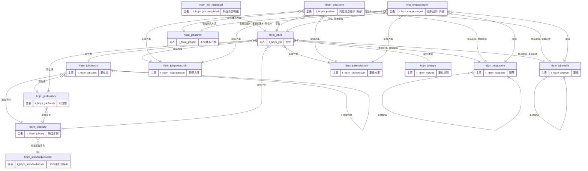

### 3.11 规则引擎域（5个实体，6条关系）

实体清单

| 实体 | 中文名 |
|------|--------|
| `brm_ruledesign` | 规则设计 |
| `brm_rulelist` | 规则列表 |
| `brm_scene` | 场景管理 |
| `brm_sceneinput` | 输入参数 |
| `brm_target` | 指标 |

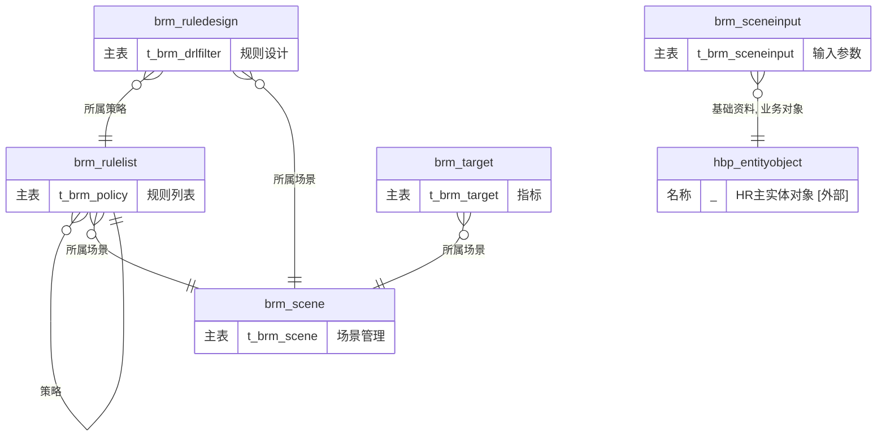

---

## 4. 专题 ER 图

按业务主题从物理域中抽取实体，生成跨域专题视图。
注释中 `[外部]` 表示该实体不属于本专题。

### 4.1 权限基础服务（33个实体，58条关系）

实体清单

| 实体 | 中文名 |
|------|--------|
| `hrcs_datarule` | 数据规则 |
| `hrcs_dimension` | 维度 |
| `hrcs_dynaauthobject` | 动态授权对象 |
| `hrcs_dynacond` | 动态数据范围配置 |
| `hrcs_dynaformctrl` | 虚字段数据控权配置 |
| `hrcs_dynamsgdealtrace` | 动态权限消息处理跟踪 |
| `hrcs_dynaschdatarule` | 动态权限方案数据规则 |
| `hrcs_dynaschdimgrp` | 动态权限方案维度值组 |
| `hrcs_dynascheme` | 动态授权方案 |
| `hrcs_dynaschexdimgrp` | 动态权限方案例外维度值组 |
| `hrcs_dynaschfield` | 动态权限方案字段权限 |
| `hrcs_dynaschorg` | 动态权限方案角色业务组织 |
| `hrcs_entityctrl` | 业务对象维度映射 |
| `hrcs_permapplybill` | 权限申请单 |
| `hrcs_permfilegrp` | 用户权限档案组 |
| `hrcs_permfilegrpmember` | 权限档案组明细表 |
| `hrcs_perminitrecord` | 权限初始化任务 |
| `hrcs_permrelat` | 关联权限项 |
| `hrcs_permrelatcfg` | 独立授权 |
| `hrcs_role` | HR通用角色 |
| `hrcs_roledatarule` | 角色数据规则 |
| `hrcs_roledimension` | 角色维度关系 |
| `hrcs_roledimgrp` | 角色维度组 |
| `hrcs_roleexdimgrp` | 角色例外维度组 |
| `hrcs_rolefield` | 角色实体列权限 |
| `hrcs_rolegrp` | 角色分组 |
| `hrcs_userdatarule` | 用户角色数据规则 |
| `hrcs_userfield` | 用户角色实体列权限 |
| `hrcs_userpermfile` | 用户权限档案 |
| `hrcs_userrole` | 用户角色业务单元范围 |
| `hrcs_userroledimgrp` | 用户角色维度组 |
| `hrcs_userroleexdimgrp` | 用户角色例外维度组 |
| `hrcs_userrolerelat` | 用户角色关联关系 |

```mermaid
erDiagram
    hrcs_dynaformctrl }o--|| hbp_devportal_bizapp : "应用"
    hrcs_dynamsgdealtrace }o--|| hrcs_dynascheme : "方案"
    hrcs_dynaschdatarule }o--|| hrcs_datarule : "方案, 数据规则方案"
    hrcs_dynaschdatarule }o--|| hrcs_dynascheme : "动态权限方案"
    hrcs_dynaschdimgrp }o--|| haos_structure : "架构方案"
    hrcs_dynaschdimgrp }o--|| hrcs_dimension : "维度"
    hrcs_dynaschdimgrp }o--|| hrcs_dynacond : "动态条件"
    hrcs_dynaschdimgrp }o--|| hrcs_dynascheme : "动态权限方案"
    hrcs_dynascheme }o--|| hrcs_dynaauthobject : "人员"
    hrcs_dynascheme }o--|| hrcs_role : "中台角色"
    hrcs_dynaschexdimgrp }o--|| haos_structure : "架构方案"
    hrcs_dynaschexdimgrp }o--|| hrcs_dimension : "维度"
    hrcs_dynaschexdimgrp }o--|| hrcs_dynascheme : "动态权限方案"
    hrcs_dynaschfield }o--|| hrcs_dynascheme : "动态权限方案"
    hrcs_dynaschfield }o--|| hrcs_role : "角色"
    hrcs_dynaschorg }o--|| hrcs_dynascheme : "动态权限方案"
    hrcs_entityctrl }o--|| hbp_devportal_bizapp : "应用"
    hrcs_entityctrl }o--|| hrcs_dimension : "维度"
    hrcs_permapplybill }o--|| hrcs_dynascheme : "方案"
    hrcs_permapplybill }o--|| hrcs_userpermfile : "权限档案"
    hrcs_permfilegrp }o--|| hrcs_permfilegrp : "上级分组"
    hrcs_permfilegrpmember }o--|| hrcs_permfilegrp : "权限档案组"
    hrcs_permfilegrpmember }o--|| hrcs_userpermfile : "权限档案"
    hrcs_perminitrecord }o--|| haos_structtype : "团队分类来源"
    hrcs_perminitrecord }o--|| haos_structure : "构架方案"
    hrcs_perminitrecord }o--|| hrcs_datarule : "数据规则方案"
    hrcs_perminitrecord }o--|| hrcs_dimension : "维度"
    hrcs_perminitrecord }o--|| hrcs_dynacond : "动态条件"
    hrcs_permrelat }o--|| hbp_devportal_bizapp : "应用"
    hrcs_permrelatcfg }o--|| hbp_devportal_bizapp : "应用"
    hrcs_role }o--|| hrcs_rolegrp : "角色组"
    hrcs_roledatarule }o--|| hrcs_datarule : "方案"
    hrcs_roledatarule }o--|| hrcs_role : "角色"
    hrcs_roledimension }o--|| hrcs_dimension : "维度"
    hrcs_roledimgrp }o--|| haos_structure : "架构方案"
    hrcs_roledimgrp }o--|| hrcs_dimension : "维度"
    hrcs_roledimgrp }o--|| hrcs_dynacond : "动态条件"
    hrcs_roledimgrp }o--|| hrcs_role : "HR角色"
    hrcs_roleexdimgrp }o--|| haos_structure : "架构方案"
    hrcs_roleexdimgrp }o--|| hrcs_dimension : "维度"
    hrcs_rolefield }o--|| hrcs_role : "角色"
    hrcs_userdatarule }o--|| hrcs_datarule : "方案, 数据规则方案"
    hrcs_userdatarule }o--|| hrcs_userrolerelat : "用户角色关联"
    hrcs_userfield }o--|| hrcs_userrolerelat : "用户角色关联"
    hrcs_userpermfile }o--|| hrcs_permfilegrp : "用户组"
    hrcs_userpermfile }o--|| hrcs_permfilegrpmember : "档案组成员"
    hrcs_userrole }o--|| hrcs_userrolerelat : "用户角色关联关系"
    hrcs_userroledimgrp }o--|| haos_structure : "架构方案"
    hrcs_userroledimgrp }o--|| hrcs_dimension : "维度"
    hrcs_userroledimgrp }o--|| hrcs_dynacond : "动态条件"
    hrcs_userroledimgrp }o--|| hrcs_userrolerelat : "用户角色关联"
    hrcs_userroleexdimgrp }o--|| haos_structure : "架构方案"
    hrcs_userroleexdimgrp }o--|| hrcs_dimension : "维度"
    hrcs_userroleexdimgrp }o--|| hrcs_userrolerelat : "用户角色关联"
    hrcs_userrolerelat }o--|| hrcs_dynascheme : "授权方案"
    hrcs_userrolerelat }o--|| hrcs_perminitrecord : "初始化记录"
    hrcs_userrolerelat }o--|| hrcs_userpermfile : "权限档案"
    hrcs_warnscene }o--|| hrcs_dimension : "控权维度"

    haos_structtype {
        主表 t_haos_otclassify "架构类型 [外部]"
    }
    haos_structure {
        主表 t_haos_structproject "矩阵组织维护 [外部]"
    }
    hbp_devportal_bizapp {
        名称 _ "HR业务应用实体 [外部]"
    }
    hrcs_datarule {
        主表 t_hrcs_datarule "数据规则"
    }
    hrcs_dimension {
        主表 t_hrcs_dimension "维度"
    }
    hrcs_dynaauthobject {
        主表 t_hrcs_dynaauthobject "动态授权对象"
    }
    hrcs_dynacond {
        主表 t_hrcs_dynacond "动态数据范围配置"
    }
    hrcs_dynaformctrl {
        主表 t_hrcs_dynaformctrl "虚字段数据控权配置"
    }
    hrcs_dynamsgdealtrace {
        主表 t_hrcs_dynamsgdealtrace "动态权限消息处理跟踪"
    }
    hrcs_dynaschdatarule {
        主表 t_hrcs_dynaschdatarule "动态权限方案数据规则"
    }
    hrcs_dynaschdimgrp {
        主表 t_hrcs_dynaschdimgrp "动态权限方案维度值组"
    }
    hrcs_dynascheme {
        主表 t_hrcs_dynascheme "动态授权方案"
    }
    hrcs_dynaschexdimgrp {
        主表 t_hrcs_dynaschexdimgrp "动态权限方案例外维度值组"
    }
    hrcs_dynaschfield {
        主表 t_hrcs_dynaschfield "动态权限方案字段权限"
    }
    hrcs_dynaschorg {
        主表 t_hrcs_dynaschorg "动态权限方案角色业务组织"
    }
    hrcs_entityctrl {
        主表 t_hrcs_entityctrl "业务对象维度映射"
    }
    hrcs_permapplybill {
        主表 t_hrcs_permapplybill "权限申请单"
    }
    hrcs_permfilegrp {
        主表 t_hbss_permfilegrp "用户权限档案组"
    }
    hrcs_permfilegrpmember {
        主表 t_hbss_permfilegrpmember "权限档案组明细表"
    }
    hrcs_perminitrecord {
        主表 t_hrcs_pinitrecord "权限初始化任务"
    }
    hrcs_permrelat {
        主表 t_hrcs_permrelat "关联权限项"
    }
    hrcs_permrelatcfg {
        主表 t_hrcs_permrelatcfg "独立授权"
    }
    hrcs_role {
        主表 t_hbss_permrole "HR通用角色"
    }
    hrcs_roledatarule {
        主表 t_hrcs_roledatarule "角色数据规则"
    }
    hrcs_roledimension {
        主表 t_hrcs_roledimension "角色维度关系"
    }
    hrcs_roledimgrp {
        主表 t_hrcs_roledimgrp "角色维度组"
    }
    hrcs_roleexdimgrp {
        主表 t_hrcs_roleexdimgrp "角色例外维度组"
    }
    hrcs_rolefield {
        主表 t_hrcs_rolefield "角色实体列权限"
    }
    hrcs_rolegrp {
        主表 t_hbss_permrolegrp "角色分组"
    }
    hrcs_userdatarule {
        主表 t_hrcs_userdatarule "用户角色数据规则"
    }
    hrcs_userfield {
        主表 t_hrcs_userfield "用户角色实体列权限"
    }
    hrcs_userpermfile {
        主表 t_hbss_permfiles "用户权限档案"
    }
    hrcs_userrole {
        主表 t_hbss_userrole "用户角色业务单元范围"
    }
    hrcs_userroledimgrp {
        主表 t_hrcs_userroledimgrp "用户角色维度组"
    }
    hrcs_userroleexdimgrp {
        主表 t_hrcs_userroleexdimgrp "用户角色例外维度组"
    }
    hrcs_userrolerelat {
        主表 t_hrcs_userrolerelat "用户角色关联关系"
    }
    hrcs_warnscene {
        主表 t_hrcs_warnscene "预警场景 [外部]"
    }
```
