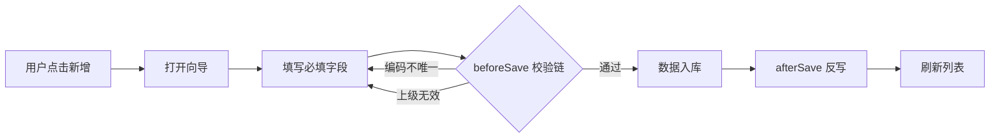
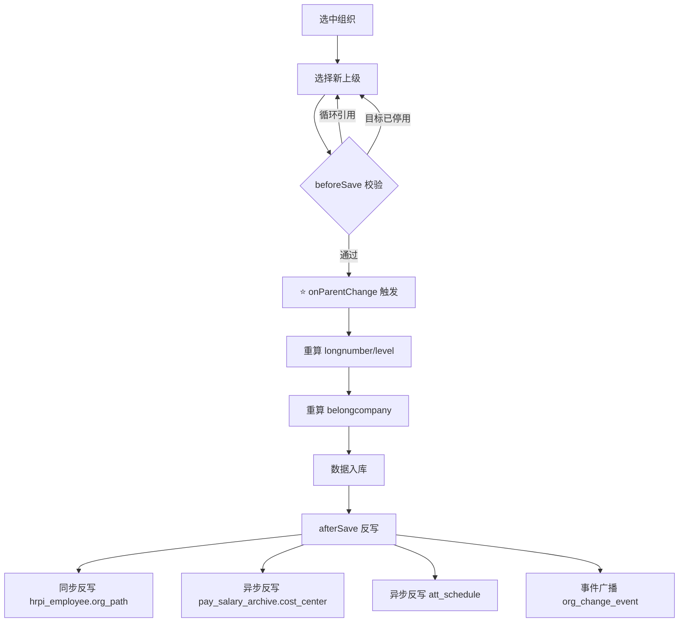

# 业务流转 + 插入点地图 · 行政组织快速维护

> **状态**: 🟢 基于 `knowledge/domain/org/ontology.md` 状态机 + `standard_design.md` 双路径
> **confidence**: verified

---

## 一、双路径设计（标品哲学）

苍穹行政组织变更有**两条正交路径**，必须先选对：

```
┌─────────────────────────────────────────────────────┐
│  路径 A: 快速维护 (haos_adminorgtablist) ⭐ 本场景   │
│  ──────────────────────────────────────────────── │
│  直接生效，无审批                                     │
│  组织专员日常操作                                     │
│  入口: 核心人事 > 组织 > 快速维护                     │
└─────────────────────────────────────────────────────┘

┌─────────────────────────────────────────────────────┐
│  路径 B: 调整申请 (homs_orgchgbill)                  │
│  ──────────────────────────────────────────────── │
│  走审批流                                            │
│  HR 主管复核                                         │
│  涉及 4 前缀分录（原信息 / info_ / parent_ / add_）  │
└─────────────────────────────────────────────────────┘
```

**判断依据**: 敏感度
- **快速维护**: 信息纠错、小范围调整
- **调整申请**: 上级变更、大范围调整、影响员工归属

---

## 二、组织生命周期状态机

```
     创建
      ↓
  ┌─────────┐        调整         ┌─────────┐
  │  待创建  │ ───────────────► │  正常使用 │
  └─────────┘                   └────┬────┘
                                     │
                                     │ 标记停用
                                     ▼
                                ┌─────────┐
                        启用    │  待停用  │
                     ◄──────── └────┬────┘
                                     │
                                     │ 确认停用
                                     ▼
                                ┌─────────┐
                                │  已停用  │
                                └─────────┘
```

---

## 三、子场景 1：列表展示

### 流程


### 节点详情

| 节点 | 触发 | 可用扩展点 | 标品插件 | 耗时 |
|---|---|---|---|---|
| 列表加载 | 访问页面 | `onListQuery@haos_adminorgtablist` | `OrgListAuthFilterPlugin` + `OrgListStatusFilterPlugin` | < 200ms |
| DB 查询 | 加载后 | - | ORM 层 | 50-100ms |
| 权限过滤 | 查询后 | 内嵌于 OnListQuery | - | 同步 |
| 排序渲染 | 数据返回后 | 前端 | - | - |

---

## 四、子场景 2：新增行政组织

### 流程



### 节点详情

| 节点 | 可用扩展点 | 标品插件 (顺序) | 风险 |
|---|---|---|---|
| 字段联动 | `onFieldChange@haos_adminorg` | 无 | 低 |
| **保存校验** | ⭐ `beforeSave@haos_adminorg` | 1. OrgCodeValidatePlugin<br>2. OrgCodeUniquePlugin<br>3. OrgHierarchyCheckPlugin | **高** (覆盖会丢失组织完整性校验) |
| 数据入库 | 事务内 | - | - |
| 反写处理 | ⭐ `afterSave@haos_adminorg` | 1. RefreshLongNumberPlugin<br>2. AuditLogPlugin<br>3. NotificationPlugin<br>4. CacheRebuildPlugin | 中 |
| 列表刷新 | 前端 | - | - |

### 必填字段

- `number` (组织编码)
- `name` (组织名称)
- `parentorg` (上级组织, 根组织除外)
- `adminorgtype` (组织类型)
- `bsed` (业务生效日期)

---

## 五、子场景 3：信息变更

### 流程

和新增类似，但：

- `entity.isNew()` 返回 `false`
- 不允许改 `number`
- 自动记录 `haos_adminorghis`（通过 `bsed` 分版本）

### 修订 vs 调整

| 场景 | 说明 | 是否新版本 |
|---|---|---|
| **修订** | 纠错（如名称打错字） | ❌ 不产生新版本 |
| **调整** | 业务含义变化（如组织职能变） | ✅ 产生新 `bsed` 版本 |

---

## 六、子场景 4：调整上级 ⭐ 最复杂

### 流程



### 节点详情

| 节点 | 扩展点 | 典型耗时 | 关键 |
|---|---|---|---|
| 预校验 | `beforeSave@haos_adminorg` | 100ms | 循环引用检查 |
| **父变更** | ⭐⭐⭐ `onParentChange@haos_adminorg` | 200-500ms | **本场景核心**，组织特有 |
| 路径重算 | 内嵌 OrgPathRecalcPlugin | 500ms-5s | 下属数量相关 |
| 入库 | 事务 | 100ms | - |
| **同步反写** | `afterSave` 事务内 | 1-5s | 下属岗位更新 |
| 异步反写 | 事件订阅 | 5-30s | 薪酬/考勤更新 |

### ⚠️ 关键铁律

**调整上级时，`onParentChange` 在 `beforeSave` 之后、入库之前触发**。
这是组织域**特有**的扩展点，其他实体都没有。

---

## 七、变动单双路径对比

```
┌──────────────────────┐  ┌──────────────────────┐
│ 快速维护              │  │ 调整申请              │
│ (本场景)              │  │ (homs_orgchgbill)    │
├──────────────────────┤  ├──────────────────────┤
│ 入口 haos_adminorg    │  │ 入口 homs_orgchgbill │
│ 直接编辑              │  │ 审批流                │
│ 立即生效              │  │ 审批通过后生效         │
│ 无 4 前缀分录         │  │ 4 前缀分录            │
│ 组织专员权限          │  │ HR 主管权限           │
└──────────────────────┘  └──────────────────────┘
```

### 4 前缀分录（调整申请才涉及）

| 前缀 | OID | 含义 |
|---|---|---|
| 无前缀 | `VQ597FqFoc` | 原组织信息 |
| `info_` | `7auphYEIJr` | 变更后信息 |
| `parent_` | `8bosVcKAfQ` | 上级信息 |
| `add_` | `wHBtyCCUik` | 新增信息 |

主表扩展 1 字段 → 调整申请单需要在 4 个分录各加 1 个同名字段（见 `06_customization_solutions.md` CS-02）。

---

## 八、各子场景总时序

```
子场景 1: 列表展示 (~ 200ms)
  页面访问 → onListQuery → DB → 返回

子场景 2: 新增组织 (~ 500ms-1s)
  点击新增 → 填写 → beforeSave 校验链 → 入库 → afterSave 反写 → 刷新列表

子场景 3: 信息变更 (~ 300ms-2s)
  选中编辑 → 改字段 → beforeSave → 入库 → 记历史 → afterSave → 反写

子场景 4: 调整上级 (~ 500ms-30s, 取决于下属规模)
  选目标父 → beforeSave → onParentChange ⭐ → 路径重算 → 入库
     → afterSave 同步反写 (岗位) → 异步反写 (薪酬/考勤)
```

---

## 九、变动消息统一出口 · `AdminChangeMsgService`（2026-04-25 多场景反编译实证）

**核心认知**：行政组织变动后的"消费/通知/广播"逻辑 · 苍穹标品**统一**走 `kd.hr.haos.business.domain.org.service.AdminChangeMsgService.handleChangeMsg` · 不在每个场景的 OP 里直接发事件。

### 跨场景实证（同一 service 同一 JOB_ID）

| 场景 | 触发点（反编译实证） | 共用 service |
|---|---|---|
| `admin_org_quick_maintenance`（本场景）· save / disable / enable / parent_change | OP 链 afterExecuteOperationTransaction → 直接调 | **AdminChangeMsgService.handleChangeMsg** · JOB_ID=`5+X/4Y=AOZ=O` |
| `homs_orgbatchchgbill_maintenance` · 申请单生效 | `OrgBatchChgBillEffectOp` → `AdminChangeMsgService` | 同上 |
| `haos_structproject` · 方案启用/停用 | StructProject*Op → `AdminChangeMsgService` | 同上 |

### 链路设计（异步派单 · 非 BEC 直发）

```
OP afterExecuteOperationTransaction (各场景 OP 类)
    ↓ AdminChangeMsgService.handleChangeMsg(变动数据 · changeType)
        ↓ JobClient.dispatch(sch_task JOB_ID=5+X/4Y=AOZ=O)
            ↓ 异步：消费方 service 处理（写日志 / 通知 ERP / 触发岗位反写 等）
```

> ⚠ **重要**：本应用历史曾有 `haos_changemsg` 菜单（"组织变动消费明细" · menuId=1494227884909396992 · visible=false）作为"看变动消费记录"的入口
> · 该菜单已**废弃**（2026-04-25 探针实证 · OpenAPI 拿不到 schemaText / getFormMetadata 返 500）
> · 现在变动消费明细统一通过 `homs_orgchgrecord`（组织变动明细查询）查看 · 已建独立场景
> · 详见 `knowledge/workbench/scene_meta.json._deprecated_menus.haos_changemsg`

### ISV 扩展坐标（针对变动消息）

- ❌ **不要**在 admin_org / homs / haos_structproject 各场景 OP 里**重复发事件**（违反 PR-011 + DRY）
- ❌ **不要**直接调 `AdminChangeMsgService.handleChangeMsg`（标品自动调 · ISV 调会双发）
- ✅ **要**消费这条消息时 · 走 `IEventServicePlugin` 订阅 sch_task 派出的 BEC 事件（如果业务需要）
- ✅ 想加自定义消费者 · 在 sch_task JOB_ID 对应的下游 service 之后挂监听
- 详见各场景的 CS-05 · 参考 `homs_orgbatchchgbill_maintenance/06_customization_solutions.md` 的 BEC 章节

---

**📌 来源追溯**：
- 双路径设计: `standard_design.md` 哲学 4
- 状态机: `ontology.md` 状态机章节
- 4 前缀 OID: `adminorg_extension_pattern.md` §3
- 扩展点清单: `anchors.md` + `openapi_capability_map.md`
- 变动消息统一出口: `_decompiled/scenarios/homs_orgbatchchgbill/AdminChangeMsgService.java` · `_decompiled/scenarios/haos_structproject/AdminChangeMsgService.java`（同一 service 跨场景共用 · 2026-04-25 反编译实证）
