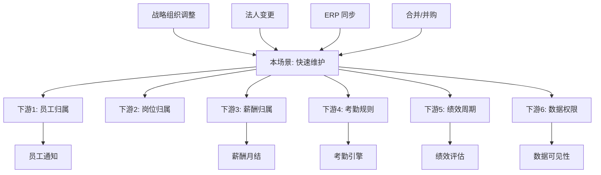

# 上下游联动逻辑 · 行政组织快速维护

> **状态**: 🟢 基于 `domain/org/ontology.md` 跨域边界 + `standard_design.md` 哲学
> **维度定位**: 业务级联动（**业务动作 → 下游业务反应**）
> **与 05_data_flow 区别**: 05 讲字段级技术反写；本文讲业务逻辑联动

---

## 一、为什么单独一个维度？

组织域是企业管理的**基石**，所有 HR 业务（薪酬/考勤/绩效/招聘）都依赖组织结构。

**一个组织业务动作**（如调整上级、停用组织），会触发**一系列下游业务反应**，这些反应**不是字段级反写**，而是**业务流程级联动**。

例如：**组织停用** → 
- 该组织下的在职员工怎么办？→ 需要转移到其他组织
- 岗位怎么办？→ 需要废弃或迁移  
- 薪酬归属成本中心怎么办？→ 重新分配
- 未完成的变动单怎么办？→ 需要终止
- 跨组织的绩效周期怎么办？→ 重新评估

这些都是**业务级联动**，不是字段反写。

---

## 二、上游：什么业务动作触发组织变化？

### 上游 1 · 战略性组织架构调整

**触发源**: 人力资源战略会议 / 年度组织调整

**到达本场景的方式**:
- HR 专员在**快速维护**直接操作（小调整）
- HR 主管走**调整申请单**审批（大调整）

**依赖**: 无（组织是最上游）

### 上游 2 · 公司注册 / 法人变更

**触发源**: 法务 / 财务部门

**到达本场景的方式**: 法务完成工商注册后 → HR 同步建组织

**需要对接**: 
- `基础服务云 > 法人库`
- 先建法人 → 再建组织（`corporateorg` 字段关联）

### 上游 3 · ERP 组织同步（标品工具）

**触发源**: 外部 ERP 系统（EAS/SAP 等）

**到达本场景的方式**: 标品提供 ERP 组织同步工具

**三种同步模式**:
- **先财后 HR**: 先在 ERP 建组织，再同步到 HR
- **同步上**: 两边同时建
- **只 HR**: HR 独立建组织，不同步回 ERP

**⚠️ 待补充**: 具体同步工具的 API 和触发机制（`standard_design.md` 提及但未展开）

### 上游 4 · 合并 / 并购

**触发源**: 公司战略

**到达本场景的方式**: 需要批量导入外部组织结构

**推荐**: 走 `haos_adminorgbatch` 批量建组织入口

---

## 三、下游：组织变化触发哪些业务反应？

### 下游 1 · 员工归属变化

**触发条件**:
- 组织调整上级 → 该组织下员工的 `adminorg_path` 变化
- 组织停用 → 在职员工必须转移
- 组织删除（极少）→ 必须先清空员工

**业务流程**:
```
组织调整上级
    ↓
自动：员工 adminorg_path 路径更新（技术反写）
    ↓
业务影响：
  ├── 员工收到"您的组织已调整"通知
  ├── 员工看到的应用门户可能变化（按组织展示）
  ├── 员工的数据权限（可看哪些数据）重新计算
  └── 直属上级可能变化（如组织变更导致）
```

**相关业务场景**:
- [员工组织调动](./placeholder_employee_org_transfer.md) ⏳ 待建
- [员工数据权限](./placeholder_employee_data_auth.md) ⏳ 待建

### 下游 2 · 岗位归属变化

**触发条件**: 组织调整上级 / 合并 / 拆分

**业务流程**:
```
组织调整上级
    ↓
岗位 (hbpm_position.adminorg) 保持不变
岗位的上下文变化：
  ├── 岗位编制（人数上限）可能重新审批
  ├── 岗位的管理层级可能变化
  └── 岗位上的员工数据权限变化
```

**相关实体**: `hbpm_position` / `hbpm_positionstd`

### 下游 3 · 薪酬归属变化

**触发条件**: 组织调整上级（特别是跨公司调整）

**业务流程**:
```
组织调整上级
    ↓
薪酬档案 (pay_salary_archive) 
  ├── cost_center 更新（技术反写，见 05_data_flow.md）
  ├── 如跨公司 → 可能触发薪酬方案变更
  ├── 如跨成本中心 → 月度薪资结算的分摊变化
  └── 薪酬预算归属变化
```

**业务决策点**:
- 是否保留原薪酬方案？
- 调整日生效还是次月生效？
- 历史薪资归属哪个成本中心？

### 下游 4 · 考勤规则变化

**触发条件**: 组织调整上级（上级可能有不同考勤班制）

**业务流程**:
```
组织调整上级
    ↓
考勤排班 (att_schedule)
  ├── org_scope 字段更新（技术反写）
  ├── 可能继承新上级的考勤规则
  └── 已排好的班次通常保留到当周/月底
```

### 下游 5 · 绩效周期变化

**触发条件**: 跨部门调整上级（不同部门可能有不同绩效周期）

**业务流程**:
```
组织调整上级
    ↓
如跨绩效周期:
  ├── 原绩效周期的进度如何处理？
  ├── 新绩效周期如何起算？
  └── 绩效目标是否重置？
```

**决策依据**: 业务规则（通常保留原周期到当季度末）

### 下游 6 · 数据权限链变化

**触发条件**: 任何组织结构变化

**业务流程**:
```
组织结构变化
    ↓
数据权限链重新计算:
  ├── "管辖该组织"的 HR 范围变化
  ├── 上级组织的数据可见性变化
  └── 跨组织查询权限变化
```

---

## 四、业务联动决策表

### 场景: 组织调整上级（小范围）

| 下游系统 | 自动联动 | 需人工确认 | 不联动 |
|---|---|---|---|
| 员工归属路径 | ✅ 自动更新 | - | - |
| 员工数据权限 | ✅ 自动重算 | - | - |
| 直属上级关系 | ⚠️ 视组织类型 | ✅ 跨公司需确认 | - |
| 岗位归属 | - | - | ✅ 不变 |
| 薪酬成本中心 | ✅ 自动同步 | - | - |
| 薪酬方案 | - | ✅ 跨公司需确认 | - |
| 考勤班次 | - | - | ✅ 当期不变 |
| 绩效周期 | - | ⚠️ 季度边界前需确认 | - |
| 数据权限链 | ✅ 自动重算 | - | - |

### 场景: 组织停用

| 下游系统 | 自动联动 | 需人工确认 | 阻断 |
|---|---|---|---|
| 该组织下员工 | - | ✅ **必须先转移** | ❌ 未转移则阻断停用 |
| 该组织下岗位 | - | ✅ 必须先废弃/迁移 | ❌ 未处理阻断 |
| 在进行的变动单 | ⚠️ 终止或转给别人 | ✅ 需决策 | - |
| 历史薪酬 | ✅ 保留归属 | - | - |

---

## 五、业务联动的"决策点"清单

这些是**业务流程**中必须人工决策的关键点（不是技术能自动的）：

1. **组织调整日期选择**: 月末调整 vs 月中调整（影响薪酬月结）
2. **薪酬方案是否跟随**: 调到新公司是否用新薪酬体系
3. **考勤规则是否切换**: 跨地区调整，时区 / 公休日可能变
4. **历史数据归属**: 调整前的数据归属原组织还是新组织
5. **权限迁移**: 原 HR 的管辖权是否跟随组织转移
6. **通知策略**: 通知所有员工 / 只通知管理层 / 不通知

---

## 六、业务联动的"阻断规则"

以下情况系统会**阻止组织操作**：

| 规则 | 阻断条件 | 解除方法 |
|---|---|---|
| 有在职员工不能停用组织 | `SELECT COUNT(*) FROM hrpi_employee WHERE adminorg = ? AND status = 'active' > 0` | 先转移员工 |
| 有活跃岗位不能停用组织 | 同上 | 先废弃/迁移岗位 |
| 被下游引用不能删除组织 | 任何下游表引用 | 用停用代替 |
| 有进行中变动单不能调整 | 存在 `orgchgbill.status = 'running'` | 先处理变动单 |
| 有未结算薪资不能停用 | 存在当期未结算薪资 | 等薪资结算 |

---

## 七、典型业务联动剧本

### 剧本 1 · "总部部门合并"

**背景**: 总部研发中心 + 产品中心合并为"研发产品中心"

**联动步骤**:
```
1. 新建"研发产品中心"组织 (haos_adminorg)
2. 批量调整员工 adminorg → 新组织（走批量调动）
3. 批量调整岗位 adminorg → 新组织
4. 薪酬档案成本中心切换
5. 考勤规则统一（如班次统一）
6. 停用"研发中心"和"产品中心"（此时应无员工/岗位）
7. 绩效周期重新对齐（等季度边界）
8. 数据权限重构（新的 HR 管辖范围）
```

**需要配合的系统**: 员工自助、薪酬月结、考勤引擎、绩效模块

### 剧本 2 · "新设子公司"

**背景**: 集团新成立子公司"XX 科技"

**联动步骤**:
```
1. 法务先建法人（基础服务云）
2. 财务建成本中心（财务云）
3. HR 建组织（本场景）
    - 类型选"公司"或"集团"
    - corporateorg 关联新法人
    - belongcompany 自动计算=自己
4. 配置薪酬方案
5. 配置考勤规则
6. 招聘员工
```

---

## 八、上下游联动图（Mermaid）



---

## 九、最佳实践

### 大规模组织调整的"业务流"建议

不要**连续快速维护**，会导致：
- 通知轰炸员工
- 薪酬考勤多次重算，数据不一致
- 审计混乱

**推荐做法**:
1. **冻结窗口**: 组织变更前提前 1 周冻结员工调动、薪资变更
2. **批量单操作**: 走 `haos_adminorgbatch` / `homs_orgbatchc`
3. **事后通知**: 所有变更完成后，统一发通知
4. **结算隔离**: 跨越薪资结算日时必须等结算完成
5. **数据校对**: 变更后对比员工数量、岗位数量、预算总额

---

## 十、待补充内容

> HR 专家可以补充的联动规则：

- [ ] ERP 组织同步工具的具体 API
- [ ] 跨法人调动时的税务处理
- [ ] 海外子公司的时区 / 本地化规则
- [ ] 外部系统（AD/LDAP/BI）的同步触发点
- [ ] 数据保留期限规则（GDPR/个保法）

---

**📌 来源追溯**：
- 跨域边界: `knowledge/domain/org/ontology.md` §跨域边界
- 双路径设计: `standard_design.md` 哲学 4
- 阻断规则: `anchors.md` 禁区清单
- 业务联动推断: HR 专家经验 + 实务习惯

---

<!-- BEGIN cross-cloud-upstream (auto · ADR-009) -->

## 上游底座引用（跨云）

> 自动生成 · 数据源 `_cross_cloud_index.json` · 更新时间 2026-04-29
> 本 form（`haos_adminorgdetail`，所属 组织发展云）引用了其他云的 **3** 个底座实体：

### ⬆️ HR 基础服务云（`hr_hrmp`）3 个引用

| 字段 | 字段名 | 类型 | 引用实体 | 上游场景 |
|---|---|---|---|---|
| `industrytype` | 行业类别 | BasedataField | `hbss_industrytype` | [hbss_position_dict](../hbss_position_dict/) |
| `corporateorg` | 法律实体 | BasedataField | `hbss_lawentity` | [hbss_law_entity](../hbss_law_entity/) |
| `workplace` | 工作地 | BasedataField | `hbss_workplace` | [hbss_supplier](../hbss_supplier/) |

> ⚠️ ISV 扩展须知（ADR-009）：
> - 上游底座实体是**标品字典**，原则上不可改字段（参各上游场景的 06_customization_solutions.md）
> - 引用方式（fieldType / refEntity）由本 form 元数据控制；本 form 改 ref 字段值用 `setValue` 即可
> - 修改前必须读对应上游场景的 11_upstream_downstream_logic.md，确认上游 ISV 扩展规则

<!-- END cross-cloud-upstream -->

<!-- BEGIN ppt-cross-injected -->

## 📚 PPT 知识引用（PPT 02 沉淀）

> 本场景的业务语义补充见 [PPT02_DEEP_TRACE.md](../../docs/PPT02_DEEP_TRACE.md)
> - 16 实体清单（含历史模型类型/物理表）
> - 7 个标品定时任务（含 haos_func_orgsync_SKDP_S 同步平台）
> - 30+ OpenAPI（行政组织/岗位/职位查询保存等）
> - 5 SDK 扩展点（IAfterEffectAdminOrgExtPlugin / IAdminOrgTreeLabelExtPlugin 等）
> - 综合参考 [PPT01_DEEP_TRACE.md](../../docs/PPT01_DEEP_TRACE.md) 总论金字塔

### 关键 SDK Helper（按 org_dev 常用）

```java
HAOSServiceHelper   // 提供新增/变更/启用/禁用组织
HBJMServiceHelper   // 提供新增/变更/启用/禁用职位
HBPMServiceHelper   // 提供新增/变更/启用/禁用岗位
```

### 业务事件订阅点

```
haos.adminOrgChangeEvent           组织变动事件
hbpm.standarpositionChangeEvent    标准岗位变动事件
hbpm.positionChangeEvent           岗位变动事件
hbjm_jobhr.change                  职位变动·生效
```

<!-- END ppt-cross-injected -->

<!-- BEGIN cross-cloud-downstream (auto · ADR-009) -->

## 下游消费者（被其他云引用）

> 自动生成 · 数据源 `_cross_cloud_reports/` · 更新时间 2026-04-29
> 本场景实体当前**未被其他云**引用。

<!-- END cross-cloud-downstream -->
