# 上下游联动逻辑 · 岗位信息维护 (hbpm_positionhr)

> **状态**: 🟢 基于 `scene_doc.json` refEntity 引用关系 + `refentity_reverse.json` 27 下游实证 + 7 类 position 反编译 + HR 域常识整合
> **维度定位**: 业务级联动（**业务动作 → 下游业务反应**）
> **与 05_data_flow 区别**: 05 讲字段级技术反写；本文讲业务逻辑联动
> **confidence**: real_deploy

---

## 一、为什么单独一个维度？

岗位是**员工 / 组织 / 薪酬 / 绩效 / 招聘 / 预警的共同枢纽**。一个企业的岗位体系发生调整（如新增"高级架构师"岗位 · 调整"销售总监"职级范围）· 会触发**一系列下游业务反应**：

- 员工档案要重新换绑（`hrpi_empposorgrel` / `hrpi_empjobrel` 27 处引用）
- 编制报表要重新计算（`haos_dimstaffreport` 等）
- 薪酬档案按职级定档 · 职级变了薪酬可能变
- 绩效评估模板可能按岗位家族配置
- 招聘需求发布必须引用一个有效岗位
- 预警方案 `hrcs_warnscheme` 按岗位监控指标

这些都是**业务级联动** · 不是字段级反写。

**与职位域对比**：
- 职位（hbjm_jobhr）下游标品反写 0 · 主要靠 ISV 扩展
- 岗位（hbpm_positionhr）**27 处标品下游引用**（`refentity_reverse.json` 实证）· 加上调度任务 + `IBosPositionService` 同步 · 影响面深一个层级

---

## 二、上游：什么业务动作触发岗位体系变化？

### 上游 1 · 组织架构变动（最高频）

**触发源**：`haos_adminorg` 行政组织变化（合并 / 拆分 / 新建）

**到达本场景的方式**：
- 新组织建立 → 新岗位（`adminorg` = 新组织）
- 组织合并 → 岗位可能需要批量调整 `adminorg`
- 组织禁用 → 该组织下岗位必须先转走或禁用

**关联字段**：
- `adminorg`（`HRAdminOrgField` · 唯一 required=true · `scene_doc.json` L615）
- `org`（自动从 `adminorg.org` 派生 · `PositionHrSaveOp.beforeExecuteOperationTransaction` L60）
- `orgdesignbu`（职位体系管理组织）

**前端联动**：`PositionEdit.propertyChanged` adminorg 分支 L462-L481 自动带出 countryregion / city / workplace / org · 置空 positiontpl

### 上游 2 · 职位体系升级（战略性）

**触发源**：职位（hbjm_jobhr）体系调整 · HR COE 年度回顾

**到达本场景的方式**：
- 关联的 `job` 字段所引用的职位发生变化
- `jobscm` / `joblevelscm` / `jobgradescm` 方案变更 → 岗位的职级职等范围需重算
- 职位被禁用 → 挂该职位的岗位必须改挂或废弃

**关联字段**：
- `job` (BasedataField → `hbjm_jobhr`) · 可选（受 `SystemParamHelper.getPosMustRelateJobParameter` 控制）
- `jobscm` / `joblevelscm` / `jobgradescm` 3 个方案字段
- `lowjoblevel` / `highjoblevel` / `lowjobgrade` / `highjobgrade` 4 个区间字段

**联动校验**：`JobLevelGradeRangeImportValidator.checkJobRelatedInformation` L58-L77 的 15 条校验规则

### 上游 3 · 岗位模板调整

**触发源**：HR COE 维护岗位模板（`hbpm_positiontpl`）

**到达本场景的方式**：
- 选模板后 · 标品 `PositionEdit.changePositionTpl` L517-L549 批量回填 8 字段：
  - `POSITIONTPL_FILED_KEYS = [job, jobscm, lowjoblevel, highjoblevel, lowjobgrade, highjobgrade, jobgradescm, joblevelscm]`
- 模板 `ablemodifyfield` / `fieldrange` 控制哪些字段可改

**相关系统参数**：`SystemParamHelper.getBatchParameter` → `openpositiontpl` 控制是否启用模板

### 上游 4 · 岗位类型字典变化

**触发源**：HR COE 调整 `hbpm_positiontype` 基础资料（如新增"技术专家"岗位类型）

**到达本场景的方式**：
- 新增岗位时可选新类型
- 结合 CS-02 · 选类型带出默认值

### 上游 5 · 招聘策略调整

**触发源**：业务部门反馈 / 招聘市场变化

**到达本场景的方式**：
- 新增一个"大数据架构师"岗位
- 调整岗位的招聘要求字段（`diplomareq` / `agereq` / `knowledgereq` / `skillreq` / `abilityreq` / `experiencereq`）

### 上游 6 · 薪酬体系改革

**触发源**：薪酬部门 / 全员调薪

**到达本场景的方式**：
- 调整职级方案 `joblevelscm`
- 调整岗位的职级范围 `lowjoblevel` / `highjoblevel`

### 上游 7 · ERP / HR 主数据同步（外部系统）

**触发源**：集团 ERP（如 EAS/SAP）岗位主数据同步

**到达本场景的方式**：
- `sourcesyskey` / `initdatasource` 字段标记来源
- 通过 HIES 导入 `importdata_hr`（走 `cusstartpage: hismodel_importstart`）

**三种同步模式**：
- **先 ERP 后 HR**：ERP 主数据下发
- **HR 主导**：HR 建岗位 · ERP 订阅
- **双向同步**：冲突解决按 `sourcesyskey` 仲裁

### 上游 8 · 岗位说明书修订

**触发源**：职责边界变化（组织优化 / 岗位合并）

**到达本场景的方式**：
- 修改 `posduty` / `posstandard` / `posorientation` 3 个多语言字段
- 触发新版本（`newhisversion`）

---

## 三、下游：岗位变化触发哪些业务反应？（27 处实证）

### 下游分类总览（`refentity_reverse.json` hbpm_positionhrf7 段 · 27 条）

| Tier | 类型 | 实体数 | 阻断策略 |
|---|---|---|---|
| Tier 1 | 任职关系类（员工核心） | 5 | **必阻断禁用**（CS-03） |
| Tier 2 | 组织关系类 | 6 | 弹窗提示 · 允许 |
| Tier 3 | 岗位内部 | 7 | 岗位树 / 变更记录 · 不阻断 |
| Tier 4 | 预警 | 1 | 提示 |

### Tier 1 · 任职关系类（5 实体 · 禁用必查）

**业务重要性**：这 5 个实体直接关联在职员工 · 岗位禁用时不查必出事故（CASE-03）

| 实体 | 字段 | 业务含义 | 触发条件 |
|---|---|---|---|
| `hrpi_empposorgrel` | `position` / `positionvid` | 员工-岗位-组织关系（员工信息管理核心） | 员工在岗 + iscurrentversion=true |
| `hrpi_empjobrel` | `position` | 员工-职位-岗位任职关系 | 在职 + iscurrentversion=true |
| `hrpi_rotationinfo` | `position` | 员工轮岗信息（原任岗位） | 轮岗中 |
| `hrpi_dispatchinfo` | `position` | 员工派遣信息 | 派遣中 |
| `hrpi_appointremoverel` | `position` / `positionvid` | 任免经历 | 生效中 |

### Tier 2 · 组织关系类（6 实体 · 提示即可）

| 实体 | 字段 | 业务含义 |
|---|---|---|
| `haos_chargeperson` | `position` | 部门负责人岗位 |
| `haos_orgpersonstaffinfo` | `position` | 占编员工维护信息 |
| `haos_dimstaffreport` | `position` | 多维度编制报表 |
| `haos_muldimendetail` | `position` | 多维度编制明细 |
| `haos_muldimendetailhis` | `position` | 多维度编制明细历史 |
| `hrpi_blacklist` | `position` | 员工黑名单（原任职岗位） |

### Tier 3 · 岗位内部（7 字段 · 变更记录类）

| 实体 | 字段 | 业务含义 |
|---|---|---|
| `hbpm_positionhr` | `parent` | 下级岗位（**自引用**） |
| `hbpm_positionrelation` | `role` / `parent` | 岗位汇报 / 协作关系 |
| `hbpm_chgrecord` | `position` / `targetposition` / `sourceposition` / `hisposition` | 岗位变动明细（历史记录用） |
| `hbpm_chgrecordevt` | `targetposition` / `sourceposition` / `hisposition` | 岗位变动事件 |
| `hbpm_position_msgdetail` | `bo` / `beforeversion` / `afterversion` | 岗位变更消息明细（本就是变更日志） |

### Tier 4 · 预警（1 实体）

| 实体 | 字段 | 业务含义 |
|---|---|---|
| `hrcs_warnscheme` | `position` | 预警方案（如到期提醒） |

---

## 四、下游业务反应细则

### 下游 1 · 员工岗位关系变化

**触发条件**：
- 岗位禁用 → 该岗位下员工档案出现告警（Tier 1 · 5 实体）
- 岗位 `adminorg` 变更 → 员工的组织维度变化
- 岗位职级范围调整 → 员工的职级是否还在范围内

**业务流程**：
```
岗位变更（confirmchange / save / enable / disable）
    ↓
[标品] PositionHrCommonOp.afterExecuteOperationTransaction
    ChangeMsgServiceImpl.sendMsg()  → 调度任务
    IBosPositionService.addOrUpdatePositions(boids)  → 更新下游岗位缓存
    ↓
[标品] 调度任务（sch_task · jobId 5/2/X9QCCFNS）
    读 hbpm_position_msgdetail 批量发消息
    ↓
[ISV CS-05] afterExecuteOperationTransaction
    IEventService.triggerEventSubscribeJobs("HBPM_POSITION_CHANGED", variables)
    ↓
[下游订阅方 · 员工模块]
    按 boid 查 hrpi_empposorgrel.position.boid = ?
    业务影响：
      ├── 员工档案显示"岗位已禁用"告警
      ├── 需要走员工调岗流程（换绑新岗位）
      └── 员工的历史职业经历保留（hrpi_empjobrel）
```

**相关 PR**：PR-008（查询用 iscurrentversion）+ PR-009（用 boid）+ PR-011（走 BEC）

**推荐扩展**：CS-03 禁用前检查 · 阻止有在职员工的岗位被硬禁用

### 下游 2 · 编制报表 / 多维度统计

**触发条件**：岗位新建 / 禁用 / 职级调整

**业务流程**：
```
岗位变化
    ↓
haos_dimstaffreport / haos_muldimendetail 重新统计编制
    ↓
业务影响：
  ├── 编制报表数据变化（当前编制 / 在岗编制 / 空缺数）
  ├── 多维度统计（按行政组织 × 岗位类型 × 职级）
  └── 高管驾驶舱指标更新
```

**相关实体**：`haos_dimstaffreport` / `haos_muldimendetail` / `haos_muldimendetailhis`

### 下游 3 · 薪酬档案变化

**触发条件**：
- 岗位 `joblevelscm` / `jobgradescm` 方案变更 → 员工薪酬档案的定档基准变化
- 岗位 `lowjoblevel` / `highjoblevel` 调整 → 员工薪酬可能需重新定级

**业务流程**：
```
岗位变更 → 新 hisversion
    ↓
[CS-05] BEC 事件 HBPM_POSITION_CHANGED
    ↓
pay 模块订阅 · 按 boid 查员工薪酬档案
    ↓
业务影响：
  ├── 薪酬档案 (pay_salary_archive) 的 position 字段版本更新
  ├── 如跨职级范围 → 薪酬方案重新评估
  └── 月度薪资结算的职级定档重新推算
```

**业务决策点**：
- 是否保留原薪酬方案？
- 调整日生效还是次月生效？
- 历史薪资归属哪个职级？

### 下游 4 · 绩效评估变化

**触发条件**：
- 岗位 `job` 或 `positiontype` 变更 → 绩效模板可能按岗位类型 / 职位家族配置
- 岗位说明书（`posduty` / `posstandard`）变更 → 考核指标变化

**业务流程**：
```
岗位 job / posduty 变更
    ↓
如果绩效模板按岗位类型配置:
  ├── 原绩效模板是否适用？
  ├── 新绩效周期如何起算？
  └── 绩效目标是否重置？
```

### 下游 5 · 招聘需求变化

**触发条件**：
- 岗位招聘要求变更（`diplomareq` / `experiencereq` / 6 个 req 字段）
- 岗位禁用 → 招聘需求必须对应转移
- 岗位新建 → 招聘模块的岗位 F7 自动出现

**业务流程**：
```
岗位变更
    ↓
招聘模块订阅 HBPM_POSITION_CHANGED
    ↓
业务影响：
  ├── 已发布的招聘需求（关联此岗位）需要审视
  ├── 简历筛选模型（按 diplomareq 自动过滤）重新生效
  └── 面试官配置（按 positiontype）重新分配
```

**扩展示例**：CS-05 "招聘状态"字段 + 联动看板

### 下游 6 · 岗位说明书 / 打印模板

**触发条件**：岗位核心字段（`posduty` / `posstandard` / `posorientation`）变更

**业务流程**：
```
岗位变更
    ↓
selecttplprint opKey 使用新版岗位说明书
    ↓
业务影响：
  ├── 打印的岗位说明书自动反映最新信息
  ├── 历史打印版本保留在附件里
  └── 外部发布 / 培训材料需要重新发布
```

### 下游 7 · 数据权限链变化

**触发条件**：岗位 `adminorg` 变更 / 禁用

**业务流程**：
```
岗位组织归属变化
    ↓
数据权限链重新计算:
  ├── "管辖该岗位"的 HR 范围变化
  ├── 岗位 F7 选择时可见范围变化（通过 HRDataBaseList 自带过滤）
  └── 跨组织查询权限变化
```

**相关插件**：`PositionEdit.beforeF7Select` adminorg 分支 L926-L931 + `getPermOrgResult` L951-L968

### 下游 8 · 变更记录 / 审计日志

**触发条件**：任何岗位变更

**业务流程**：
```
岗位变更
    ↓
hbpm_chgrecord / hbpm_chgrecordevt 记录详细变更
    ↓
业务影响：
  ├── 审计日志可追溯
  ├── hbpm_position_msgdetail 消息明细供订阅方消费
  └── 变更历史回放
```

### 下游 9 · 预警方案

**触发条件**：岗位到期 / 空缺超期

**业务流程**：
```
岗位监控条件命中
    ↓
hrcs_warnscheme.position 触发预警
    ↓
通知 HR 管理员 · 进入预警处理流程
```

---

## 五、业务联动决策表

### 场景 · 岗位基础信息修改（如 name / description / posduty）

| 下游系统 | 自动联动 | 需人工确认 | 不联动 |
|---|---|---|---|
| 员工岗位显示名 | ✅ 自动刷新（多语言字段直存主表） | - | - |
| 编制报表 | - | - | ✅ 不变（仅名称） |
| 薪酬档案 | - | - | ✅ 不变 |
| 招聘需求 | - | ⚠️ 描述变更时需要确认 | - |
| 岗位说明书 | ✅ 下次打印自动更新 | - | - |

### 场景 · 岗位职级范围调整

| 下游系统 | 自动联动 | 需人工确认 | 阻断 |
|---|---|---|---|
| 员工薪酬定档 | - | ✅ 薪酬部门确认 | - |
| 编制职级 | - | ✅ 必须审批 | - |
| 招聘简历筛选 | ✅ 自动生效新规则 | - | - |
| 已有员工是否超范围 | - | ✅ 检查并处理 | - |

### 场景 · 岗位禁用

| 下游系统 | 自动联动 | 需人工确认 | 阻断 |
|---|---|---|---|
| 该岗位下员工 (Tier 1) | - | ✅ **必须先转移**（推荐 CS-03） | ❌ 标品默认不阻断（风险） |
| 该岗位下层级岗位 | - | ✅ 必须先调整 | ❌ 标品默认不阻断 |
| 正在进行的招聘 | - | ✅ 需决策（取消或转岗位） | - |
| 历史薪酬档案 | ✅ 保留归属 | - | - |

### 场景 · 岗位新建（newhisversion）

| 下游系统 | 自动联动 | 需人工确认 | 不联动 |
|---|---|---|---|
| 员工任职 F7 | ✅ 自动出现 | - | - |
| 招聘需求可选岗位 | ✅ 自动出现 | - | - |
| 编制报表 | ✅ 自动加入统计 | - | - |
| 薪酬方案 | - | ✅ 需要 HR 配置 | - |
| 绩效模板 | - | ✅ 需要配置 | - |

---

## 六、业务联动的"决策点"清单

这些是**业务流程**中必须人工决策的关键点（不是技术能自动的）：

1. **岗位变更日期选择**：月末变更 vs 月中变更（影响薪酬月结）
2. **职级范围收紧时处理**：有员工不在新范围内怎么办
3. **禁用 vs 停招**：业务语义区分（禁用 = 整条线废弃 · 停招 = 临时停止招聘）
4. **跨岗位类型调整**：员工的绩效历史归属变化
5. **时态生效日期 bsed 选择**：立即生效 / 次月生效 / 次季度生效
6. **通知策略**：通知所有员工 / 只通知管理层 / 不通知
7. **导入模板列选择**：HIES 导入时哪些字段必填 / 可选
8. **岗位树层级调整**：parent 变更是立即生效还是新版本生效
9. **协作关系重建**：批量清理 vs 逐个维护

---

## 七、业务联动的"阻断规则"

以下情况**应该**阻止岗位操作（需要自定义扩展实现 · 标品默认不阻断）：

| 规则 | 阻断条件 | 解除方法 | 实现 CS |
|---|---|---|---|
| 有在职员工不能禁用岗位 | `SELECT COUNT(*) FROM t_hrpi_empposorgrel WHERE fpositionid = ? AND fiscurrentversion = 1 > 0` | 先转移员工 | ⭐ CS-03 |
| 有下级岗位不能禁用 | `hbpm_positionhr.parent.boid = ?` 存在 | 先调整下级岗位 | CS-03 扩展 |
| 新职级范围不覆盖已有员工 | 员工职级 `NOT BETWEEN lowjoblevel AND highjoblevel` | 先调整员工或再扩范围 | - |
| 岗位类型已禁用不能启用岗位 | `positiontype.enable = 0` | 先启用类型 | 类比 CS-03 |
| 未来有在招的岗位不能禁用 | `SELECT COUNT(*) FROM hr_recruit WHERE position = ? AND status = 'open'` | 先关闭招聘 | 自定义 |
| 上级岗位未启用不能启用本岗位 | `parent.enable = 0` | 先启用 parent | `onAddValidators@enable` 扩展 |
| 标准岗位必须有 applicableorg 分录 | `isstandardpos=1 AND COUNT(applicableorgentity) = 0` | 补分录 | `onAddValidators@save` |

---

## 八、典型业务联动剧本

### 剧本 1 · "技术线岗位体系升级"

**背景**：某科技公司把研发线从"高级工程师"改为细化"P1-P6 架构师/专家/高级工程师/工程师/初级工程师/实习" 6 级岗位 · 并调整职级方案 `joblevelscm` 为 `tech_v2`

**联动步骤**：
```
1. 新建职级方案 (hbjm_joblevelscmhr) "tech_v2"
2. 新建岗位模板 (hbpm_positiontpl) "研发 tech_v2 模板"
3. 原研发岗位批量 newhisversion → 新版本绑定 tech_v2 + 新模板
4. 对需要拆分的岗位 · 新建子岗位（parent 指向原岗位）
5. 批量 confirmchange 生效
6. 员工批量调岗：
    - hrpi_empposorgrel 按 boid 换绑新岗位
    - 薪酬定档批处理
7. 编制审视：haos_dimstaffreport 重新统计
8. 绩效对齐：研发线绩效模板按新岗位 positiontype 配置
9. 招聘策略：简历筛选模型按新职级配置
10. 通知员工：走 BEC 事件 → 员工自助查看新岗位
```

**需要配合的系统**：职位、员工档案、薪酬月结、招聘、绩效、预警

**需要 ISV 扩展**：
- CS-04 编码按类型前缀（新岗位编码规范）
- CS-05 BEC 事件（通知下游模块）

### 剧本 2 · "销售线整合（多公司合并岗位）"

**背景**：集团收购 · 需要把原公司销售岗位 + 被收购公司销售岗位合并

**联动步骤**：
```
1. 对比双方岗位清单（adminorg × positiontype × number）
2. 决定保留方案 + 合并方案
3. 对冗余岗位走 disable
    - ⭐ 必须先 CS-03 检查在职员工
    - 员工先 hrpi_empposorgrel 换绑保留方岗位
4. 对需要改组织的岗位 · 走 change → confirmchange
    - adminorg 编辑态不可改（PositionEdit.setControlVisibleEanbleWhenEdit L383）
    - 必须新版本
5. 薪酬方案按新组织重新评估
6. 发通知 → 员工档案刷新显示
7. 招聘暂停 → 等合并完成后统一放开
```

**注意**：步骤 3 是**高风险**环节 · 没 CS-03 做前置校验会出事故（参考 CASE-03）

### 剧本 3 · "新岗位快速上线（招聘驱动）"

**背景**：业务部门紧急要招"大数据产品经理"· 无此岗位

**联动步骤**：
```
1. HR 快速新建岗位（hbpm_positionhr）
    - adminorg = 业务部门的研发中心（必填）
    - 选 positiontype = 产品经理
    - 选 positiontpl = "产品序列通用模板" → 自动回填 8 字段
    - 填职级范围 lowjoblevel / highjoblevel
    - 填招聘要求 diplomareq / experiencereq / skillreq
2. 走 save（无 submit/audit · 岗位保存即生效）
3. 招聘模块立即可以发布招聘需求（F7 能查到新岗位）
4. 薪酬定档（需 HR 配置 · 走薪酬方案）
5. 绩效模板（需配置或沿用产品序列通用模板）
6. 编制约定（需与业务部门约定编制数 · 可自扩展 "capacity" 字段）
```

**联动校验**：
- JobLevelGradeRangeImportValidator 15 条校验会自动跑
- 如配置 `getPosMustRelateJobParameter=true` · job 必填

---

## 九、上下游联动图（Mermaid）

```mermaid
graph TD
    A[组织架构 haos_adminorg] --> B[本场景: hbpm_positionhr]
    C[职位体系 hbjm_jobhr] --> B
    D[岗位模板 hbpm_positiontpl] --> B
    E[岗位类型 hbpm_positiontype] --> B
    F[职级方案 hbjm_joblevelscmhr] --> B
    G[职等方案 hbjm_jobgradescmhr] --> B
    H[ERP 主数据同步] --> B

    B --> I[Tier1: hrpi_empposorgrel 员工岗位关系]
    B --> J[Tier1: hrpi_empjobrel 员工任职]
    B --> K[Tier1: hrpi_rotationinfo 轮岗]
    B --> L[Tier1: hrpi_dispatchinfo 派遣]
    B --> M[Tier1: hrpi_appointremoverel 任免]

    B --> N[Tier2: haos_chargeperson 部门负责人]
    B --> O[Tier2: haos_dimstaffreport 编制报表]
    B --> P[Tier2: haos_orgpersonstaffinfo 占编]

    B --> Q[Tier3: hbpm_chgrecord 变更记录]
    B --> R[Tier3: hbpm_position_msgdetail 变更消息]
    B --> S[Tier3: hbpm_positionrelation 协作关系]
    B --> T[Tier3: hbpm_positionhr.parent 下级岗位]

    B --> U[Tier4: hrcs_warnscheme 预警方案]

    I --> V[员工档案告警 / 调岗流程]
    J --> W[在职状态维护]
    O --> X[编制数重新统计 / 高管驾驶舱]

    B -.-> Y[标品 ChangeMsgServiceImpl.sendMsg 调度任务]
    B -.-> Z[ISV CS-05 BEC 事件]
    
    Y --> AA[下游消息明细订阅]
    Z --> AB[薪酬/绩效/招聘独立订阅]
```



---

## 十、最佳实践

### 大规模岗位体系调整的"业务流"建议

不要**连续单条变更** · 会导致：
- 通知轰炸员工
- 薪酬考勤多次重算 · 数据不一致
- 审计混乱

**推荐做法**：
1. **冻结窗口**：岗位变更前提前 1 周冻结员工调岗、定级
2. **批量导入**：走 HIES `importdata_hr`（`hismodel_importstart` 向导）
3. **分批走 confirmchange**：每次最多 50 个岗位一批
4. **事后通知**：所有变更完成后 · 统一发通知
5. **结算隔离**：跨越薪资结算日时必须等结算完成
6. **数据校对**：变更后对比岗位数量、员工换绑数、编制数

### 新岗位快速上线的"业务流"建议

1. **先验证需求**：通过 HR BP 确认真的需要新岗位（避免岗位膨胀）
2. **复用岗位模板**：优先选已有 positiontpl · 不要为一个新岗位建新模板
3. **职级范围保守**：宁可范围小后续扩展 · 不要一开始给大范围
4. **招聘要求具体化**：6 个 req 字段都要填
5. **走标品流转**：标品岗位无 submit/audit · 保存即生效 · 但仍要 HR 主管审核后再发招聘

### 岗位停用的"业务流"建议

1. **先转所有关联数据**：员工调岗 → 下级岗位调整 → 招聘关闭
2. **先停招**（业务状态：停招 · 走 CS-05 "招聘状态"字段）：观察 1 个月无新引用
3. **再硬禁用**：走 `disable` opKey（配合 CS-03 前置 Validator 兜底）
4. **保留历史数据**：不要物理删（岗位本就无 delete opKey · 只能 `isdeleted=1`）· 保留版本查询能力

---

## 十一、ISV 扩展的跨模块通知模式（遵循 PR-011）

### 发布方（hbpm_positionhr 侧）

**5 个 opKey 都要挂**：`save` · `enable` · `disable` · `confirmchange` · `dochangerelation`

```java
// CS-05 代码骨架（详见 06）
public class PositionChangeEventPublishOp extends HRDataBaseOp {
    @Override
    public void afterExecuteOperationTransaction(AfterOperationArgs e) {
        // PR-010 · 主事务已提交 · 安全触发
        IEventService svc = ServiceHelper.getService(IEventService.class);
        for (DynamicObject after : e.getDataEntities()) {
            Map<String, Object> variables = new HashMap<>();
            variables.put("positionBoid", after.getLong("boid"));        // PR-009
            variables.put("hisversion", after.getString("hisversion"));
            variables.put("changedFields", diffFields(...));
            // ❌ 不要传完整 DynamicObject（PR-011 反模式）
            svc.triggerEventSubscribeJobs("hbpm", "HBPM_POSITION_CHANGED", "岗位变更", variables);
        }
    }
}
```

### 订阅方（下游薪酬 / 绩效 / 招聘 3 app）

**各自独立实现**：
```java
public class PositionChangedSubscriber implements IEventServicePlugin {
    @Override
    public void handleEvent(KDBizEvent event) {
        long boid = (Long) event.getVariables().get("positionBoid");
        String hisversion = (String) event.getVariables().get("hisversion");
        // 幂等 · 按 boid + hisversion
        if (alreadyProcessed(boid, hisversion)) return;
        
        // 业务处理
        // 薪酬: 按 boid 查员工薪酬档案 · 对比职级变化 · 生成重新定档任务
        // 绩效: 按 positiontype 重新评估绩效模板
        // 招聘: 按 boid 查"正在招聘"需求 · 提醒 HR 审视
    }
}
```

**注册**：【苍穹开发平台】→【业务事件管理】→ 订阅 `HBPM_POSITION_CHANGED` → 绑下游插件类

---

## 十二、阻断规则 × PR-009 boid 维度查询（标准模式）

**所有下游引用查询必须用 boid · 不用 id**（遵循 PR-009）：

```java
// ❌ 错 · 用 id 只查到某个具体版本
QFilter wrong = new QFilter("position", "=", position.getLong("id"));

// ✅ 对 · 用 boid 查业务对象维度
QFilter correct = new QFilter("position", "=", position.getLong("boid"));
```

**为什么**：
- 下游实体的 `position` 字段是 `HRPositionField` · 引用的是**岗位业务对象**而非某个版本
- 该字段存储的就是 **boid**（`PositionHrSaveOp.beginOperationTransaction` 写 sourcevid 时也是保留 boid 作为业务标识）
- 用 id 查 · 只能查到当前版本的引用 · 历史版本引用漏查

**同时带 iscurrentversion（PR-008）**：
```java
QFilter qf = new QFilter("position", "=", positionBoid)
    .and("iscurrentversion", "=", Boolean.TRUE);     // PR-008 · 当前版本
long count = new HRBaseServiceHelper("hrpi_empposorgrel").count("id", qf.toArray());
```

---

## 十三、待补充内容

> HR 专家可以补充的联动规则：

- [ ] 具体下游实体的业务字段名确认（如 `hrpi_empposorgrel.status` 到底是什么枚举）
- [ ] ERP 主数据同步工具的 API
- [ ] 跨租户 / 跨法人岗位同步规则
- [ ] 海外子公司的本地化岗位规则（如日本岗位有独特层级）
- [ ] 外部系统（如猎头平台、招聘网站）的岗位同步触发点
- [ ] 数据保留期限（GDPR / 个保法：禁用岗位的数据何时清除）
- [ ] 组织合并时的岗位合并自动化脚本模板
- [ ] 多语言字段的自动翻译集成点

---

## 十四、来源追溯

- 上游字典 refEntity：`scene_doc.json` refEntity 段（70+ 字段）
- 27 下游引用：`knowledge/workbench/_indexes/refentity_reverse.json` `refs.hbpm_positionhrf7` 段
- 组织字段：`scene_doc.json` L153-L186 adminorg / org / orgdesignbu
- 招聘要求字段：`scene_doc.json` 6 个 req 字段（MuliLangTextField）
- PositionHrCommonOp 消息机制：`ChangeMsgServiceImpl.java` L40-L85 + `PositionHrCommonOp.afterExecuteOperationTransaction` L28-L35
- 岗位模板 8 字段：`PositionEdit.java` L183 `POSITIONTPL_FILED_KEYS`
- 外部系统字段：`scene_doc.json` `sourcesyskey` / `initdatasource`
- 阻断规则：基于 7 类反编译 opKey 已有 validations 反向推导（标品 disable 仅 IBosPositionService 内部校验 · 无业务引用检查）
- PR-008 / PR-009 / PR-010 / PR-011：`knowledge/_shared/platform_rules.json`
- CS-05 BEC 模式：`bos-mservice-bec-api-8.0.jar` + `IEventService` 反编译实证

---

<!-- BEGIN cross-cloud-upstream (auto · ADR-009) -->

## 上游底座引用（跨云）

> 自动生成 · 数据源 `_cross_cloud_index.json` · 更新时间 2026-04-29
> 本 form（`hbpm_positionhr`，所属 组织发展云）引用了其他云的 **2** 个底座实体：

### ⬆️ HR 基础服务云（`hr_hrmp`）2 个引用

| 字段 | 字段名 | 类型 | 引用实体 | 上游场景 |
|---|---|---|---|---|
| `diplomareq` | 最低学历要求 | BasedataField | `hbss_diploma` | [hbss_edu_train](../hbss_edu_train/) |
| `workplace` | 工作地 | BasedataField | `hbss_workplace` | [hbss_supplier](../hbss_supplier/) |

> ⚠️ ISV 扩展须知（ADR-009）：
> - 上游底座实体是**标品字典**，原则上不可改字段（参各上游场景的 06_customization_solutions.md）
> - 引用方式（fieldType / refEntity）由本 form 元数据控制；本 form 改 ref 字段值用 `setValue` 即可
> - 修改前必须读对应上游场景的 11_upstream_downstream_logic.md，确认上游 ISV 扩展规则

<!-- END cross-cloud-upstream -->

---

<!-- BEGIN ppt-cross-injected -->

## 📚 PPT 知识引用（PPT 02 沉淀）

> 本场景的业务语义补充见 [PPT02_DEEP_TRACE.md](../../docs/PPT02_DEEP_TRACE.md)
> - 16 实体清单（含历史模型类型/物理表）
> - 7 个标品定时任务（含 haos_func_orgsync_SKDP_S 同步平台）
> - 30+ OpenAPI（行政组织/岗位/职位查询保存等）
> - 5 SDK 扩展点（IAfterEffectAdminOrgExtPlugin / IAdminOrgTreeLabelExtPlugin 等）
> - 综合参考 [PPT01_DEEP_TRACE.md](../../docs/PPT01_DEEP_TRACE.md) 总论金字塔

### 关键 SDK Helper（按 org_dev 常用）

```java
HAOSServiceHelper   // 提供新增/变更/启用/禁用组织
HBJMServiceHelper   // 提供新增/变更/启用/禁用职位
HBPMServiceHelper   // 提供新增/变更/启用/禁用岗位
```

### 业务事件订阅点

```
haos.adminOrgChangeEvent           组织变动事件
hbpm.standarpositionChangeEvent    标准岗位变动事件
hbpm.positionChangeEvent           岗位变动事件
hbjm_jobhr.change                  职位变动·生效
```

<!-- END ppt-cross-injected -->

<!-- BEGIN cross-cloud-downstream (auto · ADR-009) -->

## 下游消费者（被其他云引用）

> 自动生成 · 数据源 `_cross_cloud_reports/` · 更新时间 2026-04-29
> 本场景实体当前**未被其他云**引用。

<!-- END cross-cloud-downstream -->
