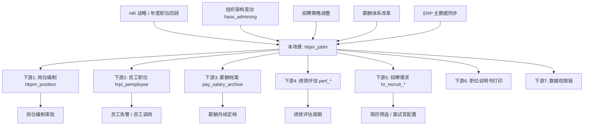

# 上下游联动逻辑 · 职位体系维护 (hbjm_jobhr)

> **状态**: 🟢 基于 `scene_doc.json` refEntity 引用关系 + `_auto_plugin_semantics.md` `JobHrMsgHandleOp` 版本链维护 + HR 域常识整合
> **维度定位**: 业务级联动（**业务动作 → 下游业务反应**）
> **与 05_data_flow 区别**: 05 讲字段级技术反写；本文讲业务逻辑联动

---

## 一、为什么单独一个维度？

职位是**人员 / 岗位 / 薪酬 / 绩效 / 招聘的共同语言**。一个企业的职位体系发生调整（如增设"高级工程师"、调整"销售总监"职级），会触发**一系列下游业务反应**：

- 岗位的编制审批要重新走（岗位 → 职位 → 职级范围）
- 员工档案的职位信息可能需要换绑
- 薪酬方案按职级定档，职级变了薪酬可能变
- 绩效评估模板可能按职位家族配置
- 招聘需求发布必须引用一个有效职位

这些都是**业务级联动**，不是字段级反写。

---

## 二、上游：什么业务动作触发职位体系变化？

### 上游 1 · 职位体系方案升级（战略性）

**触发源**：HR 战略调整 / 年度职位体系回顾

**到达本场景的方式**：
- HR COE 在**职位管理**菜单直接新增 / 变更职位
- 走 `change` / `newhisversion` 产生新版本

**依赖基础数据**：
- `hbjm_jobseqhr`（职位序列，`scene_doc.json` L670）
- `hbjm_jobfamilyhr`（职位族，L682）
- `hbjm_jobclasshr`（职位类，L694）
- `hbjm_jobtype`（职位类别，L557）
- `hbjm_jobgradescmhr` / `hbjm_joblevelscmhr`（职等 / 职级方案）

### 上游 2 · 组织架构变动

**触发源**：`haos_adminorg` 行政组织变化（合并 / 拆分 / 新建）

**到达本场景的方式**：
- 新组织建立 → 新岗位 → 新职位
- 组织合并 → 职位序列可能需要整合

**关联**：职位的 `createorg` / `org` / `useorg` 3 个组织字段（`scene_doc.json` L153-L186）

### 上游 3 · 招聘策略调整

**触发源**：业务部门反馈 / 招聘市场变化

**到达本场景的方式**：
- 新增一个"大数据架构师"职位
- 调整职位的招聘要求字段（`diplomareq` / `agereq` / `knowledgereq` / `skillreq` / `abilityreq` / `experiencereq`，`scene_doc.json` L572-L636）

### 上游 4 · 薪酬体系改革

**触发源**：薪酬部门 / 全员加薪

**到达本场景的方式**：
- 调整职级 / 职等方案（`jobgradescm` / `joblevelscm`）
- 调整职位的职级范围（`lowjoblevel` / `highjoblevel`）

### 上游 5 · ERP / HR 主数据同步（外部系统）

**触发源**：集团 ERP（如 EAS/SAP）职位主数据同步

**到达本场景的方式**：`sourcesyskey` / `sourcedata` / `initdatasource` 字段（`scene_doc.json` L321-L333 / L200-L209 / L809-L820）

**三种同步模式**：
- **先 ERP 后 HR**：ERP 主数据下发
- **HR 主导**：HR 建职位，ERP 订阅
- **双向同步**：冲突解决按 `sourcesyskey` 仲裁

**⚠️ 待补充**：具体同步工具的 API

---

## 三、下游：职位变化触发哪些业务反应？

### 下游 1 · 岗位编制变化

**触发条件**：
- 新建职位 → 有新岗位挂职位
- 修改职位的 `highjoblevel` / `lowjoblevel` → 岗位编制职级范围变化
- 禁用职位 → 挂该职位的岗位必须改挂或废弃

**业务流程**：
```
职位变更（confirmchange / save）
    ↓
JobHrMsgHandleOp.afterExecuteOperationTransaction 写 sourcevid
    ↓
（推荐自定义扩展，CS-06）推送 JobChangedEvent 到消息总线
    ↓
岗位模块订阅 → 按 boid 查 hbpm_position.job = ?
    ↓
业务影响：
  ├── 岗位编制（人数上限）可能重新审批
  ├── 岗位的职级配置可能需要调整
  └── 岗位已有人员的职级是否还在新职位范围内
```

**相关实体**（推测）：`hbpm_position` / `hbpm_positionstd`

### 下游 2 · 员工职位变化

**触发条件**：
- 职位禁用 → 该职位下员工档案出现告警
- 职位 `jobseq` 变更 → 员工的职位序列历史改变

**业务流程**：
```
职位禁用
    ↓
查 hrpi_pemployee.job.boid = 被禁用职位.boid
    ↓
业务影响：
  ├── 员工档案显示"职位已禁用"告警
  ├── 需要走员工调岗流程（换绑新职位）
  └── 员工的历史职业经历（hrpi_empjobresume）保留
```

**推荐扩展**：CS-04 禁用前检查插件，阻止有在职员工的职位被硬禁用。

### 下游 3 · 薪酬档案变化

**触发条件**：
- 职位 `joblevelscm` / `jobgradescm` 方案变更 → 员工薪酬档案的定档基准变化
- 职位 `lowjoblevel` / `highjoblevel` 调整 → 员工薪酬可能需重新定级

**业务流程**：
```
职位变更 → 新 hisversion
    ↓
pay 模块订阅 JobChangedEvent（需业务自定义）
    ↓
业务影响：
  ├── 薪酬档案 (pay_salary_archive) 的 job 字段版本更新
  ├── 如跨职级范围 → 薪酬方案重新评估
  └── 月度薪资结算的职级定档重新推算
```

**业务决策点**：
- 是否保留原薪酬方案？
- 调整日生效还是次月生效？
- 历史薪资归属哪个职级？

### 下游 4 · 绩效评估变化

**触发条件**：
- `jobfamily` 变更 → 绩效模板可能按职位族配置
- 职位说明书（`jobduty` / `jobstandard`）变更 → 考核指标变化

**业务流程**：
```
职位 jobfamily / jobduty 变更
    ↓
如果绩效模板按 jobfamily 配置：
  ├── 原绩效模板是否适用？
  ├── 新绩效周期如何起算？
  └── 绩效目标是否重置？
```

**决策依据**：业务规则（通常保留原周期到当季度末）

### 下游 5 · 招聘需求变化

**触发条件**：
- 职位招聘要求变更（`diplomareq` / `experiencereq` / 6 个 req 字段）
- 职位禁用 → 招聘需求必须对应转移

**业务流程**：
```
职位变更
    ↓
招聘模块订阅 JobChangedEvent
    ↓
业务影响：
  ├── 已发布的招聘需求（关联此职位）需要审视
  ├── 简历筛选模型（按 diplomareq 自动过滤）重新生效
  └── 面试官配置（按 jobseq）重新分配
```

### 下游 6 · 职位说明书 / 打印模板

**触发条件**：职位核心字段（`jobduty` / `joborientation` / `jobstandard`）变更

**业务流程**：
```
职位变更
    ↓
selecttplprint opKey 使用新版职位说明书
    ↓
业务影响：
  ├── 打印的职位说明书自动反映最新信息
  ├── 历史打印版本保留在附件里（参考 JobHisBasedataFiledChangeEdit 的附件监听）
  └── 外部发布 / 培训材料需要重新发布
```

### 下游 7 · 数据权限链变化

**触发条件**：职位 `createorg` / `org` 变更

**业务流程**：
```
职位组织归属变化
    ↓
数据权限链重新计算：
  ├── "管辖该职位"的 HR 范围变化
  ├── 职位 F7 选择时可见范围变化（通过 JobBaseBuListPlugin）
  └── 跨组织查询权限变化
```

---

## 四、业务联动决策表

### 场景: 职位基础信息修改（如 name / description）

| 下游系统 | 自动联动 | 需人工确认 | 不联动 |
|---|---|---|---|
| 岗位编制 | - | - | ✅ 不变 |
| 员工职位显示名 | ✅ 自动刷新（通过多语言子表 t_hbjm_job_i） | - | - |
| 薪酬档案 | - | - | ✅ 不变 |
| 招聘需求 | - | ⚠️ 描述变更时需要确认 | - |
| 职位说明书 | ✅ 下次打印自动更新 | - | - |

### 场景: 职位职级范围调整

| 下游系统 | 自动联动 | 需人工确认 | 阻断 |
|---|---|---|---|
| 岗位编制（职级） | - | ✅ 必须审批 | - |
| 员工薪酬定档 | - | ✅ 薪酬部门确认 | - |
| 招聘简历筛选 | ✅ 自动生效新规则 | - | - |
| 已有员工是否超范围 | - | ✅ 检查并处理 | - |

### 场景: 职位禁用

| 下游系统 | 自动联动 | 需人工确认 | 阻断 |
|---|---|---|---|
| 该职位下员工 | - | ✅ **必须先转移**（推荐 CS-04） | ❌ 标品默认不阻断（风险） |
| 该职位下岗位 | - | ✅ 必须先转移 | ❌ 标品默认不阻断 |
| 正在进行的招聘 | - | ✅ 需决策（取消或转职位） | - |
| 历史薪酬档案 | ✅ 保留归属 | - | - |

### 场景: 职位新建（newhisversion）

| 下游系统 | 自动联动 | 需人工确认 | 不联动 |
|---|---|---|---|
| 岗位可选职位 F7 | ✅ 自动出现 | - | - |
| 招聘需求可选职位 | ✅ 自动出现 | - | - |
| 薪酬方案 | - | ✅ 需要 HR 配置 | - |
| 绩效模板 | - | ✅ 需要配置 | - |

---

## 五、业务联动的"决策点"清单

这些是**业务流程**中必须人工决策的关键点（不是技术能自动的）：

1. **职位变更日期选择**：月末变更 vs 月中变更（影响薪酬月结）
2. **职级范围收紧时处理**：有员工不在新范围内怎么办
3. **禁用 vs 停招**：业务语义区分（禁用 = 整条线废弃，停招 = 临时停止招聘）
4. **跨职位族调整**：员工的绩效历史归属变化
5. **时态生效日期 bsed 选择**：立即生效、次月生效、次季度生效
6. **通知策略**：通知所有员工 / 只通知管理层 / 不通知
7. **导入模板列选择**：HIES 导入时哪些字段必填 / 可选

---

## 六、业务联动的"阻断规则"

以下情况**应该**阻止职位操作（需要自定义扩展实现，标品默认不阻断）：

| 规则 | 阻断条件 | 解除方法 | 实现 CS |
|---|---|---|---|
| 有在职员工不能禁用职位 | `SELECT COUNT(*) FROM hrpi_pemployee WHERE job.boid = ? AND status = 'active' > 0` | 先转移员工 | CS-04 |
| 有岗位挂靠不能禁用职位 | 有 `hbpm_position.job.boid = ?` 记录 | 先转移岗位 | CS-04 的扩展 |
| 新职级范围不覆盖已有员工 | 员工职级 `NOT BETWEEN lowjoblevel AND highjoblevel` | 先调整员工或再扩范围 | CS-03 的扩展 |
| 职位序列已禁用不能启用 | `jobseq.enable = 0` | 先启用序列 | 类比 `JobEnableValidator` |
| 未来有在招的职位不能禁用 | `SELECT COUNT(*) FROM hr_recruit WHERE job = ? AND status = 'open'` | 先关闭招聘 | 自定义 |

---

## 七、典型业务联动剧本

### 剧本 1 · "技术线职级体系升级"

**背景**：某科技公司把研发线从"P1-P9"扩展到"P1-P12"，并新增"T"技术专家线

**联动步骤**：
```
1. 新建职级方案 (hbjm_joblevelscmhr) "tech_v2"
2. 新建职等方案 (hbjm_jobgradescmhr) "tech_v2_grade"
3. 新建或修订现有职位：
    - confirmchange 原研发职位 → 新版本绑定 tech_v2 方案
    - 新增"技术专家 T1-T4"职位
4. 岗位编制联动：
    - 岗位模块批量审视 → 岗位编制审批
5. 员工定级：
    - 跑员工定级批处理 → 员工薪酬档案 job 字段版本更新
6. 薪酬方案：
    - 按新职级表调整薪酬档案
7. 招聘策略：
    - 简历筛选模型按新职级配置
8. 绩效对齐：
    - 研发线绩效模板对齐新职级
```

**需要配合的系统**：岗位模块、员工档案、薪酬月结、招聘、绩效

### 剧本 2 · "销售线整合（多公司合并职位）"

**背景**：集团收购，需要把原公司销售序列 + 被收购公司销售序列合并

**联动步骤**：
```
1. 对比双方职位序列 (hbjm_jobseqhr)
2. 决定保留方案 + 合并方案
3. 对冗余职位走 disable（**必须先 CS-04 检查在职员工**）
4. 对需要改序列的职位走 change → confirmchange
5. 员工批量调整 → 按新 jobseq 换绑
6. 薪酬方案按新职级重新评估
7. 发通知 → 员工档案刷新显示
8. 招聘暂停 → 等合并完成后统一放开
```

### 剧本 3 · "新职位快速上线（招聘驱动）"

**背景**：业务部门紧急要招"大数据产品经理"，无此职位

**联动步骤**：
```
1. HR 快速新建职位（hbjm_jobhr）
    - jobseq = 产品序列 (必填)
    - 填职级范围 lowjoblevel / highjoblevel
    - 填招聘要求 diplomareq / experiencereq / skillreq
2. 走 submit → audit 生效
3. 招聘模块立即可以发布招聘需求（F7 能查到新职位）
4. 薪酬定档（需 HR 配置）
5. 绩效模板（需配置或沿用产品序列通用模板）
6. 岗位编制（需与业务部门约定编制数）
```

---

## 八、上下游联动图（Mermaid）



---

## 九、最佳实践

### 大规模职位体系调整的"业务流"建议

不要**连续单条变更**，会导致：
- 通知轰炸员工
- 薪酬考勤多次重算，数据不一致
- 审计混乱

**推荐做法**：
1. **冻结窗口**：职位变更前提前 1 周冻结岗位调整、员工定级
2. **批量导入**：走 HIES `importdata_hr`（`hismodel_importstart` 向导）
3. **分批走 confirmchange**：每次最多 50 个职位一批
4. **事后通知**：所有变更完成后，统一发通知
5. **结算隔离**：跨越薪资结算日时必须等结算完成
6. **数据校对**：变更后对比职位数量、岗位数量、员工定级分布

### 新职位快速上线的"业务流"建议

1. **先验证需求**：通过 HR BP 确认真的需要新职位（避免职位膨胀）
2. **复用职位序列**：优先在现有 `jobseq` 下新增，不要动不动建新序列
3. **职级范围保守**：宁可范围小后续扩展，不要一开始给大范围
4. **招聘要求具体化**：6 个 req 字段（`diplomareq` / `agereq` / `knowledgereq` / `skillreq` / `abilityreq` / `experiencereq`）都要填
5. **走正规流转**：new → submit → audit → 启用，不要跳过 audit

### 职位停用的"业务流"建议

1. **先转所有关联数据**：员工调岗 → 岗位换挂 → 招聘关闭
2. **先停招**（业务状态：停招）：观察 1 个月无新引用
3. **再硬禁用**：走 `disable` opKey
4. **保留历史数据**：不要 `delete`，保留历史版本查询能力

---

## 十、待补充内容

> HR 专家可以补充的联动规则：

- [ ] 具体下游实体名称确认（`hbpm_position` / `hrpi_pemployee` 字段名）
- [ ] ERP 主数据同步工具的 API
- [ ] 跨租户 / 跨法人职位同步规则
- [ ] 海外子公司的本地化职位规则（如日本职位有独特层级）
- [ ] 外部系统（如猎头平台、招聘网站）的职位同步触发点
- [ ] 数据保留期限（GDPR / 个保法：禁用职位的 PII 数据何时清除）

---

**📌 来源追溯**：
- 上游字典 refEntity：`scene_doc.json` L509 / L521 / L533 / L545 / L557 / L569 / L581 / L670 / L682 / L694 / L783 / L795
- 组织字段：`scene_doc.json` L153-L186 createorg / org / useorg / srccreateorg
- 招聘要求字段：`scene_doc.json` L572-L636（6 个 req 字段）
- JobHrMsgHandleOp 版本链：`_auto_plugin_semantics.md` L13-L26（读 boid/iscurrentversion/sourcevid，写 sourcevid）
- 外部系统字段：`scene_doc.json` L321-L333 (initdatasource) + L809-L820 (sourcesyskey)
- 阻断规则：基于 `_auto_operations.md` 的 opKey 已有 validations 反向推导（标品 disable 仅 1 FormValidate，无业务引用检查）

---

<!-- BEGIN cross-cloud-upstream (auto · ADR-009) -->

## 上游底座引用（跨云）

> 自动生成 · 数据源 `_cross_cloud_index.json` · 更新时间 2026-04-29
> 本 form（`hbjm_jobhr`，所属 组织发展云）引用了其他云的 **2** 个底座实体：

### ⬆️ HR 基础服务云（`hr_hrmp`）2 个引用

| 字段 | 字段名 | 类型 | 引用实体 | 上游场景 |
|---|---|---|---|---|
| `depcytype` | 属地员工类别(废弃) | BasedataField | `hbss_depcytype` | [hbss_position_dict](../hbss_position_dict/) |
| `diplomareq` | 学历要求 | BasedataField | `hbss_diploma` | [hbss_edu_train](../hbss_edu_train/) |

> ⚠️ ISV 扩展须知（ADR-009）：
> - 上游底座实体是**标品字典**，原则上不可改字段（参各上游场景的 06_customization_solutions.md）
> - 引用方式（fieldType / refEntity）由本 form 元数据控制；本 form 改 ref 字段值用 `setValue` 即可
> - 修改前必须读对应上游场景的 11_upstream_downstream_logic.md，确认上游 ISV 扩展规则

<!-- END cross-cloud-upstream -->

---

<!-- BEGIN cross-cloud-downstream (auto · ADR-009) -->

## 下游消费者（被其他云引用）

> 自动生成 · 数据源 `_cross_cloud_reports/org_dev_consumed_by.json` · 更新时间 2026-04-29
> 本场景拥有的实体被以下消费方引用：

**汇总**：1 个本场景实体 · 共 20 处引用 · 其中 8 处跨云。

### `hbjm_jobhr` （跨云引用 8 处）

#### ⬇️ 核心人力云（`core_hr`）8 处

| form | field | type |
|---|---|---|
| `hrpi_appointremoverel` | `jobvid` | HisModelBasedataField |
| `hrpi_appointremoverel` | `job` | BasedataField |
| `hrpi_blacklist` | `job` | BasedataField |
| `hrpi_dispatchinfo` | `job` | BasedataField |
| `hrpi_empjobrel` | `job` | BasedataField |
| `hrpi_empposorgrel` | `job` | BasedataField |
| `hrpi_empposorgrel` | `jobvid` | BasedataField |
| `hrpi_rotationinfo` | `job` | BasedataField |

> ⚠️ ISV 修改本场景实体的字段定义前，**必读**上面的下游消费者清单 · 改 fieldType / 删字段都会破坏跨云数据契约。

<!-- END cross-cloud-downstream -->
